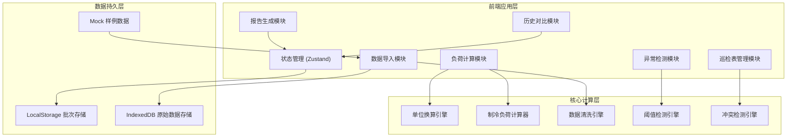
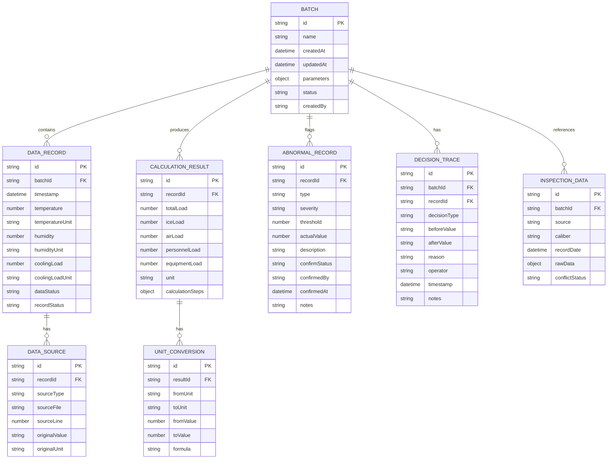

## 1. 架构设计



---

## 2. 技术描述

- **前端框架**：React@18 + TypeScript + Vite@5
- **状态管理**：Zustand（轻量级，支持持久化）
- **样式方案**：TailwindCSS@3 + CSS变量
- **UI组件**：HeadlessUI（无样式，便于自定义工业风格）
- **数据处理**：PapaParse（CSV解析）+ date-fns（日期处理）
- **图表可视化**：Recharts（趋势图、仪表盘）
- **文件导出**：jspdf（PDF导出）+ 原生Blob（Markdown导出）
- **数据持久化**：LocalStorage（配置/批次）+ IndexedDB（原始数据）
- **后端**：无，纯前端应用，数据本地存储
- **数据库**：无，使用浏览器存储 + Mock数据

---

## 3. 路由定义

| Route | 页面 | 核心功能 |
|-------|------|----------|
| `/` | 首页/工作台 | 批次列表、快速入口、系统状态 |
| `/import` | 数据导入页 | 文件上传、数据清洗、预览 |
| `/calculate` | 负荷计算页 | 参数配置、实时计算、单位换算 |
| `/detection` | 异常检测页 | 阈值监控、极端值识别、人工确认 |
| `/inspection` | 巡检表页 | 巡检表导入、冲突处理、旧口径管理 |
| `/report` | 报告生成页 | 报告预览、来源追溯、导出 |
| `/history` | 历史对比页 | 多轮对比、决策留痕、参数变更追踪 |

---

## 4. 核心数据模型

### 4.1 数据模型定义



### 4.2 TypeScript 类型定义

```typescript
// 单位类型
type TemperatureUnit = '°C' | '°F' | 'K';
type PowerUnit = 'kW' | 'W' | 'BTU/h' | 'RT';
type AreaUnit = 'm²' | 'ft²';
type ThicknessUnit = 'mm' | 'cm' | 'in';

// 数据记录状态
type DataStatus = 'clean' | 'missing' | 'unit_mismatch' | 'conflict';
type RecordStatus = 'normal' | 'pending' | 'old_caliber' | 'extreme';

// 物理参数配置
interface PhysicsParams {
  iceArea: number;
  iceAreaUnit: AreaUnit;
  iceThickness: number;
  iceThicknessUnit: ThicknessUnit;
  iceTemperature: number;
  iceTemperatureUnit: TemperatureUnit;
  ambientTemperature: number;
  ambientTemperatureUnit: TemperatureUnit;
  ambientHumidity: number;
  peopleCount: number;
  equipmentPower: number;
  equipmentPowerUnit: PowerUnit;
  lightingPower: number;
  lightingPowerUnit: PowerUnit;
}

// 阈值配置
interface ThresholdConfig {
  maxCoolingLoad: number;
  maxCoolingLoadUnit: PowerUnit;
  warningRatio: number;
  extremeOutlierThreshold: number;
}

// 单条数据记录
interface DataRecord {
  id: string;
  batchId: string;
  timestamp: Date;
  temperature: number;
  temperatureUnit: TemperatureUnit;
  humidity: number;
  coolingLoad?: number;
  coolingLoadUnit?: PowerUnit;
  dataStatus: DataStatus;
  recordStatus: RecordStatus;
  sources: DataSource[];
  missingFields: string[];
  unitIssues: string[];
}

// 数据来源
interface DataSource {
  id: string;
  recordId: string;
  sourceType: 'import' | 'inspection' | 'manual';
  sourceFile: string;
  sourceLine: number;
  originalValue: string;
  originalUnit: string;
  importTimestamp: Date;
}

// 计算结果
interface CalculationResult {
  id: string;
  recordId: string;
  totalLoad: number;
  totalLoadUnit: PowerUnit;
  iceLoad: number;
  convectionLoad: number;
  radiationLoad: number;
  moistureLoad: number;
  personnelLoad: number;
  equipmentLoad: number;
  lightingLoad: number;
  calculationSteps: CalculationStep[];
  unitConversions: UnitConversion[];
}

interface CalculationStep {
  id: string;
  name: string;
  formula: string;
  inputs: Record<string, number>;
  result: number;
  unit: string;
}

interface UnitConversion {
  id: string;
  fromUnit: string;
  toUnit: string;
  fromValue: number;
  toValue: number;
  formula: string;
}

// 异常记录
interface AbnormalRecord {
  id: string;
  recordId: string;
  type: 'threshold_exceed' | 'extreme_value' | 'data_conflict' | 'missing_data';
  severity: 'low' | 'medium' | 'high' | 'critical';
  threshold: number;
  actualValue: number;
  description: string;
  confirmStatus: 'pending' | 'confirmed' | 'rejected';
  confirmedBy?: string;
  confirmedAt?: Date;
  notes?: string;
}

// 巡检表数据
interface InspectionData {
  id: string;
  batchId: string;
  source: string;
  caliber: 'new' | 'old';
  recordDate: Date;
  rawData: Record<string, any>;
  conflictStatus: 'none' | 'pending' | 'resolved';
  conflictingFields: string[];
  conflictEvidence?: {
    importedData: any;
    inspectionData: any;
    suggestions: string[];
  };
}

// 决策留痕
interface DecisionTrace {
  id: string;
  batchId: string;
  recordId?: string;
  decisionType: 'parameter_change' | 'status_change' | 'conflict_resolve' | 'extreme_handle';
  beforeValue: any;
  afterValue: any;
  reason: string;
  operator: string;
  timestamp: Date;
  notes?: string;
}

// 批次（完整一次诊断）
interface Batch {
  id: string;
  name: string;
  createdAt: Date;
  updatedAt: Date;
  parameters: PhysicsParams;
  thresholds: ThresholdConfig;
  status: 'draft' | 'processing' | 'completed' | 'archived';
  createdBy: string;
  records: DataRecord[];
  calculationResults: CalculationResult[];
  abnormalRecords: AbnormalRecord[];
  inspectionData: InspectionData[];
  decisionTraces: DecisionTrace[];
}
```

---

## 5. 核心模块设计

### 5.1 单位换算引擎

```typescript
// 核心换算函数
class UnitConverter {
  // 温度换算
  static convertTemperature(value: number, from: TemperatureUnit, to: TemperatureUnit): number;
  
  // 功率/冷量换算
  static convertPower(value: number, from: PowerUnit, to: PowerUnit): number;
  
  // 面积换算
  static convertArea(value: number, from: AreaUnit, to: AreaUnit): number;
  
  // 厚度换算
  static convertThickness(value: number, from: ThicknessUnit, to: ThicknessUnit): number;
  
  // 智能识别单位（处理混写）
  static parseUnit(rawUnit: string): { unit: string; confidence: number; alternatives: string[] };
  
  // 获取换算公式
  static getConversionFormula(from: string, to: string): string;
}
```

### 5.2 制冷负荷计算器

```typescript
// 基于传热学的近似计算
class CoolingLoadCalculator {
  constructor(params: PhysicsParams);
  
  // 冰层蓄冷负荷 Q_ice = ρ_ice × c_ice × V × ΔT
  calculateIceLoad(): CalculationStep;
  
  // 对流换热负荷 Q_conv = h × A × ΔT
  calculateConvectionLoad(ambientTemp: number): CalculationStep;
  
  // 辐射换热负荷 Q_rad = σ × ε × A × (T_amb^4 - T_ice^4)
  calculateRadiationLoad(ambientTemp: number): CalculationStep;
  
  // 湿负荷（潜热）Q_moist = m_water × h_latent
  calculateMoistureLoad(humidity: number): CalculationStep;
  
  // 人员散热负荷 Q_people = n × q_person
  calculatePersonnelLoad(): CalculationStep;
  
  // 设备散热负荷 Q_equipment = P_equipment × η
  calculateEquipmentLoad(): CalculationStep;
  
  // 照明散热负荷 Q_lighting = P_lighting × η
  calculateLightingLoad(): CalculationStep;
  
  // 综合计算
  calculateTotal(record: DataRecord): CalculationResult;
}
```

### 5.3 数据清洗引擎

```typescript
class DataCleaner {
  // 检测采样缺口（时间序列分析）
  detectGaps(records: DataRecord[], expectedIntervalMinutes: number): DataRecord[];
  
  // 识别和处理单位混写
  normalizeUnits(records: DataRecord[]): {
    cleaned: DataRecord[];
    issues: { recordId: string; field: string; original: string; normalized: string; confidence: number }[];
  };
  
  // 识别极端值（IQR方法）
  detectExtremes(values: number[], threshold: number): {
    outliers: number[];
    bounds: { lower: number; upper: number };
    stats: { median: number; q1: number; q3: number; iqr: number };
  };
  
  // 极端值不参与平均值计算
  calculateRobustMean(values: number[], excludeExtremes: boolean): number;
}
```

### 5.4 冲突检测引擎

```typescript
class ConflictDetector {
  // 对比导入数据与巡检表数据
  detectConflicts(
    importedRecords: DataRecord[],
    inspectionRecords: InspectionData[]
  ): {
    conflicts: {
      recordId: string;
      inspectionId: string;
      field: string;
      importedValue: any;
      inspectionValue: any;
      difference: number;
      suggestions: string[];
    }[];
  };
  
  // 生成冲突证据报告
  generateConflictEvidence(conflict: any): {
    importedData: { source: string; value: any; timestamp: Date };
    inspectionData: { source: string; value: any; recordDate: Date; caliber: string };
    suggestedActions: string[];
  };
}
```

---

## 6. 状态管理设计

```typescript
// Zustand Store
interface AppState {
  // 当前批次
  currentBatch: Batch | null;
  batches: Batch[];
  
  // 工作区状态
  activeTab: string;
  selectedRecordId: string | null;
  comparisonBatchIds: string[];
  
  // Actions
  createBatch: (name: string, params: PhysicsParams) => Batch;
  importData: (batchId: string, data: any[]) => void;
  importInspection: (batchId: string, data: any[]) => void;
  runCalculation: (batchId: string) => void;
  updateParameters: (batchId: string, params: Partial<PhysicsParams>) => void;
  confirmAbnormal: (abnormalId: string, status: 'confirmed' | 'rejected', notes: string) => void;
  resolveConflict: (inspectionId: string, resolution: 'use_imported' | 'use_inspection' | 'custom', notes: string) => void;
  saveBatch: (batchId: string) => void;
  loadBatch: (batchId: string) => void;
  exportReport: (batchId: string, format: 'pdf' | 'markdown') => Blob;
  addDecisionTrace: (trace: Omit<DecisionTrace, 'id' | 'timestamp'>) => void;
}
```

---

## 7. 持久化策略

| 数据类型 | 存储方式 | 序列化 | 触发时机 |
|---------|----------|--------|----------|
| 批次元数据 | LocalStorage | JSON | 每次变更自动保存 |
| 批次列表 | LocalStorage | JSON | 批次创建/删除时 |
| 原始数据记录 | IndexedDB | 结构化存储 | 数据导入时 |
| 计算结果 | IndexedDB | 结构化存储 | 计算完成时 |
| 配置参数 | LocalStorage | JSON | 参数变更时 |
| 决策留痕 | LocalStorage + IndexedDB | 结构化存储 | 每次决策时 |

---

## 8. 性能优化

- **虚拟滚动**：数据表格使用虚拟滚动，支持10000+条记录流畅展示
- **计算缓存**：参数未变更时复用计算结果
- **增量更新**：只重新计算变更的记录
- **懒加载**：历史对比数据按需加载
- **Web Worker**：大数据量计算在Worker线程执行，不阻塞UI
