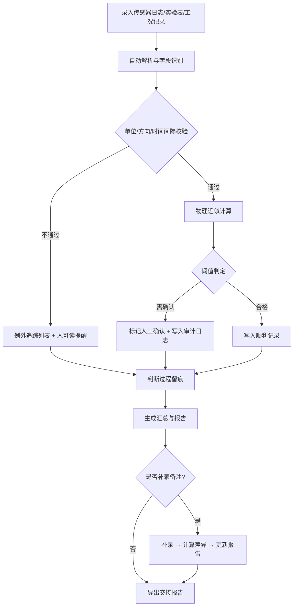

## 1. 产品概述

港口吊机摆动抑制计算看板——面向训练教练老唐的专用工具，将传感器日志、实验表和工况记录等零散材料统一对齐，自动完成物理近似计算、单位换算和阈值判定，输出可交接的审计报告，消除手工二次核对。

- 核心问题：传感器日志数据来源杂、单位不统一、方向符号易错，人工对表费时且容易遗漏例外
- 目标用户：训练教练老唐及其交接对象
- 价值：一次跑通，判断过程全程留痕，重跑可对比，交接有据可查

## 2. 核心功能

### 2.1 用户角色

| 角色 | 使用方式 | 核心权限 |
|------|----------|----------|
| 训练教练 | 直接使用 | 录入/补录数据、运行计算、查看报告、导出交接文件 |
| 交接对象 | 只读 | 查看报告、对比历史结果 |

### 2.2 功能模块

1. **数据看板页**：传感器日志录入区、计算结果卡片、阈值状态指示、例外追踪列表
2. **对比与报告页**：历史参数并排对比、备注补录差异说明、报告预览与导出

### 2.3 页面详情

| 页面名称 | 模块名称 | 功能描述 |
|----------|----------|----------|
| 数据看板页 | 传感器日志录入区 | 支持粘贴传感器日志文本，自动解析时间戳、摆角、线速度等字段；可手动录入实验表和工况记录 |
| 数据看板页 | 单位与方向校验 | 自动检测角度(deg/rad)、长度(m/cm)、时间间隔(s/ms)单位不一致并给出人可读提醒；方向符号(+/-)冲突高亮 |
| 数据看板页 | 物理计算卡片 | 基于单摆近似计算摆动周期 T=2π√(L/g)，阻尼比 ζ，残余摆角；实时刷新 |
| 数据看板页 | 阈值指示灯 | 摆角超限(>3°)、阻尼不足(ζ<0.05)、时间间隔异常(<0.1s 或 >10s)分别红/黄/绿灯指示 |
| 数据看板页 | 例外追踪列表 | 不合格记录不走汇总，单独列出并标明原因（方向错、单位错、超限等），不静默消失 |
| 数据看板页 | 判断过程审计日志 | 每条记录的校验步骤、计算参数、阈值判定结果按时间线留痕 |
| 对比与报告页 | 历史参数对比 | 同一批数据重跑时，旧参数与新结果并排显示，差异高亮 |
| 对比与报告页 | 备注补录 | 对已有记录追加备注，补录后自动计算与原结果的差异并说明 |
| 对比与报告页 | 报告生成与导出 | 一键生成包含样例记录、审计日志、阈值判定的交接报告（可打印/可导出文本） |

## 3. 核心流程

## 4. 用户界面设计

### 4.1 设计风格

- **主色调**：深蓝灰底(#1a2332) + 琥珀黄强调色(#f0a500)，模拟港口夜间作业灯光
- **辅助色**：阈值绿(#22c55e)、警告黄(#eab308)、超限红(#ef4444)
- **按钮风格**：圆角方形，琥珀黄主按钮，深灰次按钮，hover 时微微上浮+发光
- **字体**：数据区等宽字体(JetBrains Mono)，标题区工业风无衬线(Rajdhani)，正文区(IBM Plex Sans)
- **布局**：顶部窄导航栏 + 左侧录入面板 + 右侧看板卡片区 + 底部审计日志时间线
- **图标**：lucide-react 图标库

### 4.2 页面设计概览

| 页面名称 | 模块名称 | UI 元素 |
|----------|----------|---------|
| 数据看板页 | 传感器日志录入区 | 深色文本框、粘贴按钮、解析状态标签、字段映射提示 |
| 数据看板页 | 物理计算卡片 | 琥珀边框卡片、等宽数字、实时刷新指示器 |
| 数据看板页 | 阈值指示灯 | 圆形灯珠动画(呼吸效果)、灯色对应状态 |
| 数据看板页 | 例外追踪列表 | 红色左边框行、展开详情、修正建议 |
| 对比与报告页 | 历史参数对比 | 双栏并排表格、差异行高亮底色 |
| 对比与报告页 | 备注补录 | 内联输入框、补录后差异标注箭头 |
| 对比与报告页 | 报告预览 | 模拟打印排版、导出按钮 |

### 4.3 响应式

桌面优先设计，1280px 以上最佳体验；平板适配时录入区折叠为底部抽屉；手机端仅保留看板卡片和阈值指示灯。

### 4.4 样例数据设计

| 编号 | 类型 | 说明 |
|------|------|------|
| REC-001 | 顺利记录 | 传感器日志完整，单位一致，摆角 1.8° < 3°，阻尼比 0.12 > 0.05，全部绿灯 |
| REC-002 | 人工确认记录 | 传感器日志中角度单位为 rad(0.052)，自动换算为 deg(2.98°)但接近阈值，标记黄灯需人工确认 |
| REC-003 | 旧口径补录 | 从早期传感器日志补入，绳长使用旧标准 28m（现标准 30m），自动标注口径差异，计算结果附差异说明 |
