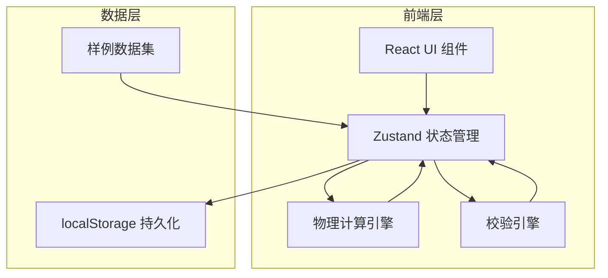
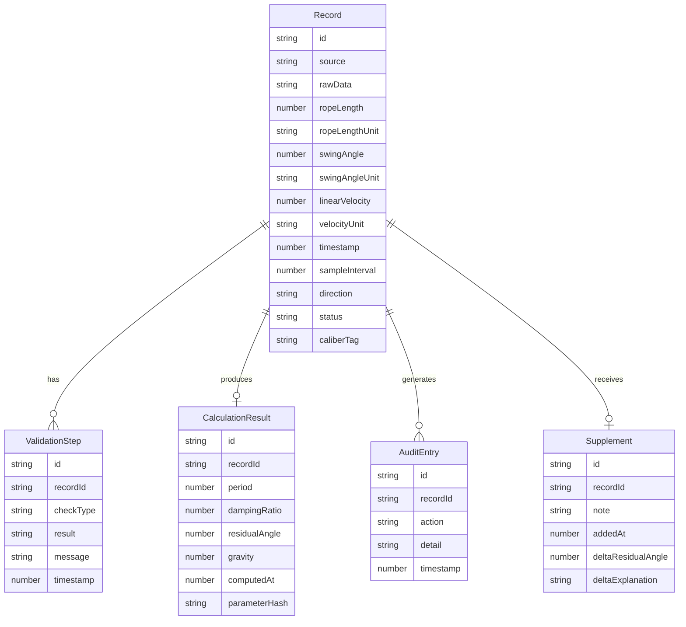

## 1. 架构设计

纯前端应用，无后端依赖，所有计算在浏览器内完成，数据通过 localStorage 持久化。

## 2. 技术说明

- **前端框架**：React 18 + TypeScript + Vite
- **样式**：Tailwind CSS 3
- **状态管理**：Zustand
- **路由**：react-router-dom
- **图标**：lucide-react
- **后端**：无（纯前端，数据存 localStorage）
- **数据库**：无（localStorage JSON 序列化）

## 3. 路由定义

| 路由 | 用途 |
|------|------|
| `/` | 数据看板页（传感器录入、计算卡片、阈值指示、例外追踪、审计日志） |
| `/compare` | 对比与报告页（历史对比、备注补录、报告导出） |

## 4. 核心数据模型

### 4.1 数据模型定义

### 4.2 物理计算公式

| 参数 | 公式 | 说明 |
|------|------|------|
| 摆动周期 T | T = 2π√(L/g) | L=绳长(m), g=9.81 m/s² |
| 阻尼比 ζ | ζ = δ / (2π) , δ = ln(θₙ/θₙ₊₁) | θₙ 为第 n 次摆幅角 |
| 残余摆角 θ_res | θ_res = θ₀ × e^(-ζωt) | ω=2π/T, t=观测时长 |

### 4.3 校验规则

| 校验项 | 规则 | 提醒文案 |
|--------|------|----------|
| 角度单位 | deg 与 rad 互斥检测 | "角度单位与已有记录不一致，已自动换算为 deg" |
| 长度单位 | m 与 cm 检测 | "绳长单位为 cm，已换算为 m" |
| 方向符号 | +/- 前缀检测 | "方向符号与相邻记录相反，请确认是否正确" |
| 时间间隔 | < 0.1s 或 > 10s | "采样间隔异常(XXs)，可能存在数据缺失或重复" |
| 阈值-摆角 | > 3° | "摆角超过 3° 安全阈值，需人工确认" |
| 阈值-阻尼 | ζ < 0.05 | "阻尼比低于 0.05，摆动抑制不足" |

### 4.4 样例数据初始值

| 字段 | REC-001(顺利) | REC-002(人工确认) | REC-003(旧口径补录) |
|------|---------------|-------------------|---------------------|
| source | sensor_log | sensor_log | sensor_log_legacy |
| ropeLength | 30 m | 30 m | 28 m |
| swingAngle | 1.8 deg | 0.052 rad | 2.1 deg |
| linearVelocity | 0.3 m/s | 0.28 m/s | 0.35 m/s |
| sampleInterval | 0.5 s | 0.5 s | 1.0 s |
| direction | + | + | - |
| caliberTag | current | current | legacy_28m |
| status | pass | needs_review | supplemented |
