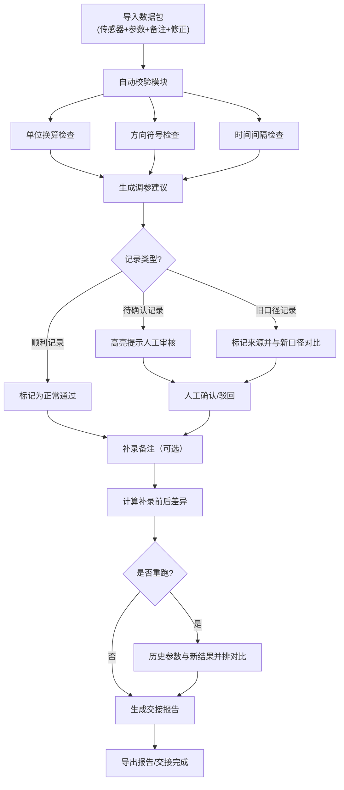

## 1. 产品概述

磁悬浮小车轨道调参系统，为实验老师林老师提供自动化数据校验和调参辅助工具，解决人工核对单位换算、方向符号、时间间隔容易出错的问题。系统保留完整判断过程，支持历史版本对比，最终生成可交接的调参报告。

- **核心问题**：人工翻找维修微信群记录、单位换算易错、调参过程无留痕、交接困难
- **目标用户**：实验老师林老师及业务同事
- **产品价值**：调参效率提升、杜绝单位换算错误、判断过程可追溯、交接清晰

---

## 2. 核心功能

### 2.1 用户角色

| 角色 | 注册方式 | 核心权限 |
|------|----------|----------|
| 实验老师 | 本地系统，无需注册 | 数据导入、调参计算、人工确认、备注补录、历史对比、报告导出 |
| 业务同事 | 本地系统，无需注册 | 查看调参建议、执行操作、确认结果 |

### 2.2 功能模块

1. **数据导入页**：上传传感器记录、设备参数、现场备注、人工修正记录
2. **调参主流程页**：数据校验、单位换算、方向检查、时间间隔校验、调参建议
3. **记录详情页**：单条记录的完整判断过程、人工确认、备注补录
4. **历史对比页**：同一批数据重跑时的历史参数与新结果并排比较
5. **交接报告页**：汇总所有记录、处理结果、差异说明、可导出报告

### 2.3 页面详情

| 页面名称 | 模块名称 | 功能描述 |
|----------|----------|----------|
| 数据导入页 | 文件上传区 | 支持拖拽上传传感器CSV、设备参数JSON、备注文本、微信截图OCR（模拟） |
| 数据导入页 | 数据预览区 | 展示导入数据的前10条，标记异常字段，支持人工修正 |
| 数据导入页 | 样例数据区 | 提供3条预设样例，一键加载演示 |
| 调参主流程页 | 校验仪表板 | 实时显示单位校验、方向符号、时间间隔的检查结果 |
| 调参主流程页 | 记录列表 | 每条记录显示状态（顺利/待确认/旧口径）、核心参数、处理建议 |
| 调参主流程页 | 批量操作 | 一键确认、批量导出、补录备注 |
| 记录详情页 | 判断过程时间线 | 完整展示每一步校验逻辑、原始值、换算后值、判断依据 |
| 记录详情页 | 人工确认区 | 提供确认/驳回选项，可填写理由 |
| 记录详情页 | 备注补录区 | 支持追加备注，自动计算补录前后差异 |
| 历史对比页 | 并排对比视图 | 左右分栏展示历史版本与新版本，高亮差异字段 |
| 历史对比页 | 版本切换器 | 支持切换不同历史版本进行对比 |
| 交接报告页 | 报告摘要 | 统计顺利/待确认/旧口径数量、关键指标变化 |
| 交接报告页 | 差异说明 | 详细列出补录备注前后的差异、重跑前后的差异 |
| 交接报告页 | 导出功能 | 支持PDF/HTML格式导出交接报告 |

---

## 3. 核心流程

### 3.1 主流程描述

实验老师林老师导入数据包 → 系统自动校验（单位/方向/时间间隔） → 生成调参建议 → 林老师查看判断过程 → 对待确认记录进行人工确认 → 临时补录备注 → 系统计算差异 → 可选择重跑数据 → 历史版本并排对比 → 生成交接报告

### 3.2 流程图

---

## 4. 用户界面设计

### 4.1 设计风格

- **主色调**：工业蓝 `#165DFF`（科技感、专业性），辅以警示橙 `#FF7D00`（待确认）、成功绿 `#00B42A`（正常）、旧记录灰 `#86909C`（旧口径）
- **按钮风格**：直角矩形，2px边框，点击时有轻微凹陷效果，工业仪表风格
- **字体**：标题使用 `JetBrains Mono` 等宽字体（数据感、精确度），正文使用 `Noto Sans SC`（清晰易读）
- **布局风格**：模块化仪表盘布局，使用细线边框分隔区域，类似工业控制面板
- **图标风格**：线性轮廓图标，配合数据表格使用，避免过度装饰

### 4.2 页面设计概述

| 页面名称 | 模块名称 | UI元素 |
|----------|----------|--------|
| 数据导入页 | 文件上传区 | 虚线边框上传区，拖拽动画，文件图标，进度条 |
| 数据导入页 | 数据预览区 | 斑马纹表格，异常单元格红框高亮，单元格可编辑 |
| 数据导入页 | 样例数据区 | 三张卡片，分别标记"顺利记录"、"待确认记录"、"旧口径记录" |
| 调参主流程页 | 校验仪表板 | 三个圆形仪表盘，指针式显示校验通过率，状态颜色指示 |
| 调参主流程页 | 记录列表 | 卡片式列表，左边缘颜色条标记状态，核心参数使用等宽字体对齐 |
| 记录详情页 | 判断过程时间线 | 垂直时间线，每个节点包含操作、原值、计算值、判断依据 |
| 记录详情页 | 差异对比区 | 左右分栏，删除线标记旧值，绿色标记新值 |
| 历史对比页 | 并排对比视图 | 可拖动分割线，同步滚动，差异单元格闪烁提示 |
| 交接报告页 | 报告摘要 | 大号数字统计，趋势箭头，关键指标卡片 |

### 4.3 响应式设计

- **桌面优先**：最小支持1280px宽度，主内容区固定1200px
- **平板适配**：调整仪表盘为两行布局，列表卡片改为单列
- **触控优化**：按钮最小高度44px，表格支持横向滚动

### 4.4 动效设计

- 数据校验时仪表盘指针平滑转动，数字滚动计数
- 记录状态变化时边缘颜色条有呼吸灯效果
- 差异字段高亮时先闪烁3次再保持高亮
- 页面加载时模块从上到下依次滑入，间隔80ms
- 鼠标悬停表格行时背景色轻微加深，边框高亮

---

## 5. 数据校验规则

### 5.1 单位校验规则

| 物理量 | 预期单位 | 常见错误单位 | 换算关系 | 提醒文案 |
|--------|----------|--------------|----------|----------|
| 轨道间隙 | mm | cm, m, 英寸 | 1cm=10mm, 1m=1000mm, 1英寸=25.4mm | "检测到单位不一致：原值X cm，已换算为Y mm。请确认测量时使用的是毫米单位。" |
| 悬浮高度 | mm | μm, nm | 1μm=0.001mm | "注意：原值X μm = Y mm，悬浮高度是否正常？建议用游标卡尺复核。" |
| 推进电流 | A | mA, kA | 1A=1000mA | "电流单位已换算：X mA = Y A。正常工作电流范围2.5A-4.0A，请注意。" |

### 5.2 方向符号规则

- X轴：向右为正（+），向左为负（-）
- Y轴：向上为正（+），向下为负（-）
- 异常提醒："第3条记录X方向符号为负，表示小车向左偏移，检查轨道左侧导向轮。"

### 5.3 时间间隔规则

- 正常采样间隔：100ms ± 10ms
- 间隔过大提醒："第12条与13条记录间隔250ms，超过正常范围，可能存在数据丢包。"
- 间隔过小提醒："第5条与6条记录间隔20ms，采样异常，请检查传感器触发设置。"
