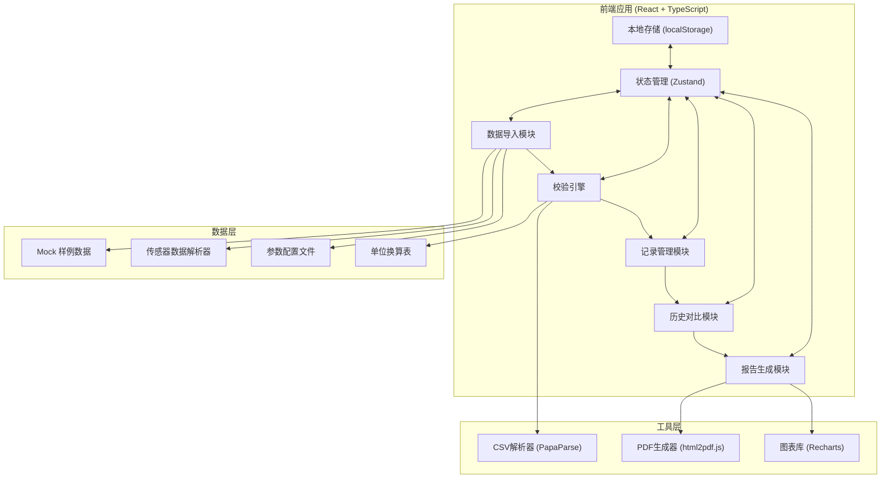
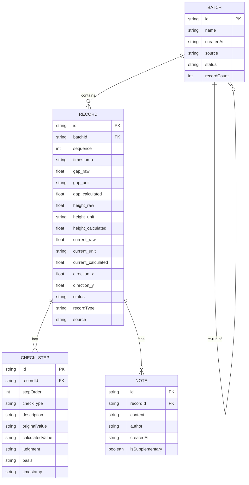

## 1. 架构设计



## 2. 技术描述

- **前端框架**：React@18 + TypeScript@5
- **构建工具**：Vite@5
- **样式方案**：TailwindCSS@3 + CSS变量
- **状态管理**：Zustand@4（轻量级，适合本地应用）
- **路由管理**：React Router@6
- **UI组件**：Radix UI 基础组件 + 自定义工业风格组件
- **数据解析**：PapaParse（CSV解析）
- **图表展示**：Recharts@2
- **PDF导出**：html2pdf.js
- **数据持久化**：localStorage（版本历史、备注记录）
- **后端**：无（纯前端应用，数据全部在本地处理）
- **数据库**：无（使用localStorage存储历史记录）

---

## 3. 路由定义

| 路由路径 | 页面名称 | 用途 |
|----------|----------|------|
| `/` | 数据导入页 | 上传数据、加载样例、数据预览 |
| `/tuning` | 调参主流程页 | 校验仪表盘、记录列表、批量操作 |
| `/record/:id` | 记录详情页 | 判断过程、人工确认、备注补录 |
| `/compare/:batchId` | 历史对比页 | 版本并排对比、差异高亮 |
| `/report/:batchId` | 交接报告页 | 报告摘要、差异说明、导出 |

---

## 4. 数据模型

### 4.1 数据模型定义



### 4.2 核心类型定义

```typescript
// 记录类型
type RecordType = 'smooth' | 'pending' | 'old_caliber';
type RecordStatus = 'pending' | 'confirmed' | 'rejected' | 'auto_pass';
type CheckType = 'unit' | 'direction' | 'interval' | 'range';

// 传感器记录
interface SensorRecord {
  id: string;
  batchId: string;
  sequence: number;
  timestamp: string;
  timeSinceLast: number; // 与上条记录的时间间隔(ms)
  
  // 轨道间隙
  gap: {
    raw: number;
    unit: string;
    calculated: number; // 统一换算为mm
  };
  
  // 悬浮高度
  height: {
    raw: number;
    unit: string;
    calculated: number; // 统一换算为mm
  };
  
  // 推进电流
  current: {
    raw: number;
    unit: string;
    calculated: number; // 统一换算为A
  };
  
  // 方向偏移
  direction: {
    x: number; // +向右 -向左
    y: number; // +向上 -向下
  };
  
  status: RecordStatus;
  recordType: RecordType;
  source: string; // 数据来源：sensor/wechat/manual
  checkSteps: CheckStep[];
  notes: Note[];
}

// 校验步骤
interface CheckStep {
  id: string;
  stepOrder: number;
  checkType: CheckType;
  title: string;
  description: string;
  originalValue: string;
  calculatedValue: string;
  judgment: 'pass' | 'warning' | 'error';
  basis: string; // 判断依据
  suggestion: string; // 处理建议
  timestamp: string;
}

// 备注
interface Note {
  id: string;
  content: string;
  author: string;
  createdAt: string;
  isSupplementary: boolean; // 是否为补录备注
  diff?: {
    field: string;
    oldValue: string;
    newValue: string;
  };
}

// 批次
interface Batch {
  id: string;
  name: string;
  createdAt: string;
  updatedAt: string;
  source: string;
  status: 'processing' | 'completed' | 'archived';
  records: SensorRecord[];
  parentBatchId?: string; // 重跑时关联原批次
}

// 校验结果
interface ValidationResult {
  unitCheck: { pass: number; total: number; warnings: string[] };
  directionCheck: { pass: number; total: number; warnings: string[] };
  intervalCheck: { pass: number; total: number; warnings: string[] };
  rangeCheck: { pass: number; total: number; warnings: string[] };
}
```

---

## 5. 核心算法

### 5.1 单位换算引擎

```typescript
const UNIT_CONVERSIONS = {
  length: {
    mm: { toBase: 1 },
    cm: { toBase: 10 },
    m: { toBase: 1000 },
    μm: { toBase: 0.001 },
    inch: { toBase: 25.4 },
  },
  current: {
    A: { toBase: 1 },
    mA: { toBase: 0.001 },
    kA: { toBase: 1000 },
  },
};

function convertUnit(
  value: number,
  fromUnit: string,
  toUnit: string,
  category: 'length' | 'current'
): number {
  const table = UNIT_CONVERSIONS[category];
  const baseValue = value * table[fromUnit].toBase;
  return baseValue / table[toUnit].toBase;
}
```

### 5.2 方向符号校验

```typescript
function checkDirection(
  record: SensorRecord,
  index: number
): CheckStep {
  const { x, y } = record.direction;
  let judgment: 'pass' | 'warning' | 'error' = 'pass';
  let suggestion = '';
  let description = `X方向: ${x > 0 ? '+' : ''}${x.toFixed(2)}mm, Y方向: ${y > 0 ? '+' : ''}${y.toFixed(2)}mm`;

  if (x < -2) {
    judgment = 'warning';
    suggestion = `第${index + 1}条记录X方向偏移${x.toFixed(2)}mm（向左），请检查轨道左侧导向轮间隙。`;
  } else if (x > 2) {
    judgment = 'warning';
    suggestion = `第${index + 1}条记录X方向偏移${x.toFixed(2)}mm（向右），请检查轨道右侧导向轮间隙。`;
  }

  if (y < -1) {
    judgment = judgment === 'warning' ? 'error' : 'warning';
    suggestion += ` Y方向偏低${Math.abs(y).toFixed(2)}mm，建议增加悬浮电流0.2A。`;
  } else if (y > 3) {
    judgment = judgment === 'warning' ? 'error' : 'warning';
    suggestion += ` Y方向偏高${y.toFixed(2)}mm，建议降低悬浮电流0.15A。`;
  }

  return {
    checkType: 'direction',
    judgment,
    description,
    suggestion,
    basis: 'X方向±2mm以内正常，Y方向-1mm~+3mm正常',
  };
}
```

### 5.3 时间间隔校验

```typescript
const EXPECTED_INTERVAL = 100; // ms
const TOLERANCE = 10; // ±10ms

function checkTimeInterval(
  current: SensorRecord,
  previous: SensorRecord | null,
  index: number
): CheckStep {
  if (!previous) {
    return {
      checkType: 'interval',
      judgment: 'pass',
      description: '首条记录，无前置时间对比',
      suggestion: '',
      basis: '',
    };
  }

  const interval = current.timeSinceLast;
  const diff = Math.abs(interval - EXPECTED_INTERVAL);
  let judgment: 'pass' | 'warning' | 'error' = 'pass';
  let suggestion = '';

  if (diff > TOLERANCE) {
    judgment = interval > EXPECTED_INTERVAL ? 'warning' : 'error';
    if (interval > EXPECTED_INTERVAL) {
      suggestion = `第${index}条与${index + 1}条记录间隔${interval}ms，超出正常范围${EXPECTED_INTERVAL}±${TOLERANCE}ms，可能存在数据丢包。`;
    } else {
      suggestion = `第${index}条与${index + 1}条记录间隔${interval}ms，采样过于密集，请检查传感器触发设置。`;
    }
  }

  return {
    checkType: 'interval',
    judgment,
    description: `与上条记录间隔: ${interval}ms`,
    suggestion,
    basis: `正常采样间隔: ${EXPECTED_INTERVAL}±${TOLERANCE}ms`,
  };
}
```

### 5.4 差异对比算法

```typescript
function compareRecords(
  oldRecord: SensorRecord,
  newRecord: SensorRecord
): Difference[] {
  const differences: Difference[] = [];
  const fields = ['gap.calculated', 'height.calculated', 'current.calculated', 'direction.x', 'direction.y'];

  for (const field of fields) {
    const oldVal = get(oldRecord, field);
    const newVal = get(newRecord, field);
    if (Math.abs(oldVal - newVal) > 0.001) {
      differences.push({
        field,
        oldValue: oldVal,
        newValue: newVal,
        change: newVal - oldVal,
        changePercent: ((newVal - oldVal) / oldVal) * 100,
      });
    }
  }

  return differences;
}
```

---

## 6. 项目结构

```
src/
├── components/          # 通用组件
│   ├── Dashboard/       # 仪表盘组件
│   ├── RecordCard/      # 记录卡片
│   ├── CheckTimeline/   # 校验时间线
│   ├── DiffViewer/      # 差异查看器
│   └── GaugeChart/      # 仪表盘图表
├── pages/               # 页面组件
│   ├── ImportPage.tsx
│   ├── TuningPage.tsx
│   ├── RecordDetailPage.tsx
│   ├── ComparePage.tsx
│   └── ReportPage.tsx
├── store/               # 状态管理
│   └── useBatchStore.ts
├── utils/               # 工具函数
│   ├── unitConverter.ts
│   ├── validator.ts
│   ├── diffEngine.ts
│   └── mockData.ts
├── types/               # 类型定义
│   └── index.ts
├── hooks/               # 自定义hooks
│   ├── useValidation.ts
│   └── useHistory.ts
├── App.tsx
├── main.tsx
└── index.css
```
