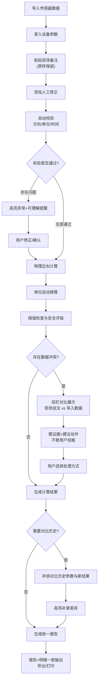

## 1. 产品概述

校园投石机安全试算工具，专为训练教练设计，整合物理近似计算、单位自动换算、安全阈值提醒与标准化报告生成。解决现场测量数据单位混乱、人工核对繁琐、备注信息易丢失等痛点，让老唐不用再手工对第二遍。

- 核心价值：保留原始现场数据的完整性，自动处理脏数据，冲突透明呈现，业务级处理建议
- 目标用户：训练教练、安全管理人员、现场操作人员

## 2. 核心功能

### 2.1 用户角色

| 角色 | 注册方式 | 核心权限 |
|------|---------|----------|
| 训练教练 | 本地直接使用 | 数据导入、参数配置、试算执行、报告生成、历史对比 |
| 安全管理员 | 本地直接使用 | 阈值配置、报告审核、数据导出 |

### 2.2 功能模块

1. **数据导入看板**：传感器数据导入、设备参数录入、现场备注上传、人工修正录入
2. **安全试算引擎**：物理近似计算、单位自动换算、冲突检测与呈现、脏数据处理
3. **实时校验面板**：方向符号检查、单位合法性检查、时间间隔校验、阈值预警
4. **历史对比中心**：历史参数并排对比、补录差异高亮、版本追溯
5. **报告生成台**：统一报告模板、明细与报告一致性、可打印/导出

### 2.3 页面详情

| 页面名称 | 模块名称 | 功能描述 |
|---------|---------|----------|
| 主工作台 | 数据导入区 | 拖拽上传传感器CSV、手动录入设备参数、粘贴现场备注、添加人工修正行，原始备注原样保留不清洗 |
| 主工作台 | 试算配置区 | 选择物理模型、配置安全阈值、设置单位偏好、启用/禁用自动修正 |
| 主工作台 | 实时校验区 | 方向符号异常高亮、单位不匹配提醒、时间间隔过大/过小警告、阈值突破红色预警 |
| 主工作台 | 计算结果区 | 物理量计算结果展示、单位换算对照表、安全等级评定、业务化处理建议 |
| 主工作台 | 冲突处理区 | 现场照片说法 vs 导入数据双栏对比、证据链展示、可选处理动作建议、不自动替用户决策 |
| 历史对比页 | 版本选择器 | 选择多批历史数据、按时间/批次筛选、标记对比基准 |
| 历史对比页 | 并排对比表 | 参数新旧值对比、差异高亮显示、补录备注溯源、计算结果偏差分析 |
| 历史对比页 | 差异说明区 | 自动生成差异描述、记录人工干预过程、保留操作时间戳 |
| 报告预览页 | 报告模板区 | 标准化安全报告格式、嵌入原始备注、计算明细与报告结论一致 |
| 报告预览页 | 导出操作区 | PDF打印、CSV导出、报告存档、一键打印 |

## 3. 核心流程

用户导入传感器数据 → 录入设备参数 → 粘贴现场备注（原样保留） → 添加人工修正 → 系统自动校验（方向/单位/时间） → 执行物理近似计算 → 单位自动换算 → 阈值检查与提醒 → 冲突数据双栏呈现 → 用户确认处理方式 → 生成安全报告 → 可选择与历史版本对比 → 导出/打印报告

## 4. 用户界面设计

### 4.1 设计风格

**工业工程图纸风格**，专业可靠兼具温度：
- 主色调：工程蓝 `#1E40AF` + 警示橙 `#F97316` + 安全绿 `#10B981` + 危险红 `#EF4444`
- 背景：浅灰底 `#F8FAFC` + 细网格纹理，营造工程图纸感
- 按钮风格：硬朗直角、轻微立体阴影、状态色边框
- 字体：显示字体用 `JetBrains Mono`（工程数字清晰），正文字体用 `Noto Sans SC`（中文易读）
- 布局：卡片分区 + 细边框分割 + 工程图纸式标注线
- 图标风格：线性工程图标 + 状态色圆点指示灯

### 4.2 页面设计概述

| 页面名称 | 模块名称 | UI元素 |
|---------|---------|--------|
| 主工作台 | 数据导入区 | 拖拽上传虚线框、参数输入网格、备注原始文本框（等宽字体）、修正行可添加 |
| 主工作台 | 实时校验区 | 左侧问题列表（带严重程度图标）、右侧定位箭头、点击跳转对应数据行、人类可读提醒文案 |
| 主工作台 | 计算结果区 | 大号工程数字显示、单位切换下拉、安全等级色卡、处理建议卡片（口语化业务语气） |
| 主工作台 | 冲突处理区 | 左右双栏布局、中间对比箭头、证据项时间戳、建议动作按钮组 |
| 历史对比页 | 并排对比表 | 左右两列对应、差异行黄底高亮、变更追溯标签、鼠标悬停显示历史值 |
| 报告预览页 | 报告模板区 | A4纸张模拟、页眉工程图框、数据表格规整、原始备注以引用框保留 |

### 4.3 响应式

- Desktop-first设计，主工作台1440px最佳显示
- 平板端：侧栏收起为图标菜单，数据区两栏变单栏
- 移动端：卡片垂直堆叠，关键数据优先展示
- 触摸优化：按钮最小44px，表格支持横向滑动

### 4.4 动效设计

- 页面加载：分区淡入（0.3s stagger），工程图纸展开感
- 数据校验：异常项脉冲高亮（红色呼吸灯），提醒滑入
- 计算完成：结果数字滚动动画（0.8s ease-out）
- 冲突发现：双栏对比滑入效果，中间VS图标旋转出现
- 历史对比：差异项淡入高亮，时间线绘制动画
