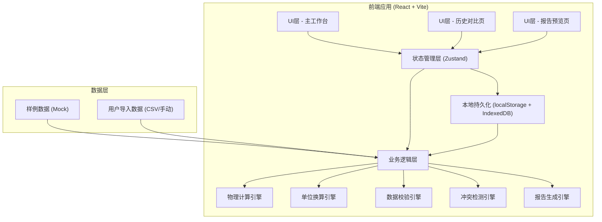
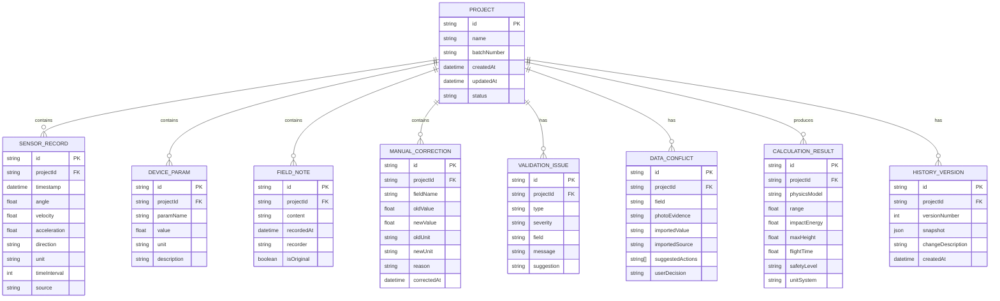

## 1. 架构设计

纯前端单页应用，数据本地持久化存储，无后端依赖。

## 2. 技术描述

- **前端框架**: React@18 + TypeScript@5
- **构建工具**: Vite@5
- **样式方案**: TailwindCSS@3 + CSS变量
- **状态管理**: Zustand@4（轻量，适合本地工具）
- **UI组件库**: 自研工业风组件（避免通用AI审美）
- **图标**: Lucide React（线性工程风格）
- **图表**: Recharts（工程数据可视化）
- **本地存储**: localStorage（配置）+ IndexedDB（历史数据）
- **CSV解析**: Papa Parse
- **PDF打印**: 原生window.print + 打印样式
- **后端**: 无，纯前端本地应用
- **数据库**: 无，本地持久化

## 3. 路由定义

| 路由 | 页面 | 用途 |
|-----|------|------|
| `/` | 主工作台 | 数据导入、校验、计算、冲突处理 |
| `/history` | 历史对比 | 多版本并排对比、差异分析 |
| `/report/:id` | 报告预览 | 标准化报告查看、打印、导出 |

## 4. 数据模型

### 4.1 核心数据结构

### 4.2 物理计算模型

1. **平抛模型**（默认）:
   - 射程: R = v₀ * cos(θ) * [v₀*sin(θ) + √(v₀²*sin²(θ) + 2gh)] / g
   - 最大高度: H = h + (v₀²*sin²(θ)) / (2g)
   - 飞行时间: t = [v₀*sin(θ) + √(v₀²*sin²(θ) + 2gh)] / g

2. **冲量能量计算**:
   - 动能: E = ½mv²
   - 冲量: I = mΔv

3. **安全阈值**:
   - 低风险: E < 10J
   - 中风险: 10J ≤ E < 50J
   - 高风险: 50J ≤ E < 200J
   - 危险: E ≥ 200J

### 4.3 单位换算支持

| 物理量 | 支持单位 | 换算系数 |
|--------|---------|---------|
| 长度 | 米(m), 厘米(cm), 毫米(mm), 英尺(ft), 英寸(in) | 1m = 100cm = 1000mm = 3.2808ft = 39.37in |
| 速度 | m/s, km/h, ft/s, mph | 1m/s = 3.6km/h = 3.2808ft/s = 2.2369mph |
| 角度 | 度(°), 弧度(rad) | π rad = 180° |
| 质量 | 千克(kg), 克(g), 磅(lb) | 1kg = 1000g = 2.2046lb |
| 能量 | 焦耳(J), 千焦(kJ), 卡(cal) | 1J = 0.001kJ = 0.239cal |
| 时间 | 秒(s), 毫秒(ms) | 1s = 1000ms |

## 5. 核心引擎设计

### 5.1 数据校验引擎

检查项：
- 方向符号：仅允许 'N','S','E','W','NE','NW','SE','SW' 或角度值
- 单位合法性：与物理量匹配的单位列表
- 时间间隔：合理范围 10ms - 60s，异常值提醒
- 数值范围：角度 -90°~90°，速度非负等
- 格式校验：数值可解析性

### 5.2 冲突检测引擎

检测规则：
- 现场备注中提到的数值与导入数据偏差 > 10%
- 单位描述不一致（如备注说"米"但数据单位是"英尺"）
- 方向描述矛盾（备注说"向东"但数据方向是"270°"）
- 同一参数多来源冲突

### 5.3 脏数据处理策略

- 缺失值：标记为"待补充"，不自动填充
- 明显异常值（如速度>300m/s）：高亮但保留原值，给出建议
- 格式混乱：原样保留，在备注区标注"格式待确认"
- 时间戳乱序：按记录顺序保留，给出时间线异常提醒

### 5.4 历史对比逻辑

- 版本快照：每次计算生成完整数据快照
- 差异对比：字段级精确对比，标注变化类型（新增/修改/删除）
- 补录识别：检测后续添加的备注或修正，特殊标记
- 并排展示：左右两列同步滚动

## 6. 开发规范

- 组件命名：PascalCase，按功能分组（features/）
- 工具函数：按领域划分（physics/, units/, validation/）
- 状态管理：单一store，按领域切片
- 样式：TailwindCSS原子类为主，复杂动画用CSS变量
- 类型：全量TypeScript，禁止any
- Mock数据：内置3套样例（正常/脏数据/冲突数据）
