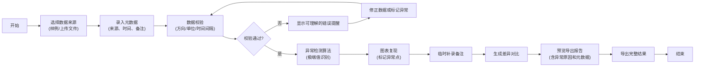

## 1. 产品概述

游乐设施离心力提醒数据分析工具，解决维修数据复盘时极端值被平均掩盖风险的问题。面向项目助理等非技术人员，提供从原始数据到异常判定的完整流程，确保风险可追溯、结果可复现。

- 核心问题：维修微信群数据复盘时，极端值被平均后风险不可见
- 目标用户：项目助理（如小宋）、安全审核人员、后续接手人员
- 产品价值：让离心力异常从样例数据一路走到可验证的判定结果

## 2. 核心功能

### 2.1 用户角色
| 角色 | 使用场景 | 核心需求 |
|------|----------|----------|
| 项目助理 | 日常数据处理、补录备注 | 快速导入、清晰的异常提示、可导出结果 |
| 审核人员 | 复盘、风险确认 | 可追溯数据源、处理时间、判定依据 |
| 接手人员 | 交接后了解历史 | 完整的元数据、差异对比说明 |

### 2.2 功能模块
1. **数据导入页**：支持实验表上传、照片说明、工况记录，包含样例数据一键加载
2. **数据分析页**：数据校验、异常检测算法、实时图表复现
3. **结果导出页**：异常原因说明、差异对比、完整元数据导出
4. **使用说明页**：样例运行指南、参数修改、失败原因排查

### 2.3 页面详情
| 页面名称 | 模块名称 | 功能描述 |
|---------|----------|----------|
| 数据导入页 | 文件上传区 | 支持CSV/Excel上传，拖拽或点击选择 |
| 数据导入页 | 样例加载 | 一键加载"游乐设施离心力提醒"小样例数据 |
| 数据导入页 | 元数据录入 | 原始来源、处理时间、备注补录 |
| 数据分析页 | 数据校验 | 方向符号、单位、时间间隔自动检查，错误高亮提醒 |
| 数据分析页 | 异常检测 | 极端值识别、防止平均掩盖风险的算法 |
| 数据分析页 | 图表复现 | 时间序列图、异常点标记、原始数据vs处理后对比 |
| 数据分析页 | 备注补录 | 临时添加备注，记录差异原因 |
| 结果导出页 | 导出预览 | 完整报告预览，包含异常原因、判定依据 |
| 结果导出页 | 差异对比 | 补录前后数据对比，差异原因清晰说明 |
| 使用说明页 | 运行指南 | 步骤说明：怎么跑样例、怎么改参数 |
| 使用说明页 | 故障排查 | 常见失败原因及解决方法 |

## 3. 核心流程

用户从导入数据开始，经过校验和分析，最终导出带完整说明的报告。

## 4. 用户界面设计

### 4.1 设计风格
- **主色调**：工业蓝 (#1e3a5f)，代表专业、安全、可靠
- **辅助色**：警示橙 (#f59e0b) 用于异常提醒，成功绿 (#10b981) 用于正常状态，危险红 (#ef4444) 用于严重异常
- **按钮风格**：圆角矩形，微妙阴影，hover时有轻微上浮效果
- **字体**：标题使用 Noto Sans SC 粗体，正文使用系统无衬线字体，确保中文可读性
- **布局风格**：卡片式布局，清晰的信息层级，左侧导航 + 主内容区
- **图标风格**：线性图标，工业风格，避免过度卡通化

### 4.2 页面设计概述
| 页面名称 | 模块名称 | UI元素 |
|---------|----------|--------|
| 数据导入页 | 上传区 | 虚线边框拖拽区，大上传按钮，文件列表 |
| 数据导入页 | 样例卡 | 突出显示的卡片，一键加载按钮，样例说明 |
| 数据分析页 | 校验面板 | 状态徽章（正常/警告/错误），详细错误说明 |
| 数据分析页 | 图表区 | 大尺寸折线图，异常点用红色圆点高亮，可悬停查看详情 |
| 数据分析页 | 数据表格 | 斑马纹，异常行背景色，支持排序筛选 |
| 结果导出页 | 报告预览 | 仿纸张效果，打印友好，可折叠章节 |
| 使用说明页 | 步骤指南 | 编号步骤，代码块，高亮提示框 |

### 4.3 响应式
- 桌面端优先设计，适配 1280px 及以上
- 平板端：导航折叠为侧边栏菜单
- 移动端：图表自适应宽度，表格横向滚动
- 触摸优化：按钮最小 44x44px，足够的点击间距

### 4.4 动效设计
- 页面加载：内容淡入，元素依次出现（animation-delay）
- 数据校验：状态切换时有平滑过渡动画
- 图表渲染：线条从左到右绘制，异常点弹跳出现
- 异常提醒：轻微震动效果 + 颜色渐变脉冲
- 悬停效果：卡片轻微上浮，阴影加深
