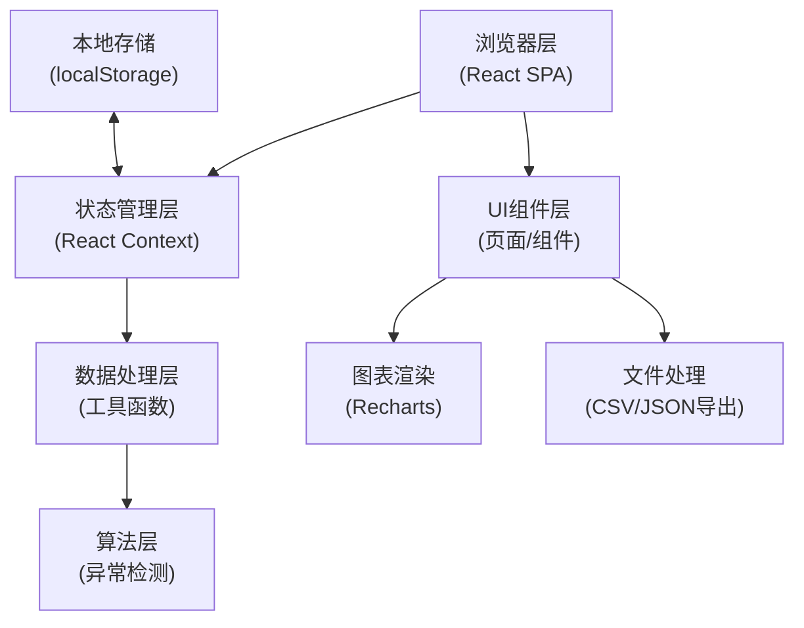

## 1. 架构设计

纯前端单页应用，所有数据处理在浏览器端完成，无需后端服务。



## 2. 技术描述

- **前端框架**: React@18 + TypeScript
- **构建工具**: Vite@5
- **样式方案**: TailwindCSS@3
- **图表库**: Recharts@2
- **图标库**: Lucide React
- **文件处理**: 内置 File API + 自定义 CSV 解析
- **数据持久化**: localStorage (用于保存会话数据)
- **无后端**: 所有计算在浏览器端完成，确保数据隐私

## 3. 路由定义

| 路由 | 页面 | 功能 |
|------|------|------|
| / | 数据导入页 | 选择数据源、加载样例、录入元数据 |
| /analysis | 数据分析页 | 数据校验、异常检测、图表展示 |
| /export | 结果导出页 | 报告预览、差异对比、导出文件 |
| /guide | 使用说明页 | 运行指南、参数说明、故障排查 |

## 4. 数据模型

### 4.1 核心数据结构

```typescript
// 离心力数据点
interface DataPoint {
  id: string;
  timestamp: number;      // 时间戳 (ms)
  timeLabel: string;      // 显示时间
  centrifugalForce: number; // 离心力值 (N)
  direction: 'positive' | 'negative' | 'unknown'; // 方向
  unit: string;           // 单位
  isAnomaly?: boolean;    // 是否异常
  anomalyReason?: string; // 异常原因
}

// 数据源元数据
interface Metadata {
  source: string;         // 原始来源 (如: 微信群记录/实验表)
  processedAt: number;    // 处理时间
  processor: string;      // 处理人 (如: 项目助理小宋)
  remarks: string;        // 备注
  supplementaryNote?: string; // 临时补录备注
}

// 校验结果
interface ValidationResult {
  isValid: boolean;
  errors: ValidationError[];
  warnings: ValidationWarning[];
}

interface ValidationError {
  type: 'direction' | 'unit' | 'time_interval' | 'missing_value';
  rowIndex: number;
  message: string;
  suggestion: string;
}

interface ValidationWarning {
  type: string;
  rowIndex?: number;
  message: string;
}

// 异常检测配置
interface AnomalyConfig {
  method: 'iqr' | 'zscore' | 'threshold';
  iqrMultiplier: number;  // 默认 1.5
  zscoreThreshold: number; // 默认 3.0
  manualThreshold?: { min: number; max: number };
}

// 完整分析会话
interface AnalysisSession {
  id: string;
  name: string;
  createdAt: number;
  updatedAt: number;
  dataPoints: DataPoint[];
  metadata: Metadata;
  validation: ValidationResult;
  anomalyConfig: AnomalyConfig;
  hasSupplementaryNote: boolean;
  dataBeforeSupplementary?: DataPoint[];
}
```

### 4.2 样例数据格式

```csv
时间,离心力(N),方向,单位,备注
2024-01-15 08:00:00,1250,正,N,正常运行
2024-01-15 08:00:05,1280,正,N,正常运行
2024-01-15 08:00:10,1310,正,N,正常运行
2024-01-15 08:00:15,2850,正,N,⚠️ 极端值
2024-01-15 08:00:20,1270,正,N,恢复正常
2024-01-15 08:00:25,1240,正,N,正常运行
```

## 5. 核心算法

### 5.1 异常检测算法

**IQR 方法 (四分位距法)**:
```
Q1 = 第25百分位数
Q3 = 第75百分位数
IQR = Q3 - Q1
下界 = Q1 - multiplier * IQR
上界 = Q3 + multiplier * IQR
超出范围即为异常
```

**Z-Score 方法**:
```
均值 = μ
标准差 = σ
Z = (X - μ) / σ
|Z| > threshold 即为异常
```

### 5.2 防止"极端值被平均"策略

- 检测前不做任何平滑或平均处理
- 异常标记基于原始数据点
- 图表同时显示：原始数据点 + 移动平均线（仅作参考，不影响判定）
- 导出报告中明确标注：哪些是原始数据、哪些是统计值

## 6. 导出格式

### 6.1 JSON 导出（完整数据）
包含所有元数据、原始数据、校验结果、异常标记、补录备注

### 6.2 CSV 导出（数据表）
原始数据 + 异常标记列 + 异常原因列

### 6.3 HTML 报告（打印友好）
- 基本信息（来源、处理时间、处理人）
- 异常摘要（数量、最严重值）
- 图表截图（使用 canvas 导出）
- 数据表格
- 补录备注及差异对比
- 使用说明摘要
