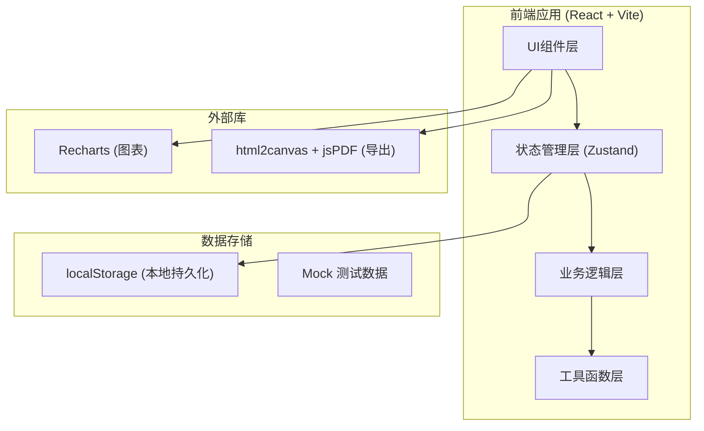
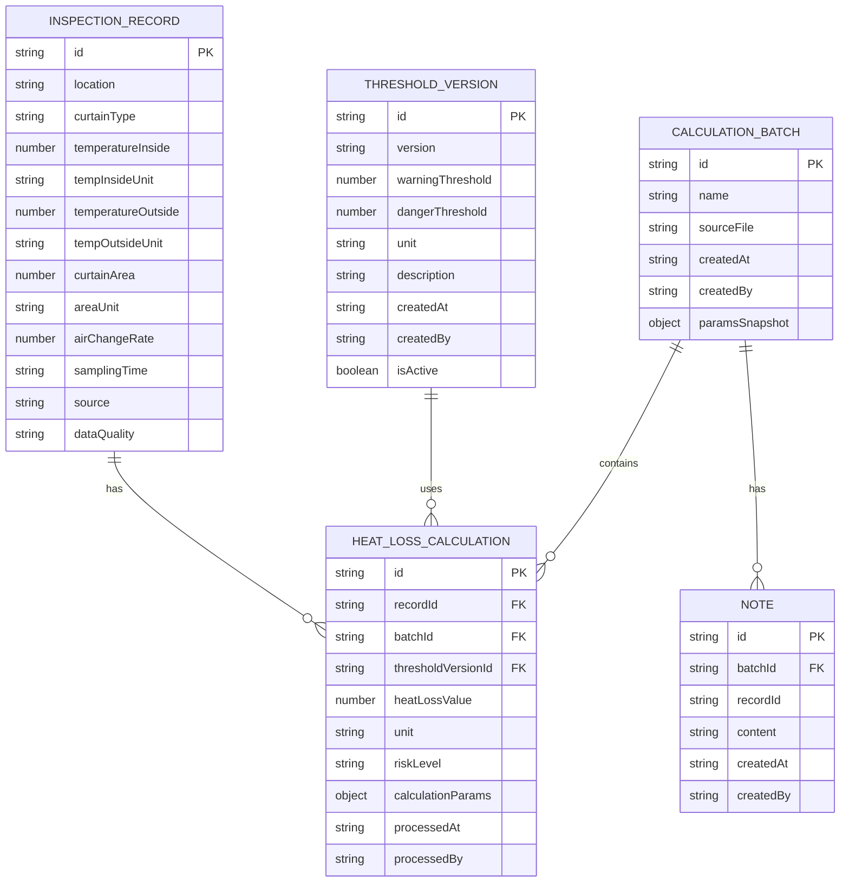

## 1. 架构设计



## 2. 技术选型说明

- **前端框架**: React@18 + TypeScript - 类型安全，组件化开发
- **构建工具**: Vite@5 - 快速开发体验
- **样式方案**: TailwindCSS@3 - 原子化CSS，高效开发
- **状态管理**: Zustand - 轻量级状态管理，适合中小型应用
- **图表库**: Recharts - React生态图表库，性能优秀
- **导出功能**: html2canvas + jsPDF - 客户端PDF导出
- **数据持久化**: localStorage - 本地存储，无需后端服务

## 3. 路由定义

| 路由 | 页面/组件 | 功能说明 |
|-------|-----------|----------|
| / | 主计算面板 | 数据导入、参数配置、实时计算、结果展示 |
| /history | 历史对比页面 | 批次选择、双栏对比、差异分析 |
| /report | 报告导出页面 | 报告预览、处理建议、PDF/Excel导出 |

## 4. 数据模型

### 4.1 核心数据结构



### 4.2 TypeScript 类型定义

```typescript
// 巡检记录
interface InspectionRecord {
  id: string;
  location: string;
  curtainType: string;
  temperatureInside: number | null;
  tempInsideUnit: string;
  temperatureOutside: number | null;
  tempOutsideUnit: string;
  curtainArea: number | null;
  areaUnit: string;
  airChangeRate: number | null;
  samplingTime: string;
  source: string;
  dataQuality: 'good' | 'missing' | 'unit_mismatch' | 'outlier';
  dataIssues: string[];
}

// 热损失计算结果
interface HeatLossResult {
  id: string;
  recordId: string;
  batchId: string;
  thresholdVersionId: string;
  heatLossValue: number;
  unit: string;
  riskLevel: 'normal' | 'warning' | 'danger';
  calculationParams: CalculationParams;
  processedAt: string;
  processedBy: string;
}

// 计算参数
interface CalculationParams {
  airDensity: number;           // kg/m³
  specificHeatCapacity: number; // kJ/(kg·°C)
  heatTransferCoeff: number;    // W/(m²·°C)
  openingTimeFactor: number;    // 开门时间系数
}

// 阈值版本
interface ThresholdVersion {
  id: string;
  version: string;
  warningThreshold: number;
  dangerThreshold: number;
  unit: string;
  description: string;
  createdAt: string;
  createdBy: string;
  isActive: boolean;
}

// 计算批次
interface CalculationBatch {
  id: string;
  name: string;
  sourceFile?: string;
  createdAt: string;
  createdBy: string;
  paramsSnapshot: CalculationParams;
  thresholdVersionId: string;
  recordCount: number;
}
```

## 5. 核心业务逻辑

### 5.1 单位换算规则

| 物理量 | 支持单位 | 换算关系 |
|--------|----------|----------|
| 温度 | °C, °F, K | °C = (°F - 32) × 5/9; °C = K - 273.15 |
| 面积 | m², ft² | 1 ft² = 0.092903 m² |
| 热损失 | W, kW, kWh/d | 1 kW = 1000 W; 1 kWh/d = W × 24 / 1000 |

### 5.2 热损失计算公式

采用简化的工程近似公式：

```
Q = k × A × ΔT × f

其中：
- Q: 热损失 (W)
- k: 综合传热系数 (W/(m²·°C))，默认值 3.5
- A: 门帘面积 (m²)
- ΔT: 库内外温差 (°C)
- f: 开门时间系数，默认值 0.15
```

### 5.3 数据质量检测规则

1. **采样缺口检测**：检测必填字段是否为空
2. **单位混写检测**：识别不规范的单位表示
3. **异常值检测**：基于3σ原则检测数值异常

## 6. 模块划分

```
src/
├── components/          # UI组件
│   ├── DataImport/      # 数据导入组件
│   ├── DataQuality/     # 数据质量检测组件
│   ├── Calculation/     # 计算参数与结果组件
│   ├── Threshold/       # 阈值管理组件
│   ├── History/         # 历史对比组件
│   ├── Report/          # 报告生成组件
│   └── common/          # 通用组件
├── stores/              # Zustand状态管理
│   ├── useDataStore.ts
│   ├── useThresholdStore.ts
│   └── useBatchStore.ts
├── utils/               # 工具函数
│   ├── unitConverter.ts
│   ├── heatLossCalc.ts
│   ├── dataQuality.ts
│   └── export.ts
├── types/               # TypeScript类型定义
│   └── index.ts
├── data/                # Mock数据
│   └── mockRecords.ts
└── pages/               # 页面组件
    ├── MainPanel.tsx
    ├── HistoryCompare.tsx
    └── ReportExport.tsx
```
