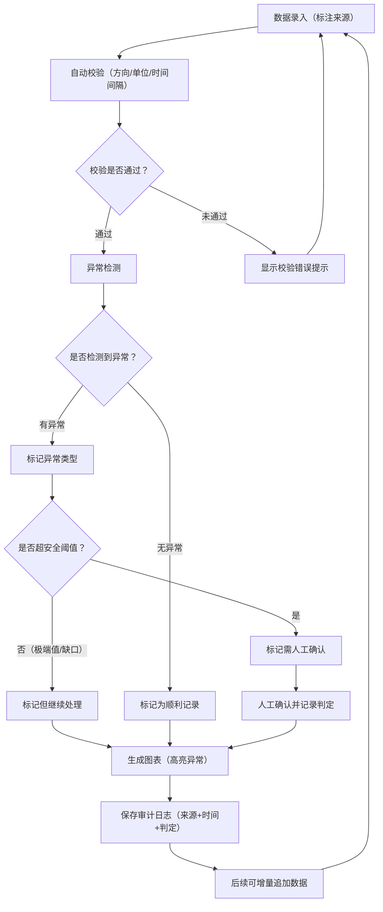

## 1. 产品概述

微重力弹簧实验台数据处理系统——面向项目助理的弹簧实验数据校验、异常检测与可视化平台。解决现场照片原始数据无法直接分析、极端值被平均后风险隐匿、材料来源不可追溯的问题，确保每条记录可追溯至原始来源，异常不被掩盖，后续补充材料时可持续处理。

- 目标用户：项目助理（如小宋），需要频繁处理弹簧实验数据、对接现场照片证据、向团队汇报风险
- 核心价值：消除手工二次核对，保留完整审计链路，换人交接时无需反复追问

## 2. 核心功能

### 2.1 用户角色

| 角色 | 使用方式 | 核心权限 |
|------|----------|----------|
| 项目助理 | 直接使用 | 数据录入、校验、异常确认、图表查看、导出 |

### 2.2 功能模块

1. **数据录入页**：批量粘贴/逐条输入弹簧实验参数，支持标注来源（现场照片编号、手工记录等）
2. **校验与异常页**：自动校验方向符号、单位、时间间隔；检测采样缺口、超阈值记录；极端值不被平均
3. **图表可视化页**：弹簧实验数据折线图/散点图复现，高亮异常点和安全阈值线
4. **审计追踪页**：每条记录的原始来源、处理时间、判定结果，支持增量追加

### 2.3 页面详情

| 页面名称 | 模块名称 | 功能描述 |
|----------|----------|----------|
| 数据录入页 | 批量数据输入 | 粘贴或逐条输入实验参数（弹簧刚度、位移、力、时间戳），标注数据来源 |
| 数据录入页 | 单位与格式预处理 | 自动识别混写单位（如"mm"与"cm"混用），统一转换；提示方向符号异常 |
| 校验与异常页 | 自动校验 | 检查方向符号一致性、单位正确性、时间间隔均匀性、采样缺口检测 |
| 校验与异常页 | 异常检测 | 识别超出安全阈值的记录、极端值单独标记（不参与平均）、需人工确认项 |
| 校验与异常页 | 人工确认 | 标记"需人工确认"的记录，可补充判定意见和修正值 |
| 图表可视化页 | 实验数据图表 | 折线图展示弹簧力-位移关系，散点图展示时间序列，标注安全阈值线和异常点 |
| 图表可视化页 | 图表复现 | 基于已有数据一键复现图表，确保可重复性 |
| 审计追踪页 | 来源追溯 | 每条记录显示原始来源（现场照片编号/手工记录等）、录入时间、处理时间 |
| 审计追踪页 | 增量追加 | 后续补充材料时可直接追加，不破坏已有判定 |
| 审计追踪页 | 交接说明 | 显示每条记录的判定依据，换人可看懂前次判断 |

## 3. 核心流程

1. 项目助理将现场照片中的数据录入系统（标注来源）
2. 系统自动校验方向符号、单位、时间间隔，生成校验报告
3. 系统检测异常：采样缺口、超阈值、极端值
4. 异常记录分为"自动通过"和"需人工确认"两类
5. 项目助理对需确认项给出判定
6. 系统生成可复现的图表，高亮异常
7. 所有操作保留审计日志，后续可增量追加

## 4. 用户界面设计

### 4.1 设计风格

- **主色调**：深空蓝（#0F172A）+ 微重力橙（#F97316）作为警示强调色 + 冷白前景
- **辅助色**：深灰面板（#1E293B）、安全绿（#22C55E）表示通过、警告黄（#EAB308）表示需确认
- **按钮风格**：圆角矩形，微重力橙为操作按钮主色，灰色为辅助操作
- **字体**：JetBrains Mono 用于数据/数字展示，Noto Sans SC 用于中文界面
- **布局风格**：左侧导航 + 右侧内容区，卡片式模块布局
- **图标**：使用 lucide-react 图标库

### 4.2 页面设计概览

| 页面名称 | 模块名称 | UI 元素 |
|----------|----------|----------|
| 数据录入页 | 批量输入区 | 文本区域（粘贴数据）、逐条表单、来源标注下拉、单位选择器、提交按钮 |
| 数据录入页 | 预处理提示 | 内联提示卡片：单位混写警告、方向符号异常提示 |
| 校验与异常页 | 校验结果列表 | 表格：行级状态标记（通过/警告/错误）、可展开详情、筛选器 |
| 校验与异常页 | 异常详情面板 | 侧滑面板：异常描述、建议修正、人工确认按钮、备注输入框 |
| 图表可视化页 | 图表区 | 折线图+散点图、阈值线标注、异常点高亮、时间轴缩放 |
| 图表可视化页 | 图表控制 | 参数选择器、时间范围筛选、导出按钮 |
| 审计追踪页 | 审计列表 | 时间线视图：每条记录的来源、处理时间、判定结果、操作人 |
| 审计追踪页 | 追加入口 | "追加数据"按钮，跳转录入页并保持上下文 |

### 4.3 响应式设计

- 桌面优先设计，1920px 为基准宽度
- 平板（768px-1024px）：侧边栏收起为图标模式
- 移动端（<768px）：单列布局，表格改为卡片列表

### 4.4 3D 场景

不涉及 3D 场景。
