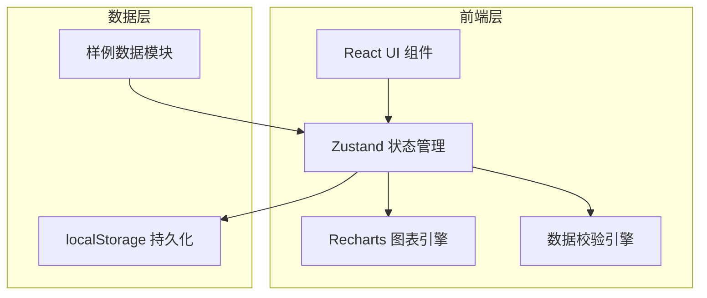
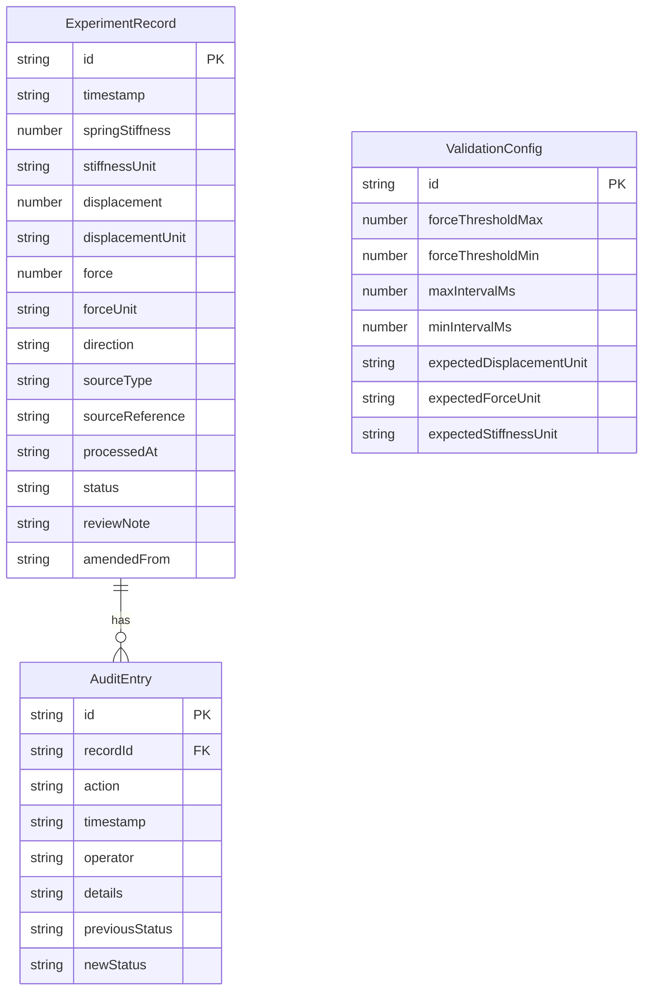

## 1. 架构设计



纯前端架构，无需后端服务。所有数据处理、校验、存储均在前端完成。

## 2. 技术说明

- **前端**：React@18 + TypeScript + Vite + Tailwind CSS@3
- **初始化工具**：vite-init（react-ts 模板）
- **后端**：无（纯前端应用）
- **数据库**：localStorage 持久化 + 内存状态管理
- **图表库**：Recharts（轻量 React 图表库，支持折线图/散点图）
- **图标库**：lucide-react
- **状态管理**：Zustand（含 persist 中间件实现持久化）

## 3. 路由定义

| 路由 | 用途 |
|------|------|
| `/` | 重定向到数据录入页 |
| `/input` | 数据录入页：批量/逐条输入实验参数，标注来源 |
| `/validation` | 校验与异常页：自动校验结果、异常检测、人工确认 |
| `/charts` | 图表可视化页：实验数据图表复现，异常高亮 |
| `/audit` | 审计追踪页：来源追溯、判定记录、增量追加入口 |

## 4. API 定义

无后端 API。前端内部模块接口定义如下：

### 4.1 数据校验引擎接口

```typescript
interface ValidationResult {
  recordId: string
  checks: CheckResult[]
  status: 'pass' | 'warning' | 'error'
}

interface CheckResult {
  type: 'direction' | 'unit' | 'interval' | 'gap' | 'threshold'
  passed: boolean
  message: string
  suggestion?: string
}
```

### 4.2 实验记录接口

```typescript
interface ExperimentRecord {
  id: string
  timestamp: string
  springStiffness: number
  stiffnessUnit: string
  displacement: number
  displacementUnit: string
  force: number
  forceUnit: string
  direction: '+' | '-'
  source: {
    type: 'photo' | 'manual' | 'legacy'
    reference: string
  }
  processedAt: string
  status: 'passed' | 'needs_review' | 'legacy_amended'
  reviewNote?: string
  amendedFrom?: string
}
```

### 4.3 审计日志接口

```typescript
interface AuditEntry {
  id: string
  recordId: string
  action: 'created' | 'validated' | 'reviewed' | 'amended' | 'appended'
  timestamp: string
  operator: string
  details: string
  previousStatus?: string
  newStatus?: string
}
```

## 5. 服务端架构

不涉及。

## 6. 数据模型

### 6.1 数据模型定义



### 6.2 数据定义语言

使用 TypeScript 接口定义 + localStorage JSON 存储，无需 SQL DDL。

**localStorage 键设计：**

| 键名 | 内容 |
|------|------|
| `spring-lab-records` | ExperimentRecord[] |
| `spring-lab-audit` | AuditEntry[] |
| `spring-lab-config` | ValidationConfig |

**样例数据初始化：**

应用首次加载时检测 localStorage 是否为空，若为空则注入三条样例记录：
1. 顺利通过记录（status: 'passed'）
2. 超阈值需人工确认记录（status: 'needs_review'）
3. 从现场照片补录的旧口径记录（status: 'legacy_amended'）
