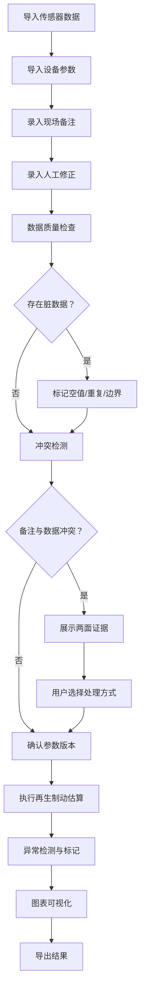

## 1. 产品概述

电动车再生制动估算系统——将实验记录本中的临时凑算流程数字化，确保参数来源可溯、异常不被平均掩盖、人工修正留痕、计算结果与原始材料不脱节。

- **核心问题**：现有流程依赖实验记录本手动拼凑，例外被平均后风险不可见；阈值修改无版本追踪；脏数据（空值、重复、边界）无交代；记录本说法与导入数据冲突时自动拍板
- **目标用户**：电动车制动实验工程师、训练教练（老唐等）做结果交接
- **产品价值**：让再生制动估算从"顺的时候才靠谱"变成"脏材料进来也有交代"，例外与冲突永远留在明面上

## 2. 核心功能

### 2.1 用户角色

| 角色 | 使用方式 | 核心权限 |
|------|----------|----------|
| 实验工程师 | 导入数据、调整阈值、执行估算 | 数据导入、参数修改、估算执行、导出结果 |
| 训练教练 | 审阅结果、历史对比、接收交接 | 查看结果、历史对比、导出交接文档 |

### 2.2 功能模块

1. **数据导入页**：传感器记录导入、设备参数导入、现场备注录入、人工修正录入
2. **估算工作台**：参数配置与版本管理、再生制动估算计算、异常检测与标记、图表可视化
3. **冲突与异常审查页**：数据冲突两面证据展示、脏数据（空值/重复/边界）审查、建议动作列表
4. **历史对比页**：同批数据重跑对比、参数版本并排比较、结果差异标注
5. **导出与交接页**：结果导出（含源材料关联）、交接文档生成

### 2.3 页面详情

| 页面名称 | 模块名称 | 功能描述 |
|----------|----------|----------|
| 数据导入页 | 传感器记录导入 | 支持CSV/JSON格式导入，自动解析时间戳、车速、制动压力、电机转速等字段；导入时即时检测空值、重复行、越界值并标记 |
| 数据导入页 | 设备参数导入 | 导入车辆质量、轮毂半径、传动比、电机特性曲线等设备参数；参数变更自动生成新版本号 |
| 数据导入页 | 现场备注录入 | 按时间戳或区间关联备注文本，支持关键事件标记（如"路面湿滑"、"温度骤降"） |
| 数据导入页 | 人工修正录入 | 记录修正内容、修正原因、修正人；修正后原值保留，修正标记为"人工修正"参与计算 |
| 估算工作台 | 参数配置与版本管理 | 显示当前参数版本号、变更历史；每次阈值修改生成新版本；后续计算标注使用的参数版本 |
| 估算工作台 | 再生制动估算计算 | 基于传感器数据和设备参数计算再生制动力、能量回收率；异常值不被平均，单独标记并纳入统计 |
| 估算工作台 | 异常检测与标记 | 检测超出物理极限值、与趋势严重偏离、与现场备注矛盾的数据点；标记级别：警告/严重/排除 |
| 估算工作台 | 图表可视化 | 制动力-速度曲线、能量回收率时间序列、异常点分布图；图表可基于参数版本复现 |
| 冲突与异常审查页 | 数据冲突展示 | 当实验记录本备注与导入数据冲突时，左右并列展示两边证据，列出建议动作供用户选择 |
| 冲突与异常审查页 | 脏数据审查 | 空值行列表、重复项列表、边界记录列表；每条附处理建议（插值/删除/标记保留/人工确认） |
| 冲突与异常审查页 | 建议动作 | 不自动拍板，提供"使用传感器值"、"使用备注值"、"标记为待确认"、"排除"等选项 |
| 历史对比页 | 同批数据重跑对比 | 选择历史批次，并排展示旧参数与新参数、旧结果与新结果 |
| 历史对比页 | 参数版本比较 | 左右对比两版参数差异，高亮变更项 |
| 历史对比页 | 结果差异标注 | 计算结果差异百分比，异常标记变化对比 |
| 导出与交接页 | 结果导出 | 导出估算结果、图表截图、参数版本快照；所有导出关联源材料批次号 |
| 导出与交接页 | 交接文档生成 | 生成包含参数版本、异常记录、冲突处理决定、估算结论的交接文档 |

## 3. 核心流程

**主估算流程**：导入数据 → 数据质量检查（标记空值/重复/边界）→ 冲突检测（备注 vs 传感器）→ 参数版本确认 → 执行估算 → 异常标记（不平均掉）→ 图表生成 → 结果导出

**冲突处理流程**：发现冲突 → 展示两边证据 → 列出建议动作 → 用户选择 → 记录决定（含选择原因）→ 后续计算使用用户选择

**参数变更流程**：用户修改阈值 → 自动生成新版本号 → 记录变更人与时间 → 后续计算标注使用的参数版本

## 4. 用户界面设计

### 4.1 设计风格

- **主色调**：深灰蓝（#1a2332）为底，配合警示橙（#e67e22）标记异常、确认绿（#27ae60）标记正常
- **辅助色**：中性灰（#6c7a89）用于次要信息，红色（#c0392b）用于严重异常
- **按钮风格**：圆角矩形（8px），主要操作深灰蓝底白字，危险操作红底白字，次要操作灰底深字
- **字体**：数据展示使用等宽字体 JetBrains Mono，界面文本使用 Noto Sans SC
- **布局风格**：左侧固定导航栏 + 右侧工作区，工作区采用卡片式布局
- **图标风格**：线性图标（Lucide），与文字配合使用

### 4.2 页面设计概览

| 页面名称 | 模块名称 | UI 元素 |
|----------|----------|----------|
| 数据导入页 | 传感器记录导入 | 拖拽上传区、字段映射表格、质量检查进度条、问题数据高亮行 |
| 数据导入页 | 设备参数导入 | 参数表单卡片、版本号标签、变更历史折叠面板 |
| 数据导入页 | 现场备注录入 | 时间轴组件、备注输入框、关键事件标签选择 |
| 数据导入页 | 人工修正录入 | 原值/修正值对比卡片、修正原因下拉、修正人标记 |
| 估算工作台 | 参数配置 | 参数卡片组、版本号徽章、变更对比弹窗 |
| 估算工作台 | 估算结果 | 制动力曲线图、能量回收率图、异常点散点图、统计摘要卡片 |
| 冲突与异常审查页 | 冲突展示 | 左右分栏证据卡、建议动作按钮组、决定记录列表 |
| 冲突与异常审查页 | 脏数据审查 | 数据表格（带状态标签）、批量操作工具栏 |
| 历史对比页 | 版本比较 | 左右并排参数表、差异高亮、结果差异折线图 |
| 导出与交接页 | 导出面板 | 格式选择、内容勾选、源材料关联清单、交接文档预览 |

### 4.3 响应式设计

桌面优先设计，数据表格和图表需保证在 1280px 以上宽度最佳展示。移动端仅支持查看导出文档和基础审查操作。

### 4.4 3D 场景指引

不适用
