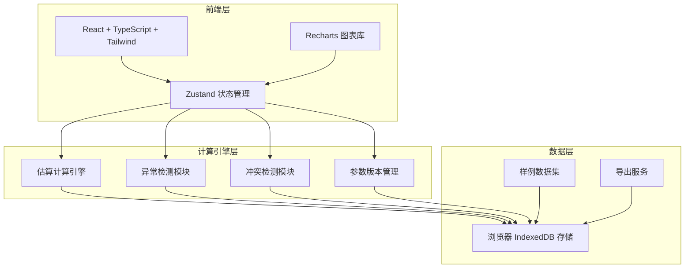
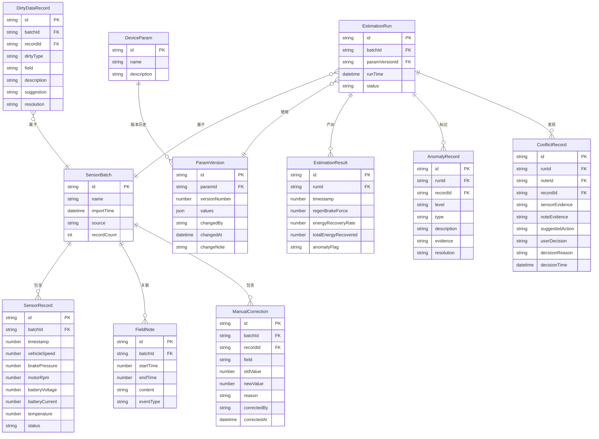

## 1. 架构设计

## 2. 技术说明

- **前端**：React@18 + TypeScript + Tailwind CSS@3 + Vite
- **初始化工具**：vite-init（react-ts 模板）
- **后端**：无（纯前端，数据存储在浏览器 IndexedDB）
- **图表库**：Recharts（React 图表组件库）
- **数据存储**：Dexie.js（IndexedDB 封装库），用于持久化传感器数据、参数版本、估算结果
- **状态管理**：Zustand
- **路由**：react-router-dom
- **导出**：前端生成 CSV/JSON/PDF（使用 jsPDF）

## 3. 路由定义

| 路由 | 用途 |
|------|------|
| `/` | 重定向到数据导入页 |
| `/import` | 数据导入页：传感器记录、设备参数、备注、修正 |
| `/workspace` | 估算工作台：参数配置、估算计算、图表可视化 |
| `/review` | 冲突与异常审查页：冲突证据、脏数据审查 |
| `/compare` | 历史对比页：参数版本并排、结果差异 |
| `/export` | 导出与交接页：结果导出、交接文档 |

## 4. 数据模型

### 4.1 数据模型定义

### 4.2 核心计算逻辑

**再生制动力估算**：
- 制动力 F_regen = (T_motor × η_trans) / R_wheel
- T_motor = f(motorRpm, batteryVoltage, batteryCurrent) — 电机转矩特性查表
- 能量回收率 η_recovery = E_recovered / E_kinetic × 100%
- E_kinetic = 0.5 × m × v²

**异常检测规则**：
- 物理极限检测：车速 > 设计极限、制动力 > 最大制动力
- 趋势偏离检测：连续N个点偏离拟合曲线超过2σ
- 备注矛盾检测：现场备注标记"无制动"但传感器记录有制动压力
- 空值检测：关键字段缺失
- 重复检测：时间戳+车速完全相同的记录
- 边界检测：值等于量程上下限的记录

**冲突检测规则**：
- 备注时间区间内的传感器数据与备注描述不一致
- 人工修正与后续传感器读数矛盾
- 设备参数与传感器测量范围不匹配

## 5. 样例数据设计

样例数据包含以下场景：
1. **正常数据**：30条平滑的制动过程传感器记录
2. **空值记录**：3条关键字段缺失的记录（vehicleSpeed为空、motorRpm为空、batteryVoltage为空）
3. **重复记录**：2条时间戳和所有字段完全重复的记录
4. **边界记录**：1条车速等于设计极限(200km/h)的记录
5. **异常数据**：2条制动力超出物理极限的记录
6. **现场备注**：3条备注（含1条与传感器数据矛盾的备注："第15-18秒无制动操作"）
7. **人工修正**：2条修正记录（修正车速、修正制动力阈值）
8. **设备参数**：2个版本（v1初始参数、v2修改了制动力上限阈值）
