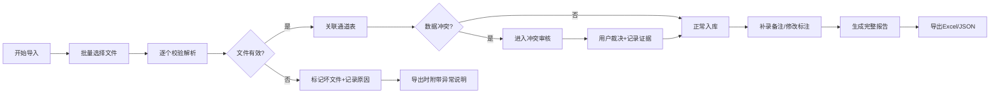

## 1. 产品概述

专为音乐老师林老师打造的音乐版权分成追踪工具，解决舞台通道表中杂乱材料的对账问题。核心价值在于将文件、曲目、批注与异常原因完整串联，替代当前依赖文件夹和聊天记录的低效协作方式。

- **核心目标**：让"脏材料"也能清晰追溯，异常处理有迹可循
- **目标用户**：音乐老师林老师及版权管理相关人员
- **解决痛点**：命名混乱、追踪困难、异常无记录、人工标注易丢失

## 2. 核心功能

### 2.1 用户角色

| 角色 | 注册方式 | 核心权限 |
|------|----------|----------|
| 音乐老师 | 本地使用（无需注册） | 全部功能：导入、审核、标注、导出 |

### 2.2 功能模块

1. **导入面板**：批量文件导入、坏文件隔离、导入进度展示
2. **曲目台账**：舞台通道表数据展示、文件关联、异常标记
3. **批注中心**：备注补录、差异对比、历史版本追踪
4. **冲突审核**：数据冲突展示、双边证据、建议动作
5. **导出报告**：完整报告导出、异常原因附带、数据一致性保证

### 2.3 页面详情

| 页面名称 | 模块名称 | 功能描述 |
|----------|----------|----------|
| 导入面板 | 文件上传区 | 拖拽上传、批量选择、文件格式校验 |
| 导入面板 | 结果反馈区 | 成功/失败统计、坏文件列表、异常原因预览 |
| 曲目台账 | 通道表格 | 舞台通道表展示、筛选排序、状态标签 |
| 曲目台账 | 文件关联 | 音频文件绑定、元数据提取、命名解析 |
| 批注中心 | 备注编辑器 | 临时补录、修改记录、时间戳追踪 |
| 冲突审核 | 对比视图 | 左右分栏对比、证据高亮、人工裁决 |
| 导出报告 | 导出配置 | 格式选择、内容范围、异常详情开关 |

## 3. 核心流程

用户从批量导入开始，系统自动解析文件名并关联舞台通道表，标记异常项。用户可补录备注、审核冲突、人工标注，最终导出完整报告。所有操作本地持久化，下次打开数据保留。

## 4. 用户界面设计

### 4.1 设计风格

- **主色调**：深橄榄绿 (#2D3A2E) - 代表专业与音乐艺术气息
- **辅助色**：琥珀金 (#D4A84B) - 高亮重要信息，象征价值
- **警示色**：砖红 (#B54747) - 标记异常和冲突
- **成功色**：苔绿 (#5A7D5A) - 标记正常项
- **中性色**：米白 (#F5F2EB) 背景 + 深灰 (#333) 文字

- **按钮风格**：微立体、圆角4px、悬停有轻微上浮动画
- **字体选择**：
  - 标题：Noto Serif SC - 文艺专业感
  - 正文：Noto Sans SC - 清晰易读
- **布局风格**：卡片式分区，左侧导航+右侧内容，有纸张纹理背景
- **图标风格**：线性简约图标，音乐元素（五线谱、音符）点缀

### 4.2 页面设计概览

| 页面名称 | 模块名称 | UI元素 |
|----------|----------|--------|
| 导入面板 | 上传区 | 虚线框、拖放动画、文件队列进度条 |
| 曲目台账 | 表格 | 斑马纹、状态色标、悬浮展开详情 |
| 批注中心 | 时间线 | 垂直时间轴、气泡式备注、编辑态切换 |
| 冲突审核 | 对比卡 | 左右分栏、差异高亮、建议按钮组 |
| 导出报告 | 预览区 | 报告缩略、选项开关、导出进度环 |

### 4.3 响应式

- Desktop-first 设计，主内容区最小宽度 1200px
- 平板端：左侧导航折叠为图标栏
- 移动端：单列布局，表格横向滚动

