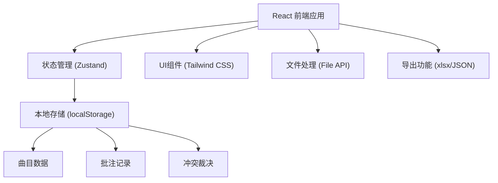
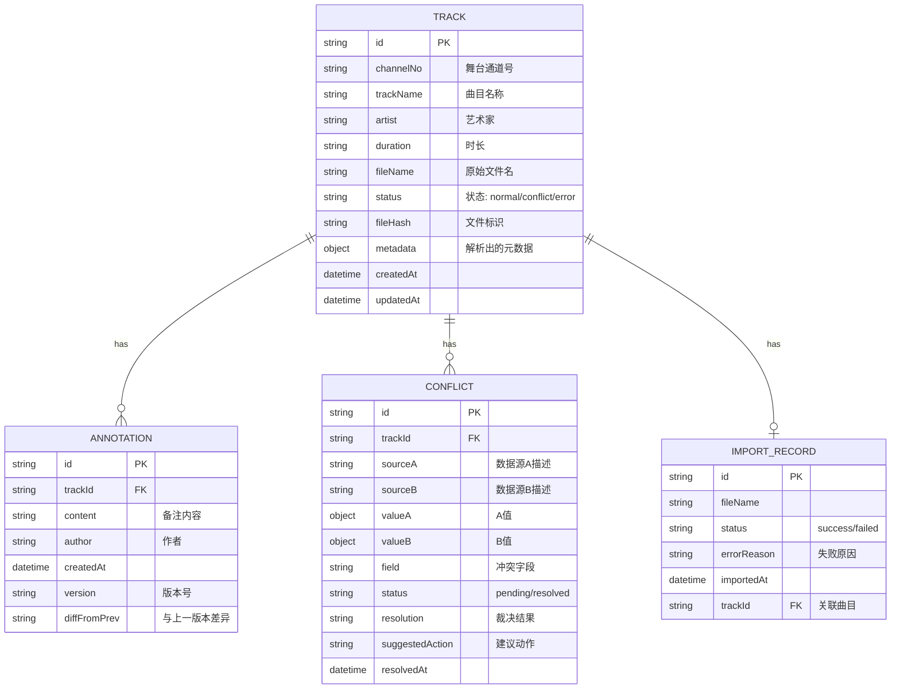

## 1. 架构设计

纯前端单页应用，数据完全本地化存储，无需后端服务。使用 localStorage 持久化用户操作数据，保证下次打开时人工标注和备注仍然保留。



## 2. 技术描述

- **前端框架**：React@18 + TypeScript
- **构建工具**：Vite@5
- **样式方案**：Tailwind CSS@3
- **状态管理**：Zustand（轻量，适合本地存储场景）
- **表格组件**：@tanstack/react-table（灵活的表格功能）
- **Excel导出**：xlsx库
- **图标库**：lucide-react
- **数据持久化**：localStorage + zustand-persist 中间件

## 3. 路由定义

| Route | 页面用途 |
|-------|----------|
| / | 重定向到导入面板 |
| /import | 导入面板 - 批量文件上传和解析 |
| /tracks | 曲目台账 - 舞台通道表数据管理 |
| /annotations | 批注中心 - 备注管理和历史记录 |
| /conflicts | 冲突审核 - 数据对比和人工裁决 |
| /export | 导出报告 - 报告生成和下载 |

## 4. 数据模型

### 4.1 数据模型定义



### 4.2 TypeScript 类型定义

```typescript
// 曲目状态
type TrackStatus = 'normal' | 'conflict' | 'error' | 'pending';

// 曲目数据
interface Track {
  id: string;
  channelNo: string;
  trackName: string;
  artist?: string;
  duration?: string;
  fileName: string;
  fileSize?: number;
  status: TrackStatus;
  fileHash?: string;
  metadata: Record<string, any>;
  createdAt: string;
  updatedAt: string;
}

// 批注记录
interface Annotation {
  id: string;
  trackId: string;
  content: string;
  author: string;
  createdAt: string;
  version: number;
  diffFromPrev?: string;
}

// 冲突记录
interface Conflict {
  id: string;
  trackId: string;
  sourceA: string;
  sourceB: string;
  field: string;
  valueA: any;
  valueB: any;
  status: 'pending' | 'resolved';
  resolution?: 'A' | 'B' | 'manual';
  manualValue?: any;
  suggestedAction: string;
  resolvedAt?: string;
}

// 导入记录
interface ImportRecord {
  id: string;
  fileName: string;
  fileSize: number;
  status: 'success' | 'failed' | 'skipped';
  errorReason?: string;
  importedAt: string;
  trackId?: string;
}

// 应用状态
interface AppState {
  tracks: Track[];
  annotations: Annotation[];
  conflicts: Conflict[];
  importRecords: ImportRecord[];
  currentPage: string;
}
```

## 5. 核心功能实现要点

### 5.1 文件名解析器
- 支持中英文混合命名解析
- 提取曲目名称、艺术家、版本信息
- 模糊匹配算法关联舞台通道表

### 5.2 批量导入处理器
- 异步队列逐个处理文件
- 单文件失败不中断整体流程
- 实时更新导入进度和状态

### 5.3 冲突检测引擎
- 对比导入数据与已有数据
- 字段级差异识别
- 生成建议动作和证据展示

### 5.4 数据持久化
- Zustand + localStorage 自动同步
- 版本号管理防止数据冲突
- 支持数据导出/导入备份

