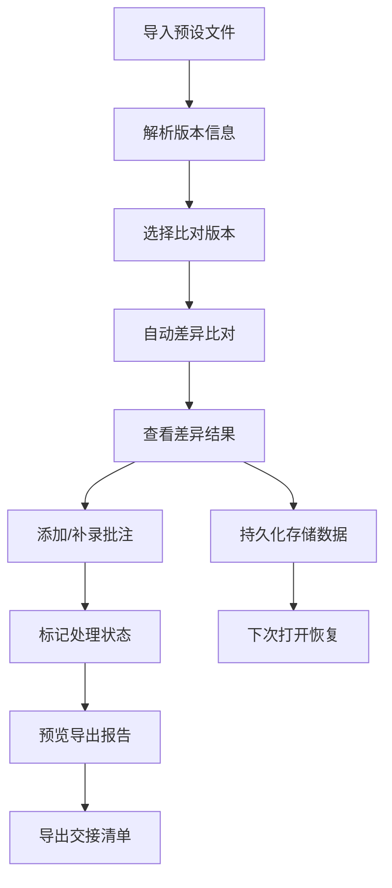

# 合成器预设差异比对工具 - 产品需求文档 (PRD)

## 1. 产品概述

合成器预设差异比对工具是一款专为演出制作团队设计的音频预设版本管理系统，解决多版本预设文件混淆、人工追溯困难的问题。
目标用户为演出统筹、音频工程师，核心价值在于实现版本可追溯、差异可视化、交接标准化。

## 2. 核心功能

### 2.1 用户角色
| 角色 | 注册方式 | 核心权限 |
|------|----------|----------|
| 演出统筹 (阿蓝) | 本地直接使用 | 导入预设、比对差异、添加批注、导出清单、数据持久化 |

### 2.2 功能模块
1. **预设导入页**: 文件上传、文件夹扫描、自动识别版本信息
2. **差异比对页**: 并排对比、差异高亮、版本时间线、修改历史
3. **批注管理**: 人工备注、状态标记、补录差异说明
4. **导出中心**: 差异报告导出、交接清单生成、带比对原因导出

### 2.3 页面详情
| 页面名称 | 模块名称 | 功能描述 |
|----------|----------|----------|
| 预设导入 | 文件上传区 | 支持拖拽上传、文件夹选择、版本命名解析 |
| 预设导入 | 版本列表 | 显示所有导入预设、版本号、时间戳、文件状态 |
| 差异比对 | 并排对比视图 | 左右分栏显示两个版本参数、差异高亮标记 |
| 差异比对 | 版本时间线 | 可视化展示版本演进历史、操作人信息 |
| 批注管理 | 备注编辑区 | 支持添加/编辑人工批注、标记处理状态 |
| 批注管理 | 差异补录 | 支持手动补录未被自动识别的差异项 |
| 导出中心 | 报告预览 | 实时预览导出内容、包含比对原因说明 |
| 导出中心 | 格式选择 | 支持 JSON/CSV/Markdown 格式导出 |

## 3. 核心流程

演出统筹阿蓝使用流程：
1. 导入一小包合成器预设材料进行比对
2. 系统自动识别版本信息并列出差异
3. 阿蓝临时补录一条备注说明特殊差异
4. 系统记录补录后的完整差异清单
5. 导出带比对原因的交接报告
6. 下次打开时保留所有人工标注和处理备注

## 4. 用户界面设计

### 4.1 设计风格
- **主色调**: 深靛蓝 (#1e3a5f) - 代表专业、音频工程
- **辅助色**: 霓虹绿 (#00ff88) - 差异高亮、科技感
- **警告色**: 琥珀橙 (#ff9f1c) - 重复项、边界记录
- **错误色**: 珊瑚红 (#ff6b6b) - 空值、冲突
- **按钮风格**: 微立体、圆角 8px、悬停时轻微上浮
- **字体**: JetBrains Mono (代码/参数) + Noto Sans SC (中文)
- **布局风格**: 卡片式 + 深色工业风，适合长时间专业工作
- **图标风格**: 线性图标 + 霓虹发光效果

### 4.2 页面设计概述
| 页面名称 | 模块名称 | UI 元素 |
|----------|----------|---------|
| 预设导入 | 上传区 | 虚线边框、拖放动画、文件图标、进度条 |
| 差异比对 | 对比视图 | 左右分栏、同步滚动、行级差异高亮、参数表格 |
| 差异比对 | 时间线 | 垂直线条、节点标记、悬浮气泡显示详情 |
| 批注管理 | 备注卡片 | 可折叠、编辑状态高亮、作者信息、时间戳 |
| 导出中心 | 报告预览 | Markdown 渲染、打印样式、差异统计摘要 |

### 4.3 响应式
- Desktop-first 设计，优先适配 1440px 及以上专业显示器
- 平板端 (1024px)：对比视图改为上下分栏
- 移动端：简化为列表视图，保留核心比对功能

### 4.4 动效设计
- 页面加载：元素从上到下交错入场 (staggered reveal)
- 差异高亮：呼吸动画吸引注意力
- 悬停效果：卡片轻微上浮 + 阴影增强
- 状态切换：平滑过渡动画
