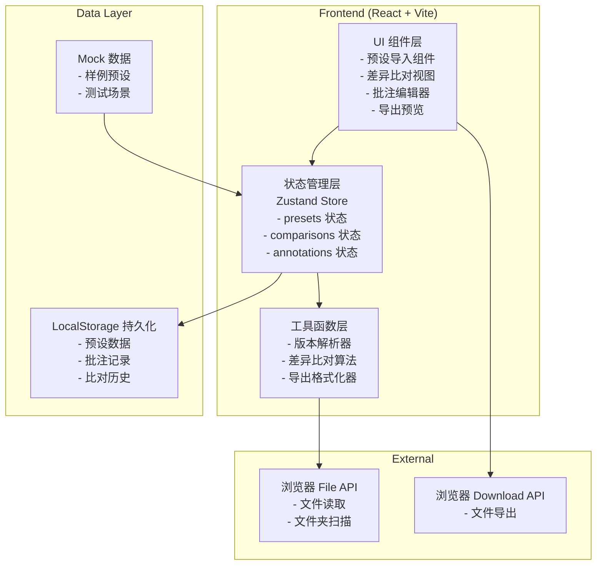
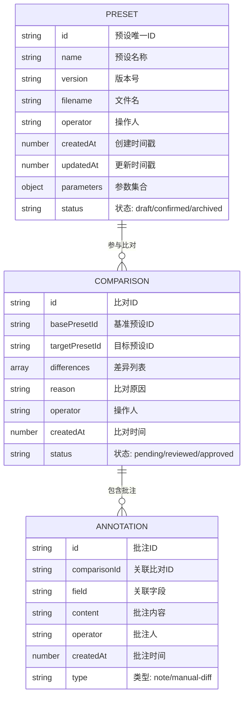

# 合成器预设差异比对工具 - 技术架构文档

## 1. 架构设计



## 2. 技术描述

- **Frontend**: React@18 + TypeScript + Vite
- **样式**: TailwindCSS@3 + CSS Variables (深色工业风)
- **状态管理**: Zustand (轻量级、支持持久化)
- **图标**: Lucide React
- **数据持久化**: localStorage + zustand-persist
- **初始化工具**: vite-init
- **后端**: None (纯前端本地应用)
- **数据库**: localStorage (浏览器本地存储)

## 3. 路由定义

| Route | Purpose |
|-------|---------|
| / | 预设导入页 - 文件上传与版本列表 |
| /compare | 差异比对页 - 并排对比与时间线 |
| /annotate | 批注管理页 - 备注编辑与差异补录 |
| /export | 导出中心 - 报告预览与导出 |

## 4. 数据模型

### 4.1 数据模型定义



### 4.2 TypeScript 类型定义

```typescript
// Preset 类型
interface Preset {
  id: string;
  name: string;
  version: string;
  filename: string;
  operator: string;
  createdAt: number;
  updatedAt: number;
  parameters: PresetParameters;
  status: 'draft' | 'confirmed' | 'archived';
}

interface PresetParameters {
  oscillators?: Oscillator[];
  filters?: Filter[];
  envelopes?: Envelope[];
  lfos?: LFO[];
  effects?: Effect[];
  [key: string]: any;
}

// Comparison 类型
interface Comparison {
  id: string;
  basePresetId: string;
  targetPresetId: string;
  differences: Difference[];
  reason: string;
  operator: string;
  createdAt: number;
  status: 'pending' | 'reviewed' | 'approved';
}

interface Difference {
  field: string;
  baseValue: any;
  targetValue: any;
  type: 'changed' | 'added' | 'removed' | 'null' | 'duplicate' | 'boundary';
  severity: 'low' | 'medium' | 'high';
}

// Annotation 类型
interface Annotation {
  id: string;
  comparisonId: string;
  field?: string;
  content: string;
  operator: string;
  createdAt: number;
  type: 'note' | 'manual-diff';
}
```

## 5. 核心算法

### 5.1 差异比对算法
- 递归深度对比两个预设参数对象
- 识别：值变更、新增字段、删除字段
- 特殊处理：空值 (null)、重复项、边界记录

### 5.2 版本解析器
- 文件名模式匹配：`{名称}_v{版本}_{日期}_{操作人}.{ext}`
- 支持半中文半英文命名：`贝斯主音_v1.2_20240115_alan.json`
- 回退策略：无法解析时使用文件元数据

### 5.3 导出格式化器
- Markdown：适合交接文档
- JSON：适合程序读取
- CSV：适合表格分析
- 所有格式必须包含：比对原因、差异列表、人工批注
