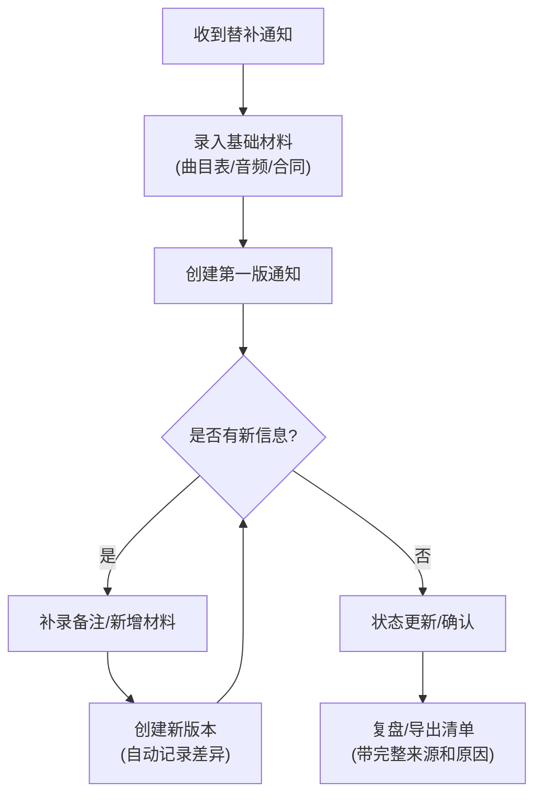

## 1. 产品概述

乐团替补排练通知管理系统是一个针对琴房前台人员设计的业务工具，用于追踪、管理和复盘乐团替补排练通知的全生命周期。解决了人工管理通知时来源不清、版本混乱、复盘困难等问题。

- 核心目标：让每条"乐团替补排练通知"都有迹可循、有据可查、有版可溯
- 目标用户：琴房前台（如小温）、乐团老师、管理人员

## 2. 核心功能

### 2.1 用户角色

| 角色 | 注册方式 | 核心权限 |
|------|----------|----------|
| 琴房前台 | 本地用户 | 新建通知、补录备注、导出清单、查看全部记录 |
| 乐团老师 | 本地用户 | 查看通知、添加批注、确认状态 |

### 2.2 功能模块

1. **通知列表页**：通知概览、筛选搜索、状态标签、快速操作
2. **通知详情页**：版本历史、来源追踪、批注记录、差异对比
3. **新建/编辑页**：多来源录入、材料上传、状态设置、原因说明
4. **导出功能**：带原因说明的清单导出、版本追溯信息

### 2.3 页面详情

| 页面名称 | 模块名称 | 功能描述 |
|---------|---------|----------|
| 通知列表页 | 顶部导航 | 新建通知按钮、搜索框、状态筛选、导出按钮 |
| 通知列表页 | 通知卡片列表 | 显示标题、状态、最新版本时间、操作按钮 |
| 通知详情页 | 信息概览 | 基本信息、当前状态、替补原因、处理时间 |
| 通知详情页 | 版本时间线 | 按时间倒序展示所有版本，支持对比差异 |
| 通知详情页 | 来源追踪区 | 展示曲目表、音频、合同截图、群聊批注等所有来源 |
| 通知详情页 | 批注补录区 | 新增人工批注、显示历史批注、标注补录差异 |
| 新建/编辑页 | 基本信息表单 | 标题、学生信息、曲目、排练时间 |
| 新建/编辑页 | 来源材料区 | 多类型材料上传、来源描述、引用标注 |
| 新建/编辑页 | 原因说明区 | 替补原因、状态设置、人工判断依据 |

## 3. 核心流程

### 3.1 主要用户流程

琴房前台小温收到替补通知后，先录入曲目表、音频文件等基础材料，创建第一版通知。随后在群聊中发现新的批注或老师补充信息时，补录备注并创建新版本。系统自动记录每次修改的时间、人员和具体变化。月底复盘时，可直接导出带有完整来源和版本历史的清单。

### 3.2 数据追溯流程

每条通知的任何修改都被完整记录，包括：谁修改、何时修改、修改了什么、修改原因。所有材料来源都保留原始引用和上传时间。

## 4. 用户界面设计

### 4.1 设计风格

**设计理念：专业务实的音乐厅后台风格**

考虑到这是琴房/乐团管理场景，采用沉稳、专业的设计风格：

- **主色调**：深勃艮第红 (#722F37) - 象征音乐厅的绒幕布，专业稳重
- **辅助色**：暖金 (#D4AF37) - 象征乐器的金属光泽，点缀重要信息
- **中性色**：米白背景 (#F5F2EB)、深灰文字 (#2C2C2C) - 模拟乐谱纸张
- **按钮风格**：微圆角 (4px)、轻微阴影、悬停时有微妙的金色边框
- **字体**：标题使用衬线字体（类似乐谱印刷感），正文使用清晰的无衬线字体
- **布局风格**：卡片式布局，清晰的信息层级，时间线组件展示版本历史
- **图标风格**：线性图标，音乐主题（五线谱、音符等元素点缀）

### 4.2 页面设计概述

| 页面名称 | 模块名称 | UI元素 |
|---------|---------|--------|
| 通知列表页 | 顶部区域 | 深色导航栏、金色标题、左侧Logo区域 |
| 通知列表页 | 通知卡片 | 米白色卡片、红色状态标签、时间线连接效果 |
| 通知详情页 | 版本时间线 | 垂直时间线、版本节点高亮、差异展开/折叠动画 |
| 通知详情页 | 来源区域 | 文件卡片、来源类型徽章、悬停预览效果 |
| 新建/编辑页 | 表单区域 | 分步骤引导、材料拖拽上传区、实时保存提示 |

### 4.3 响应式

- 桌面端：三栏布局（导航+主内容+侧边信息）
- 平板端：两栏布局（导航折叠+主内容）
- 移动端：单栏布局，底部导航，卡片堆叠

## 5. 非功能需求

### 5.1 数据持久化
- 所有数据本地持久化存储，刷新不丢失
- 支持数据导入导出，便于备份

### 5.2 版本控制
- 永不覆盖历史版本，每次修改生成新版本
- 支持任意两版本间的差异对比
- 记录修改人、修改时间、修改原因

### 5.3 可追溯性
- 每条通知的每个字段都能追溯到具体来源
- 支持来源材料的原始内容查看
- 人工判断必须留有文字记录
