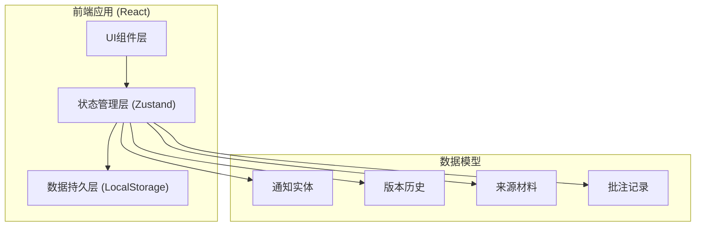
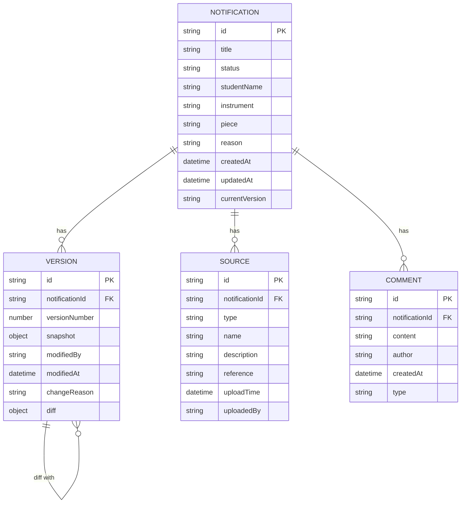

## 1. 架构设计



## 2. 技术描述

- **前端框架**：React@18 + TypeScript
- **构建工具**：Vite@5
- **样式方案**：TailwindCSS@3
- **状态管理**：Zustand (轻量级，适合本地持久化)
- **数据持久化**：LocalStorage (自动同步)
- **路由**：React Router@6
- **图标**：Lucide React
- **日期处理**：date-fns
- **差异对比**：自定义diff算法

## 3. 路由定义

| 路由 | 页面 | 功能 |
|------|------|------|
| / | 通知列表页 | 展示所有通知、搜索筛选、快速操作 |
| /notification/:id | 通知详情页 | 查看详情、版本历史、来源追踪、补录批注 |
| /new | 新建通知页 | 创建新通知、录入材料 |
| /edit/:id | 编辑通知页 | 修改通知信息（自动生成新版本） |

## 4. 数据模型

### 4.1 ER图



### 4.2 TypeScript 类型定义

```typescript
// 通知状态
type NotificationStatus = 'pending' | 'confirmed' | 'completed' | 'cancelled';

// 来源类型
type SourceType = 'repertoire' | 'audio' | 'contract' | 'chat' | 'other';

// 批注类型
type CommentType = 'annotation' | 'supplement' | 'decision';

interface Notification {
  id: string;
  title: string;
  status: NotificationStatus;
  studentName: string;
  instrument: string;
  piece: string;
  rehearsalTime?: string;
  reason: string;
  createdAt: string;
  updatedAt: string;
  currentVersion: number;
}

interface Version {
  id: string;
  notificationId: string;
  versionNumber: number;
  snapshot: Partial<Notification>;
  modifiedBy: string;
  modifiedAt: string;
  changeReason: string;
  diff?: DiffEntry[];
}

interface Source {
  id: string;
  notificationId: string;
  type: SourceType;
  name: string;
  description: string;
  reference: string;
  uploadTime: string;
  uploadedBy: string;
}

interface Comment {
  id: string;
  notificationId: string;
  content: string;
  author: string;
  createdAt: string;
  type: CommentType;
}

interface DiffEntry {
  field: string;
  oldValue: any;
  newValue: any;
  action: 'add' | 'remove' | 'update';
}
```

## 5. 状态管理设计

### 5.1 Store 结构

```typescript
interface AppState {
  notifications: Notification[];
  versions: Record<string, Version[]>;
  sources: Record<string, Source[]>;
  comments: Record<string, Comment[]>;
  currentUser: string;
  
  // Actions
  addNotification: (data: Omit<Notification, 'id' | 'createdAt' | 'updatedAt' | 'currentVersion'>, sources: SourceInput[]) => string;
  updateNotification: (id: string, data: Partial<Notification>, changeReason: string) => void;
  addComment: (notificationId: string, content: string, type: CommentType) => void;
  addSource: (notificationId: string, source: SourceInput) => void;
  exportNotification: (id: string) => ExportData;
  compareVersions: (notificationId: string, v1: number, v2: number) => DiffEntry[];
}
```

### 5.2 持久化机制

使用 Zustand persist middleware，自动将状态同步到 LocalStorage：
- Key: `orchestra-notification-store`
- 序列化: JSON.stringify
- 反序列化: JSON.parse
- 版本迁移: 支持 schema 版本升级

## 6. 核心功能实现思路

### 6.1 版本控制
- 每次修改通知时，不直接修改原记录，而是创建新版本
- 新版本包含完整数据快照和与上一版本的差异
- 版本号自动递增，永不回溯

### 6.2 差异对比算法
- 深度比较两个版本的 snapshot 对象
- 识别新增、删除、修改的字段
- 支持嵌套对象和数组的差异展示

### 6.3 导出功能
- 导出格式：JSON 和 Markdown
- 包含完整的通知信息、所有版本历史、来源材料、批注记录
- Markdown 格式适合打印和归档

## 7. 项目结构

```
src/
├── components/
│   ├── layout/           # 布局组件
│   ├── notification/     # 通知相关组件
│   ├── version/          # 版本历史组件
│   ├── source/           # 来源材料组件
│   └── comment/          # 批注组件
├── pages/
│   ├── List.tsx          # 列表页
│   ├── Detail.tsx        # 详情页
│   ├── New.tsx           # 新建页
│   └── Edit.tsx          # 编辑页
├── store/
│   └── useStore.ts       # Zustand store
├── types/
│   └── index.ts          # TypeScript 类型
├── utils/
│   ├── diff.ts           # 差异对比算法
│   ├── export.ts         # 导出工具
│   └── id.ts             # ID生成器
└── data/
    └── sampleData.ts     # 样例数据
```
