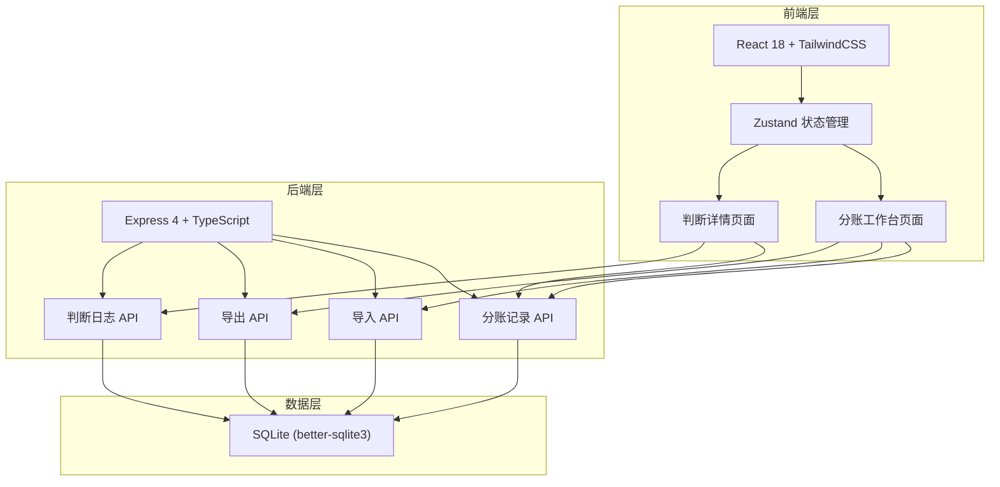
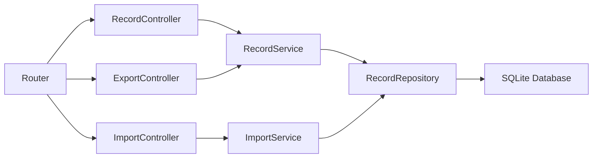
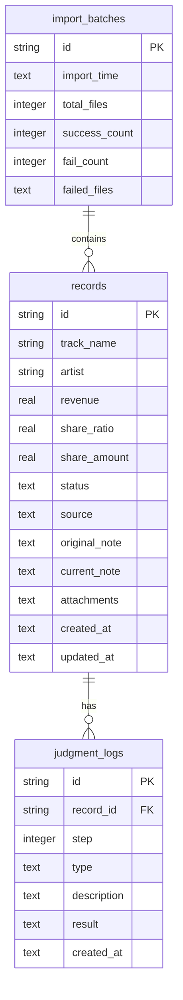

## 1. 架构设计



## 2. 技术说明

- **前端**：React@18 + TailwindCSS@3 + Vite
- **初始化工具**：vite-init (react-express-ts 模板)
- **后端**：Express@4 + TypeScript (ESM)
- **数据库**：SQLite (better-sqlite3)，单文件持久化，数据随项目走
- **状态管理**：Zustand
- **路由**：react-router-dom
- **Excel解析**：xlsx (SheetJS)
- **图标**：lucide-react

## 3. 路由定义

| 路由 | 用途 |
|------|------|
| `/` | 分账工作台主页面，含导入、列表、筛选、导出 |
| `/record/:id` | 判断详情页面，含判断时间线、人工标注、差异说明 |

## 4. API 定义

### 4.1 分账记录 API

```typescript
interface RevenueRecord {
  id: string
  trackName: string
  artist: string
  revenue: number
  shareRatio: number | null
  shareAmount: number | null
  status: 'smooth' | 'needs_confirmation' | 'old_standard'
  source: 'excel' | 'audio' | 'contract' | 'chat_annotation'
  originalNote: string
  currentNote: string
  attachments: string[]
  createdAt: string
  updatedAt: string
}

// GET /api/records?status=&source=&dateFrom=&dateTo=
// 获取分账记录列表，支持筛选
type GetRecordsResponse = { records: RevenueRecord[] }

// GET /api/records/:id
// 获取单条记录详情
type GetRecordResponse = { record: RevenueRecord }

// PATCH /api/records/:id
// 更新记录（备注编辑、人工标注）
interface UpdateRecordPayload {
  currentNote?: string
  status?: 'smooth' | 'needs_confirmation' | 'old_standard'
  shareRatio?: number
  shareAmount?: number
  manualOverrideReason?: string
}
```

### 4.2 导入 API

```typescript
// POST /api/import
// 批量导入文件（multipart/form-data）
interface ImportResult {
  totalFiles: number
  successCount: number
  failCount: number
  failedFiles: { fileName: string; reason: string }[]
  importedRecords: RevenueRecord[]
}
```

### 4.3 导出 API

```typescript
// GET /api/export?status=&source=&dateFrom=&dateTo=
// 导出当前筛选条件下的记录为 CSV
// Response: CSV 文件下载
```

### 4.4 判断日志 API

```typescript
interface JudgmentStep {
  id: string
  recordId: string
  step: number
  type: 'system_auto' | 'manual_override' | 'note_added' | 'diff_detected'
  description: string
  result: string
  createdAt: string
}

// GET /api/records/:id/judgments
// 获取某条记录的判断时间线
type GetJudgmentsResponse = { judgments: JudgmentStep[] }
```

## 5. 服务器架构图



## 6. 数据模型

### 6.1 数据模型定义



### 6.2 数据定义语言

```sql
CREATE TABLE IF NOT EXISTS records (
  id TEXT PRIMARY KEY,
  track_name TEXT NOT NULL,
  artist TEXT NOT NULL,
  revenue REAL NOT NULL DEFAULT 0,
  share_ratio REAL,
  share_amount REAL,
  status TEXT NOT NULL CHECK(status IN ('smooth', 'needs_confirmation', 'old_standard')),
  source TEXT NOT NULL CHECK(source IN ('excel', 'audio', 'contract', 'chat_annotation')),
  original_note TEXT DEFAULT '',
  current_note TEXT DEFAULT '',
  attachments TEXT DEFAULT '[]',
  created_at TEXT NOT NULL DEFAULT (datetime('now', 'localtime')),
  updated_at TEXT NOT NULL DEFAULT (datetime('now', 'localtime'))
);

CREATE TABLE IF NOT EXISTS judgment_logs (
  id TEXT PRIMARY KEY,
  record_id TEXT NOT NULL REFERENCES records(id) ON DELETE CASCADE,
  step INTEGER NOT NULL,
  type TEXT NOT NULL CHECK(type IN ('system_auto', 'manual_override', 'note_added', 'diff_detected')),
  description TEXT NOT NULL,
  result TEXT NOT NULL,
  created_at TEXT NOT NULL DEFAULT (datetime('now', 'localtime'))
);

CREATE TABLE IF NOT EXISTS import_batches (
  id TEXT PRIMARY KEY,
  import_time TEXT NOT NULL DEFAULT (datetime('now', 'localtime')),
  total_files INTEGER NOT NULL DEFAULT 0,
  success_count INTEGER NOT NULL DEFAULT 0,
  fail_count INTEGER NOT NULL DEFAULT 0,
  failed_files TEXT DEFAULT '[]'
);

CREATE INDEX IF NOT EXISTS idx_records_status ON records(status);
CREATE INDEX IF NOT EXISTS idx_records_source ON records(source);
CREATE INDEX IF NOT EXISTS idx_judgment_logs_record_id ON judgment_logs(record_id);
```

### 6.3 初始样例数据

```sql
INSERT INTO records (id, track_name, artist, revenue, share_ratio, share_amount, status, source, original_note, current_note) VALUES
('sample-001', '夏夜晚风', '回声乐队', 12000, 0.50, 6000, 'smooth', 'excel', '', ''),
('sample-002', '深巷', '锈色吉他', 8000, NULL, NULL, 'needs_confirmation', 'excel', '比例未定 待核实', '比例未定 待核实'),
('sample-003', '旧日之光', '老王', 5000, 0.40, 2000, 'old_standard', 'excel', '按老规矩分', '按老规矩分（旧口径比例60%，当前40%）');

INSERT INTO judgment_logs (id, record_id, step, type, description, result) VALUES
('j-001-1', 'sample-001', 1, 'system_auto', '系统匹配到合同分账比例', '分账比例50%，分账金额6000元，状态标记为顺利'),
('j-002-1', 'sample-002', 1, 'system_auto', '系统未找到合同分账比例', '分账比例缺失，状态标记为待确认'),
('j-003-1', 'sample-003', 1, 'system_auto', '来自旧Excel，检测到比例与当前标准不一致', '旧口径比例60%与当前标准50%不一致，标记为旧口径'),
('j-003-2', 'sample-003', 2, 'diff_detected', '补录备注后对比差异', '比例从旧口径60%调整为当前40%，差异原因：按新标准执行');
```
