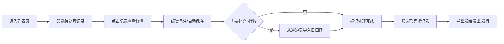

## 1. 产品概述
编曲工程轨道清理管理系统，解决厂牌运营在交接前反复核对舞台通道表的痛点。核心用户为厂牌运营（小孟）、演出/发行同事、老师。系统实现轨道清理记录的持久化管理、版本追溯、筛选导出一体化，让数据处理留痕可查，避免重复翻找原始记录。

## 2. 核心功能

### 2.1 用户角色
| 角色 | 登录方式 | 核心权限 |
|------|----------|----------|
| 厂牌运营 | 本地登录 | 全功能：记录管理、备注编辑、筛选导出、版本查看、补充材料 |
| 演出/发行同事 | 只读访问 | 查看清单、导出报表、查看处理依据 |
| 老师 | 只读访问 | 查看学生进步情况、查看处理记录 |

### 2.2 功能模块
1. **轨道清理列表页**：记录列表、筛选器、搜索、批量操作、导出
2. **记录详情页**：完整信息展示、版本历史、修改记录、备注编辑
3. **补充材料页**：从舞台通道表补录旧口径、关联原始记录
4. **导出清单页**：预览当前筛选结果、生成给演出/发行的正式清单

### 2.3 页面详情
| 页面名称 | 模块名称 | 功能描述 |
|-----------|-------------|---------------------|
| 轨道清理列表 | 顶部筛选区 | 状态筛选（待确认/已通过/需补充/已作废）、来源筛选（舞台通道表/人工补录）、时间范围、搜索曲目名称 |
| 轨道清理列表 | 数据表格 | 展示曲目、状态、来源、最新备注、处理人、处理时间，支持行内编辑备注、刷新不丢失 |
| 轨道清理列表 | 操作区 | 查看详情、补充材料、导出当前筛选结果 |
| 记录详情 | 基础信息卡 | 曲目名称、艺人、版本信息、授权状态、原始来源 |
| 记录详情 | 版本时间线 | 展示每次修改的内容、修改人、修改时间，支持对比差异 |
| 记录详情 | 备注编辑区 | 富文本编辑、自动保存、刷新不丢失 |
| 补充材料 | 通道表导入 | 从舞台通道表导入历史记录、关联到现有清理记录 |
| 导出清单 | 预览区 | 展示当前筛选的所有记录，格式化排版，适合发给演出/发行 |

## 3. 核心流程
厂牌运营小孟进入系统 → 查看轨道清理记录列表 → 按状态筛选需处理的记录 → 点击某条记录编辑备注（自动保存）→ 发现需要补充材料 → 从舞台通道表导入旧口径关联 → 确认处理完成 → 筛选已完成记录 → 导出发给演出/发行同事。

## 4. 用户界面设计
### 4.1 设计风格
- 主色：深石板蓝 `#1e3a5f`（专业、稳重）
- 辅助色：琥珀金 `#d4a574`（强调、温暖）
- 中性色：暖白 `#faf8f5`、炭灰 `#2c3e50`、浅灰 `#ecf0f1`
- 字体：展示字体用 **Playfair Display**（优雅、杂志感），正文字体用 **Lora**（清晰、易读）
- 按钮：精致圆角 4px，悬停有细微阴影变化，禁用状态低透明度
- 布局：卡片式布局，留白充足，编辑区域有细边框聚焦感
- 图标：lucide-react 线性图标，尺寸统一 18px
- 设计基调：偏编辑/杂志风格，克制的色彩，精致的排版，适合长时间专业工作

### 4.2 页面设计概述
| 页面名称 | 模块名称 | UI Elements |
|-----------|-------------|-------------|
| 轨道清理列表 | 页面头部 | Playfair Display 大标题，副标题说明，琥珀金色分隔线 |
| 轨道清理列表 | 筛选区 | 标签式筛选，紧凑排列，选中项有琥珀金底色 |
| 轨道清理列表 | 数据表格 | 斑马纹浅灰，悬停行淡蓝色背景，状态标签用圆角色块 |
| 记录详情 | 信息卡 | 白色卡片，细微阴影，标题用 Playfair Display |
| 记录详情 | 版本时间线 | 左侧竖线连接节点，每个节点带日期标签，改动内容用删除线+高亮显示差异 |
| 记录详情 | 备注区 | 文本框有聚焦边框，右下角显示自动保存状态 |
| 导出清单 | 预览页 | A4 比例白色卡片，打印样式优化，标题清晰，数据排版整齐 |

### 4.3 响应式
桌面端优先设计，1280px 以上为最佳体验。平板端表格可横向滚动，移动端卡片化堆叠展示。触控目标不小于 44x44px。

### 4.4 动效设计
- 页面加载：内容区块淡入上移，stagger 延迟 80ms
- 表格行悬停：背景色过渡 150ms ease
- 自动保存：状态指示器由"保存中"淡入变为"已保存"
- 版本时间线：滚动时节点逐个浮现
- 筛选切换：内容区域轻微淡出淡入过渡 200ms
