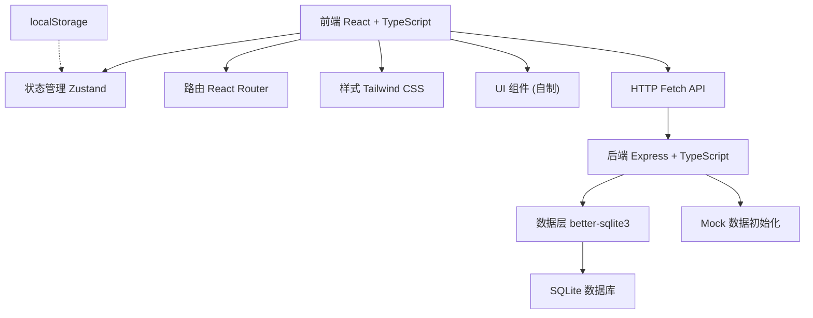
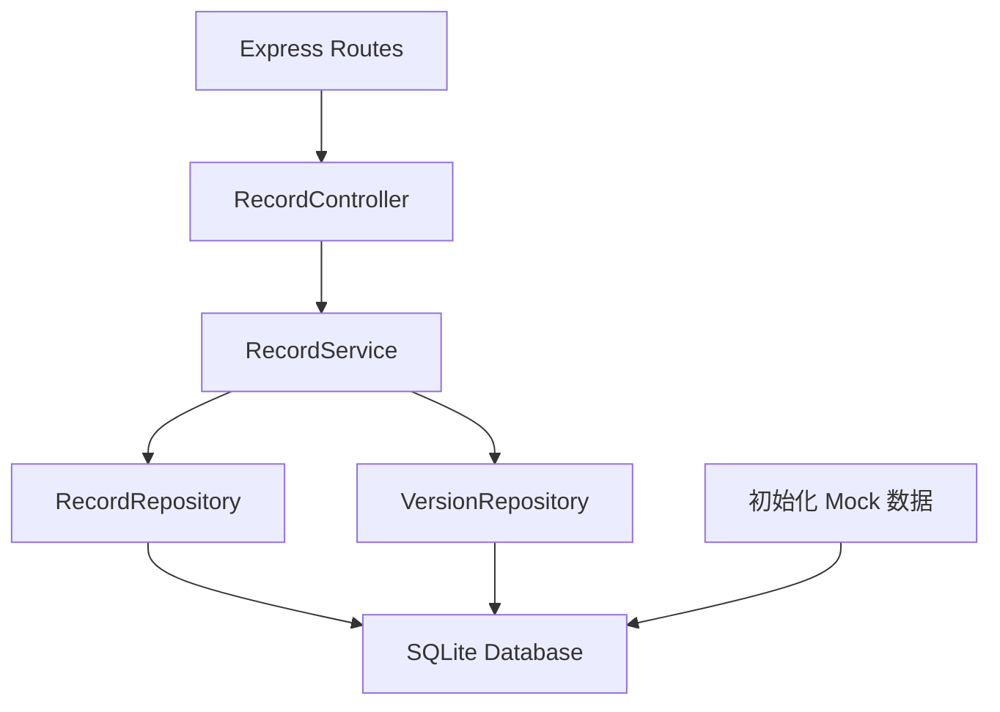
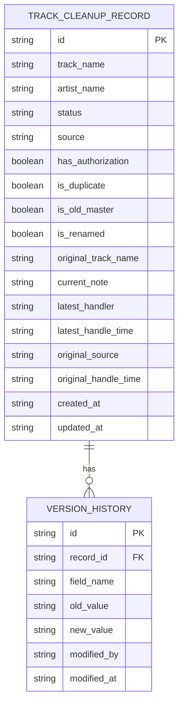

## 1. 架构设计



## 2. 技术描述
- 前端：React@18 + TypeScript + Vite + tailwindcss@3 + zustand + react-router-dom + lucide-react
- 初始化工具：vite-init
- 后端：Express@4 + TypeScript + better-sqlite3
- 数据库：SQLite（本地单文件，便于部署和交接）
- 数据持久化：后端 SQLite + 前端 localStorage 双保险，确保刷新不丢失
- 版本控制：每条记录维护独立版本历史表，永不覆盖旧数据

## 3. 路由定义
| 路由 | 用途 |
|-------|---------|
| / | 轨道清理记录列表页（首页） |
| /record/:id | 单条记录详情页 |
| /record/:id/supplement | 补充材料页（从舞台通道表导入） |
| /export | 导出清单预览页 |

## 4. API 定义

### TypeScript 类型定义
```typescript
// shared/types.ts
export type RecordStatus = 'pending' | 'approved' | 'needs_supplement' | 'obsolete';
export type RecordSource = 'stage_channel' | 'manual' | 'imported_old';

export interface TrackCleanupRecord {
  id: string;
  trackName: string;
  artistName: string;
  status: RecordStatus;
  source: RecordSource;
  hasAuthorization: boolean;
  isDuplicate: boolean;
  isOldMaster: boolean;
  isRenamed: boolean;
  originalTrackName?: string;
  currentNote: string;
  latestHandler: string;
  latestHandleTime: string;
  originalSource: string;
  originalHandleTime: string;
  createdAt: string;
  updatedAt: string;
}

export interface VersionHistory {
  id: string;
  recordId: string;
  fieldName: string;
  oldValue: string;
  newValue: string;
  modifiedBy: string;
  modifiedAt: string;
}

export interface FilterState {
  status?: RecordStatus;
  source?: RecordSource;
  searchKeyword?: string;
  dateFrom?: string;
  dateTo?: string;
}
```

### API 接口
| 方法 | 路径 | 描述 | 请求体 | 响应 |
|------|------|------|--------|------|
| GET | /api/records | 获取记录列表（支持筛选 query 参数） | - | TrackCleanupRecord[] |
| GET | /api/records/:id | 获取单条记录详情 | - | TrackCleanupRecord |
| PUT | /api/records/:id | 更新记录（备注等） | Partial<TrackCleanupRecord> | TrackCleanupRecord |
| GET | /api/records/:id/versions | 获取版本历史 | - | VersionHistory[] |
| POST | /api/records/:id/supplement | 补充材料（关联旧口径） | { oldChannelRecord: any } | TrackCleanupRecord |
| GET | /api/export | 导出当前筛选结果（CSV/JSON） | query: FilterState | 文件流 |

## 5. 服务端架构



## 6. 数据模型

### 6.1 ER 图



### 6.2 DDL 语句

```sql
-- 轨道清理记录表
CREATE TABLE IF NOT EXISTS track_cleanup_records (
  id TEXT PRIMARY KEY,
  track_name TEXT NOT NULL,
  artist_name TEXT NOT NULL,
  status TEXT NOT NULL CHECK(status IN ('pending', 'approved', 'needs_supplement', 'obsolete')),
  source TEXT NOT NULL CHECK(source IN ('stage_channel', 'manual', 'imported_old')),
  has_authorization INTEGER NOT NULL DEFAULT 1,
  is_duplicate INTEGER NOT NULL DEFAULT 0,
  is_old_master INTEGER NOT NULL DEFAULT 0,
  is_renamed INTEGER NOT NULL DEFAULT 0,
  original_track_name TEXT,
  current_note TEXT NOT NULL DEFAULT '',
  latest_handler TEXT NOT NULL,
  latest_handle_time TEXT NOT NULL,
  original_source TEXT NOT NULL,
  original_handle_time TEXT NOT NULL,
  created_at TEXT NOT NULL,
  updated_at TEXT NOT NULL
);

-- 版本历史表
CREATE TABLE IF NOT EXISTS version_history (
  id TEXT PRIMARY KEY,
  record_id TEXT NOT NULL,
  field_name TEXT NOT NULL,
  old_value TEXT,
  new_value TEXT,
  modified_by TEXT NOT NULL,
  modified_at TEXT NOT NULL,
  FOREIGN KEY (record_id) REFERENCES track_cleanup_records(id) ON DELETE CASCADE
);

CREATE INDEX IF NOT EXISTS idx_version_record_id ON version_history(record_id);
CREATE INDEX IF NOT EXISTS idx_records_status ON track_cleanup_records(status);
CREATE INDEX IF NOT EXISTS idx_records_source ON track_cleanup_records(source);
```

### 6.3 Mock 初始数据（8条，覆盖各种场景）

1. **顺利记录**：《星空叙事曲》- 李同学，已通过，授权完整，来源舞台通道表
2. **需要人工确认**：《城市边缘》- 王同学，待确认，疑似重复曲目，来源人工补录
3. **旧口径补录**：《月光奏鸣曲(旧版)》- 张同学，需补充，2023年旧口径，来源导入旧记录
4. **旧版母带**：《夏日回忆》- 赵同学，已作废，标记为旧版母带
5. **重复曲目**：《时间缝隙》- 刘同学，待确认，与现有曲目重复
6. **缺授权**：《未知海域》- 陈同学，需补充，缺少授权文件
7. **人工改名**：《初雪(原:冬之恋)》- 孙同学，已通过，原名为《冬之恋》
8. **老师关心的进步记录**：《风之诗》- 周同学，已通过，对比去年版本有明显进步
