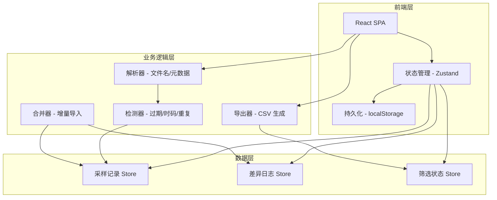
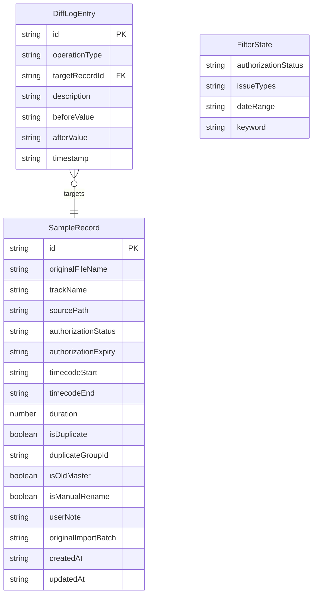

## 1. 架构设计



## 2. 技术说明

- **前端框架**：React 18 + TypeScript + Vite
- **样式方案**：Tailwind CSS 3
- **状态管理**：Zustand（轻量，自带持久化中间件）
- **持久化**：localStorage（Zustand persist middleware）
- **后端**：无（纯前端，所有数据存储在浏览器本地）
- **数据库**：无（localStorage 即数据库）

## 3. 路由定义

| 路由 | 用途 |
|------|------|
| / | 主控台页面，包含所有功能模块 |

单页应用，无需多路由。

## 4. API 定义

无后端 API。数据通过文件输入（File API / webkitdirectory）获取音频文件列表，在浏览器端解析文件名生成记录。

### 4.1 核心数据类型

```typescript
interface SampleRecord {
  id: string;
  originalFileName: string;
  trackName: string;
  sourcePath: string;
  authorizationStatus: "valid" | "expired" | "missing" | "unknown";
  authorizationExpiry: string | null;
  timecodeStart: string | null;
  timecodeEnd: string | null;
  duration: number | null;
  isDuplicate: boolean;
  duplicateGroupId: string | null;
  isOldMaster: boolean;
  isManualRename: boolean;
  userNote: string;
  originalImportBatch: string;
  createdAt: string;
  updatedAt: string;
}

interface DiffLogEntry {
  id: string;
  operationType: "import" | "note_edit" | "status_change" | "merge";
  targetRecordId: string | null;
  description: string;
  beforeValue: string | null;
  afterValue: string | null;
  timestamp: string;
}

interface FilterState {
  authorizationStatus: string[];
  issueTypes: string[];
  dateRange: { start: string | null; end: string | null };
  keyword: string;
}
```

## 5. 无服务器架构

纯前端 SPA，所有逻辑在浏览器端执行。

## 6. 数据模型

### 6.1 数据模型关系



### 6.2 持久化策略

所有数据通过 Zustand persist 中间件写入 localStorage，键名：
- `sample-auth-records`：采样记录数组
- `sample-auth-diff-log`：差异日志数组
- `sample-auth-filter`：筛选状态（可选持久化）

### 6.3 样例数据设计

样例数据包含以下刻意设计的脏数据场景：
1. **旧版母带**：文件名含 `_master_v1` 后缀，授权状态标为 unknown
2. **重复曲目**：两条文件名不同但曲目名相同，标记为重复并归入同一 duplicateGroupId
3. **缺授权**：authorizationStatus 为 missing，authorizationExpiry 为 null
4. **人工改名记录**：trackName 与 originalFileName 明显不一致，isManualRename 为 true
5. **授权过期**：authorizationExpiry 日期早于当前日期
6. **时码错位**：timecodeStart/End 不在合理范围内（如负数或超出总时长）
