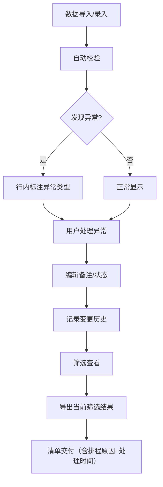

## 1. 产品概述

"乐器维修备件排程"是一套面向录音棚/演出团队的备件调度管理工具，解决当前依赖 Excel 临时凑排程时文件名与曲目表对不上、例外情况无法追溯的问题。核心目标：让备件排程在脏数据环境下也能可靠运行，每条记录的来源、处理时间、变更历史全程可追溯，导出清单与当前筛选严格一致且语气清晰可读。

- 目标用户：录音师、演出执行、发行同事等需要跨人交接排程信息的一线人员
- 核心价值：从"人肉对 Excel"升级为"页面操作即存档、筛选即导出、变更即留痕"

## 2. 核心功能

### 2.1 用户角色

| 角色 | 注册方式 | 核心权限 |
|------|----------|----------|
| 录音师/执行 | 页面内填写姓名标识 | 查看、筛选、编辑备注、导出清单 |
| 管理员 | 页面内填写姓名标识 | 以上权限 + 删除记录、批量标记 |

### 2.2 功能模块

1. **排程总览页**：排程列表、筛选、备注编辑、版本冲突检测、审计历史、导出
2. **变更历史弹窗**：单条记录的完整修改时间线

### 2.3 页面详情

| 页面名称 | 模块名称 | 功能描述 |
|----------|----------|----------|
| 排程总览页 | 筛选栏 | 按状态（待排程/已排程/缺授权/版本冲突/重复）、来源、关键词筛选 |
| 排程总览页 | 排程表格 | 显示备件编号、曲目名称、文件名、来源、状态、备注、最后修改人/时间；可编辑备注和状态；版本冲突高亮提示；重复项合并标记 |
| 排程总览页 | 变更历史 | 点击记录展开修改历史：谁在何时改了哪个字段、旧值→新值 |
| 排程总览页 | 导出按钮 | 导出当前筛选结果为 CSV，包含排程原因、处理时间、原始来源 |
| 排程总览页 | 数据校验提示 | 对空值、重复项、版本冲突、缺授权等异常数据行内标注，不阻断操作 |

## 3. 核心流程

1. **数据导入**：系统预置样例数据（含脏数据），用户也可手动录入
2. **数据校验**：导入/录入时自动检测：旧版文件 vs 新版文件（版本冲突）、重复曲目、缺授权、空值
3. **排程编辑**：用户对每条记录编辑备注、修改状态；系统自动记录变更历史（操作人、时间、字段、旧值→新值）
4. **版本保护**：旧版文件记录不允许被新版悄悄覆盖，需人工确认后才能合并/替换
5. **筛选导出**：用户按条件筛选后导出，导出内容严格匹配当前筛选视图，附带排程原因和处理时间
6. **交接可读**：导出的清单语言清晰，像给人看的备忘录而非错误日志

## 4. 用户界面设计

### 4.1 设计风格

- 主色：深钢蓝（#2D3A4A）+ 琥珀色强调（#D97706），传达"工业维修"质感
- 辅助色：状态色（待排程-灰蓝、已排程-翠绿、缺授权-橙红、版本冲突-紫红、重复-赭黄）
- 字体：标题用 "DM Serif Display"，正文用 "IBM Plex Sans"
- 布局：桌面端宽屏表格式，左侧筛选栏 + 右侧主表格
- 图标：lucide-react 实心风格

### 4.2 页面设计概览

| 页面名称 | 模块名称 | UI 元素 |
|----------|----------|---------|
| 排程总览页 | 筛选栏 | 下拉选择（状态/来源）、搜索框、筛选标签 |
| 排程总览页 | 排程表格 | 表头固定、行悬停高亮、异常行左侧色条、备注行内编辑、状态切换下拉、操作人头像缩写 |
| 排程总览页 | 变更历史 | 侧边抽屉或行展开面板，时间轴样式，字段旧值→新值对比 |
| 排程总览页 | 导出按钮 | 顶部工具栏右侧，带筛选计数提示 |
| 排程总览页 | 数据校验提示 | 行内标签（版本冲突/重复/缺授权/空值），悬停显示具体原因 |

### 4.3 响应式

- 桌面优先设计（1440px+），表格可水平滚动
- 中等屏幕（768-1439px）筛选栏折叠为顶部下拉
- 移动端（<768px）卡片式布局替代表格

### 4.4 3D 场景

不适用
