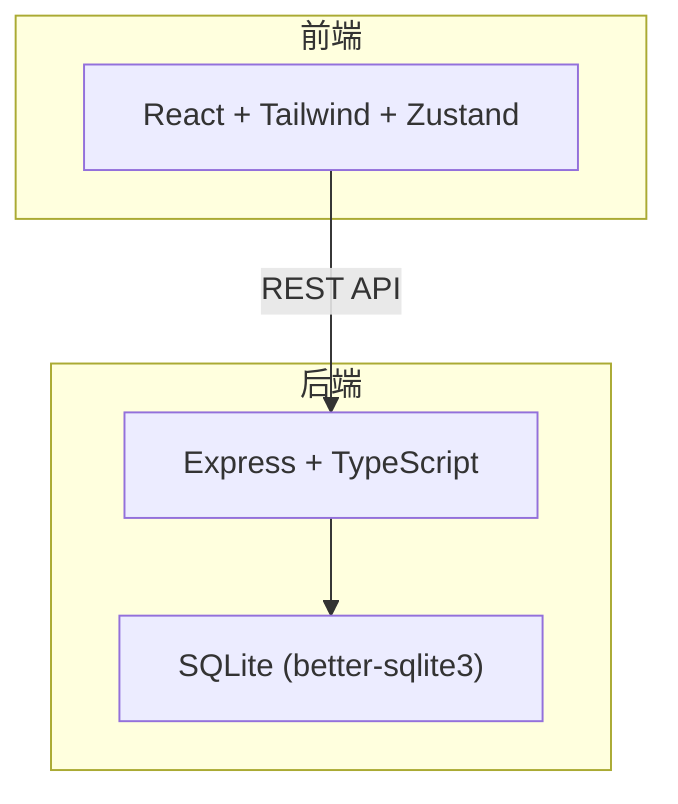
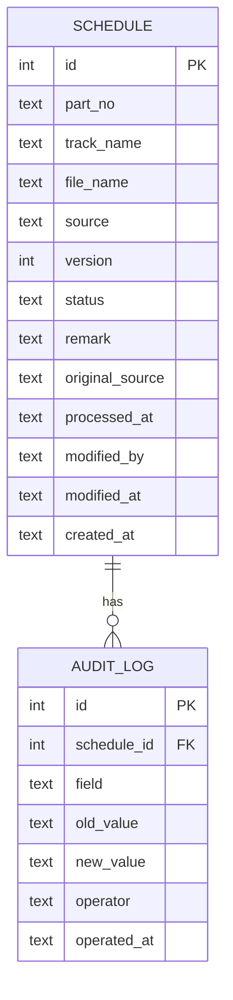

## 1. 架构设计



## 2. 技术说明

- 前端：React@18 + tailwindcss@3 + vite + zustand
- 初始化工具：vite-init
- 后端：Express@4 + TypeScript (ESM)
- 数据库：SQLite (better-sqlite3)，文件存储在项目根目录 `data/schedule.db`
- 导出：后端生成 CSV，前端下载

## 3. 路由定义

| 路由 | 用途 |
|------|------|
| `/` | 排程总览页（主页面） |

## 4. API 定义

### 4.1 排程记录

| 方法 | 路径 | 说明 |
|------|------|------|
| GET | `/api/schedules` | 获取排程列表，支持 `status`/`source`/`keyword` 查询参数 |
| GET | `/api/schedules/:id` | 获取单条排程详情 |
| POST | `/api/schedules` | 新增排程记录 |
| PATCH | `/api/schedules/:id` | 更新排程记录（备注/状态），自动写入审计日志 |
| DELETE | `/api/schedules/:id` | 删除排程记录 |

### 4.2 审计日志

| 方法 | 路径 | 说明 |
|------|------|------|
| GET | `/api/schedules/:id/audit-logs` | 获取单条排程的变更历史 |

### 4.3 导出

| 方法 | 路径 | 说明 |
|------|------|------|
| GET | `/api/export` | 导出当前筛选结果为 CSV，参数同列表查询，响应头 `Content-Disposition: attachment` |

### 4.4 数据校验

| 方法 | 路径 | 说明 |
|------|------|------|
| POST | `/api/schedules/validate` | 对导入数据批量校验，返回校验结果（不写入数据库） |

### 4.5 类型定义

```typescript
interface Schedule {
  id: number
  partNo: string
  trackName: string
  fileName: string
  source: string
  version: number
  status: 'pending' | 'scheduled' | 'missing_auth' | 'version_conflict' | 'duplicate'
  remark: string
  originalSource: string
  processedAt: string
  modifiedBy: string
  modifiedAt: string
  createdAt: string
}

interface AuditLog {
  id: number
  scheduleId: number
  field: string
  oldValue: string
  newValue: string
  operator: string
  operatedAt: string
}
```

## 5. 服务端架构图


## 6. 数据模型

### 6.1 数据模型定义



### 6.2 数据定义语言

```sql
CREATE TABLE IF NOT EXISTS schedule (
  id INTEGER PRIMARY KEY AUTOINCREMENT,
  part_no TEXT NOT NULL,
  track_name TEXT,
  file_name TEXT,
  source TEXT NOT NULL,
  version INTEGER NOT NULL DEFAULT 1,
  status TEXT NOT NULL DEFAULT 'pending',
  remark TEXT DEFAULT '',
  original_source TEXT NOT NULL,
  processed_at TEXT NOT NULL,
  modified_by TEXT DEFAULT '',
  modified_at TEXT NOT NULL,
  created_at TEXT NOT NULL DEFAULT (datetime('now'))
);

CREATE TABLE IF NOT EXISTS audit_log (
  id INTEGER PRIMARY KEY AUTOINCREMENT,
  schedule_id INTEGER NOT NULL,
  field TEXT NOT NULL,
  old_value TEXT DEFAULT '',
  new_value TEXT DEFAULT '',
  operator TEXT NOT NULL,
  operated_at TEXT NOT NULL DEFAULT (datetime('now')),
  FOREIGN KEY (schedule_id) REFERENCES schedule(id) ON DELETE CASCADE
);

CREATE INDEX IF NOT EXISTS idx_schedule_status ON schedule(status);
CREATE INDEX IF NOT EXISTS idx_schedule_source ON schedule(source);
CREATE INDEX IF NOT EXISTS idx_audit_log_schedule_id ON audit_log(schedule_id);
```

### 6.3 初始数据

预置 8 条样例数据，覆盖以下场景：
1. 正常待排程记录 ×2
2. 已排程记录 ×1
3. 旧版母带（version=1，与同 partNo 的新版 version=2 冲突）×1
4. 新版文件（version=2）×1
5. 重复曲目（相同 trackName + source）×1
6. 缺授权记录 ×1
7. 人工改名记录（file_name 与 trackName 不匹配，remark 标注改名原因）×1
