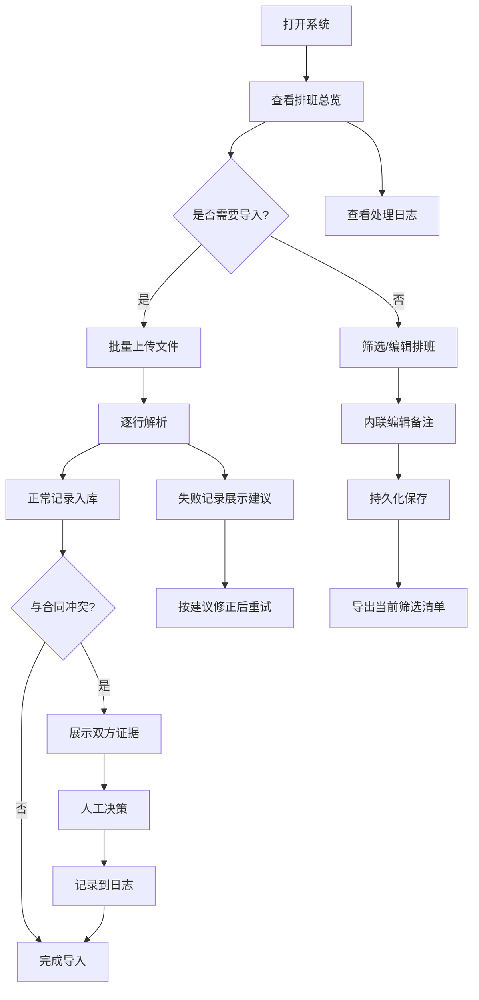

## 1. 产品概述

校园音乐节志愿者排班管理系统，面向音乐老师林老师及志愿者协调团队，解决排班信息与合同材料脱节、临时改动漏通知、批量导入容错不足等核心痛点。目标是在演出前高频变动场景下，确保排班数据、材料证据和处理决策始终对齐、可追溯、不丢失。

## 2. 核心功能

### 2.1 用户角色

| 角色 | 使用方式 | 核心权限 |
|------|----------|----------|
| 音乐老师（林老师） | 直接使用 | 编辑排班、添加备注、导入材料、处理冲突、导出清单 |
| 志愿者协调员 | 直接使用 | 查看排班、添加批注、导出清单 |

### 2.2 功能模块

1. **排班总览页**：排班列表、筛选、备注编辑、导出
2. **材料管理页**：曲目表、音频文件、合同截图、群批注的关联管理
3. **批量导入页**：文件批量上传、容错处理、冲突检测与证据展示
4. **处理日志页**：所有操作与决策的审计追踪

### 2.3 页面详情

| 页面名称 | 模块名称 | 功能描述 |
|----------|----------|----------|
| 排班总览 | 排班列表 | 展示志愿者排班表格，支持按岗位/时段/状态筛选 |
| 排班总览 | 备注编辑 | 内联编辑备注，保存后刷新不丢失，持久化到 localStorage |
| 排班总览 | 导出功能 | 导出 CSV 清单，内容与当前筛选条件严格一致 |
| 材料管理 | 材料列表 | 展示曲目表、音频文件、合同截图、群批注四类材料，关联到具体排班项 |
| 材料管理 | 材料预览 | 合同截图缩略图放大查看，批注文本高亮展示 |
| 批量导入 | 文件上传 | 支持 CSV/JSON 批量导入排班数据 |
| 批量导入 | 容错处理 | 坏文件不阻断整批，正常记录先入库，失败记录给出业务级处理建议 |
| 批量导入 | 冲突检测 | 合同扫描件信息 vs 导入数据冲突时，展示双方证据和操作建议，不自动拍板 |
| 处理日志 | 操作记录 | 展示所有人工标注、备注变更、冲突处理决策的时间线 |
| 处理日志 | 差异说明 | 补录后自动生成变更差异摘要 |

## 3. 核心流程

### 3.1 林老师的日常使用流程

林老师打开系统 → 查看当前排班总览（筛选"舞台组"） → 发现第三排班缺少备注 → 内联添加备注"需提前30分钟到场" → 刷新后备注仍在 → 导出当前筛选下的排班清单 CSV

### 3.2 批量导入与冲突处理流程

林老师上传一批排班 CSV → 系统逐行解析 → 3条格式错误，7条正常 → 正常的7条先入库展示 → 3条失败记录显示具体错误和"像业务同事能照着做的提醒" → 其中1条与合同扫描件中的志愿者姓名不一致 → 系统展示冲突面板：左侧合同截图证据 + 右侧导入数据 → 林老师手动选择保留哪方 → 决策记录到处理日志

### 3.3 补录备注与差异追踪流程

林老师查看某条排班 → 补录备注"音响调试推迟至14:00" → 系统记录变更差异（原备注 → 新备注） → 下次打开时补录后的差异说明仍在 → 报告和明细保持一致

## 4. 用户界面设计

### 4.1 设计风格

- **主色调**：深靛蓝 (#1e293b) + 琥珀金 (#f59e0b) 点缀，呼应音乐节舞台灯光氛围
- **辅助色**：暖白 (#fafaf9) 背景、石板灰 (#64748b) 文字、翡翠绿 (#10b981) 成功状态、玫瑰红 (#f43f5e) 冲突/错误
- **按钮风格**：圆角微凸（rounded-lg），主按钮琥珀金填充，次按钮描边
- **字体**：标题使用 "Playfair Display"（文艺感），正文使用 "Noto Sans SC"（中文可读性）
- **布局风格**：左侧窄导航栏 + 右侧主内容区，卡片式模块，表格主导排班展示
- **图标**：lucide-react 线性图标，搭配音符、日历、文件类图标

### 4.2 页面设计概览

| 页面名称 | 模块名称 | UI要素 |
|----------|----------|--------|
| 排班总览 | 排班列表 | 深靛蓝表头、斑马纹行、琥珀金行hover、内联备注气泡 |
| 排班总览 | 筛选栏 | 顶部横向筛选条，下拉+标签组合 |
| 排班总览 | 导出按钮 | 右上角琥珀金按钮，显示当前筛选条数 |
| 材料管理 | 材料卡片 | 四宫格分类卡片，合同截图带缩略图悬浮放大 |
| 批量导入 | 上传区域 | 虚线拖拽区，进度条，成功/失败分组列表 |
| 批量导入 | 冲突面板 | 左右分栏：左侧合同证据（截图+文字）、右侧导入数据、底部操作建议 |
| 处理日志 | 时间线 | 左侧时间轴竖线，右侧事件卡片，差异高亮 |

### 4.3 响应式

桌面优先设计，1024px 以上完整体验，768px-1024px 简化侧栏为顶部导航，768px 以下堆叠布局。

### 4.4 3D 场景

不适用。
