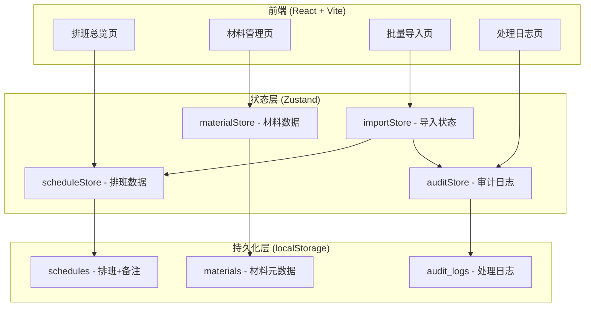
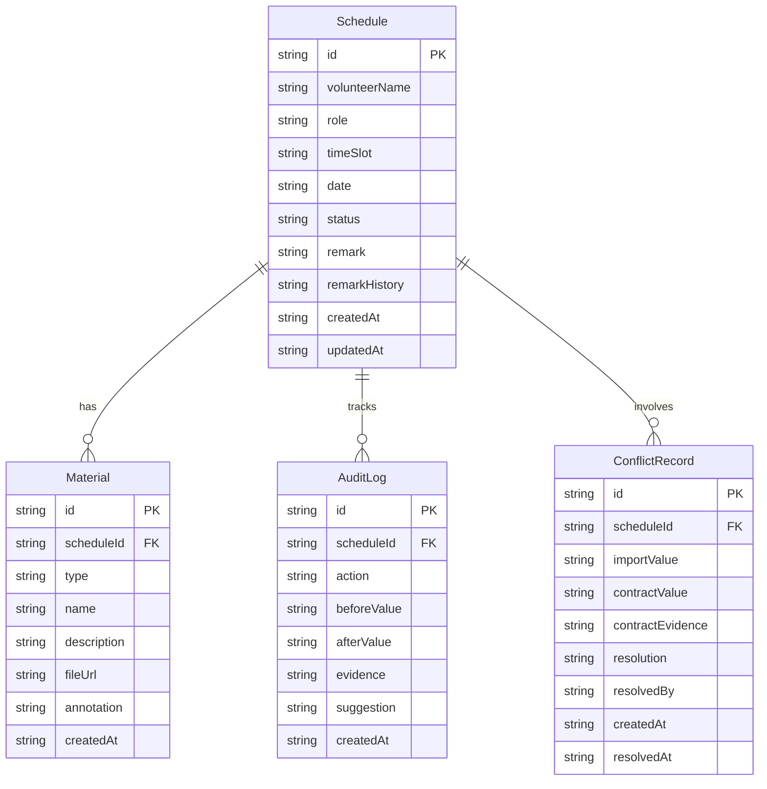

## 1. 架构设计



## 2. 技术说明

- **前端框架**：React@18 + TypeScript + Vite
- **样式方案**：Tailwind CSS@3
- **状态管理**：Zustand（含 persist 中间件实现 localStorage 持久化）
- **路由**：react-router-dom@6
- **图标**：lucide-react
- **后端**：无（纯前端，数据通过 localStorage 持久化）
- **数据库**：无（localStorage 作为客户端存储）

## 3. 路由定义

| 路由 | 用途 |
|------|------|
| / | 排班总览页，展示排班列表、筛选、备注编辑、导出 |
| /materials | 材料管理页，展示曲目表、音频、合同截图、群批注 |
| /import | 批量导入页，文件上传、容错、冲突检测 |
| /audit-log | 处理日志页，操作时间线、差异追踪 |

## 4. API 定义

不适用（纯前端，无后端 API）。

## 5. 服务端架构图

不适用（纯前端项目）。

## 6. 数据模型

### 6.1 数据模型定义



### 6.2 数据定义语言（TypeScript 接口）

```typescript
interface Schedule {
  id: string;
  volunteerName: string;
  role: string;
  timeSlot: string;
  date: string;
  status: 'confirmed' | 'pending' | 'conflict' | 'cancelled';
  remark: string;
  remarkHistory: RemarkChange[];
  createdAt: string;
  updatedAt: string;
}

interface RemarkChange {
  from: string;
  to: string;
  changedAt: string;
}

interface Material {
  id: string;
  scheduleId: string;
  type: 'tracklist' | 'audio' | 'contract_scan' | 'group_annotation';
  name: string;
  description: string;
  fileUrl: string;
  annotation: string;
  createdAt: string;
}

interface AuditLog {
  id: string;
  scheduleId: string;
  action: 'remark_edit' | 'import_success' | 'import_fail' | 'conflict_detected' | 'conflict_resolved' | 'material_linked';
  beforeValue: string;
  afterValue: string;
  evidence: string;
  suggestion: string;
  createdAt: string;
}

interface ConflictRecord {
  id: string;
  scheduleId: string;
  importValue: string;
  contractValue: string;
  contractEvidence: string;
  resolution: 'keep_import' | 'keep_contract' | 'manual_merge' | null;
  resolvedBy: string | null;
  createdAt: string;
  resolvedAt: string | null;
}

interface ImportResult {
  total: number;
  succeeded: number;
  failed: ImportFailure[];
  conflicts: ConflictRecord[];
}

interface ImportFailure {
  rowIndex: number;
  rawData: string;
  errorType: 'format_error' | 'missing_field' | 'duplicate' | 'invalid_value';
  errorMessage: string;
  suggestion: string;
}
```
