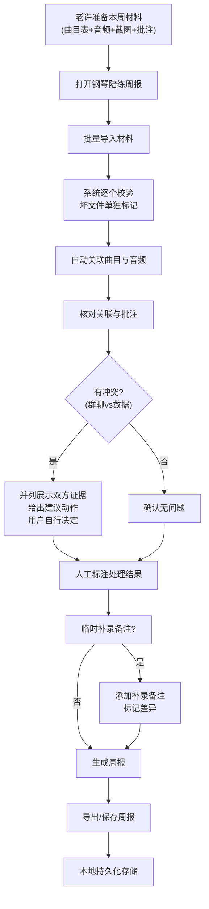

## 1. 产品概述

为录音师老许打造的轻量级"钢琴陪练周报"工具，解决排练群中零散材料（曲目表、音频文件、合同截图、临时批注）难以关联核对的问题。不求大而全，只求能把文件、曲目、批注和异常原因串起来，让实际工作能跑通。

- 核心价值：把混乱的多源材料整理成可追溯、可交接的周报记录
- 目标用户：录音师老许及其团队协作人员
- 设计原则：实用优先、容错性强、人话提示、痕迹可追溯

---

## 2. 核心功能

### 2.1 用户角色

| 角色 | 注册方式 | 核心权限 |
|------|----------|----------|
| 录音师（老许） | 本地使用，无需注册 | 导入材料、标注处理、生成周报、补录备注 |
| 接手同事 | 本地使用，无需注册 | 查看历史标注、理解前次处理逻辑 |

### 2.2 功能模块

1. **材料导入页**：批量上传曲目表、音频文件、图片截图、文字批注，支持格式容错
2. **材料核对页**：自动关联文件与曲目，高亮异常与冲突，支持人工标注
3. **周报生成页**：汇总本周处理情况，生成可读的周报内容，支持导出
4. **历史记录页**：查看过往周次的处理记录和标注，支持交接查阅

### 2.3 页面详情

| 页面名称 | 模块名称 | 功能描述 |
|---------|----------|----------|
| 材料导入页 | 批量上传区 | 拖拽上传多类型文件，实时显示上传进度和状态 |
| 材料导入页 | 格式校验模块 | 逐个检查文件，坏文件单独标记不阻塞整批，显示异常原因 |
| 材料导入页 | 导入结果摘要 | 成功数/失败数/异常数，点击可查看详情 |
| 材料核对页 | 曲目关联列表 | 自动匹配音频文件与曲目表，支持手动调整关联 |
| 材料核对页 | 批注与异常面板 | 显示群聊批注、异常原因，支持人工补充说明 |
| 材料核对页 | 冲突处理模块 | 群聊说法与导入数据冲突时，并列展示两边证据，给出建议动作，不替用户拍板 |
| 材料核对页 | 补录备注模块 | 支持临时补一条备注，清晰标记补录时间和内容差异 |
| 周报生成页 | 数据汇总卡片 | 本周曲目数、音频时长、异常数、已处理/待处理 |
| 周报生成页 | 周报内容区 | 同事口吻的周报文本，可编辑调整后导出 |
| 周报生成页 | 异常明细区 | 所有异常情况不被汇总数字掩盖，逐条列出原因和处理状态 |
| 历史记录页 | 周次切换 | 按周查看历史记录 |
| 历史记录页 | 标注追溯 | 查看当时的人工标注、处理备注、版本差异 |

---

## 3. 核心流程

**流程说明**：
1. 老许先跑一小包材料试水，确认工具可用
2. 批量导入时坏文件不拖垮整批，正常文件继续处理
3. 群聊批注与导入数据冲突时，只摆证据和建议，不自动决策
4. 补录备注会明确标记"补录"，并高亮与原记录的差异
5. 所有人工标注和处理备注都会持久化保存，下次打开还在
6. 汇总数字中的例外情况（异常、失败、未处理）不会被悄悄掩盖，会逐条列出

---

## 4. 用户界面设计

### 4.1 设计风格

**设计方向：专业录音棚感 + 同事间亲切感**

- 主色调：深炭灰 `#1E1E24` 作为背景，温暖琥珀色 `#F5A65B` 作为强调色，米白 `#F8F4E3` 作为内容区
- 辅助色：柔和绿 `#4CAF50` 表示正常，警示橙 `#FF9800` 表示异常，冲突红 `#E57373` 表示冲突
- 按钮风格：微圆角（4px），轻阴影，点击有轻微下陷反馈
- 字体选择：
  - 标题：`"Noto Serif SC"` 或 `"Source Han Serif"` – 带一点人文气息的宋体，稳重不呆板
  - 正文：`"PingFang SC"` 或 `"Noto Sans SC"` – 清晰易读的无衬线
  - 数据/编号：`"JetBrains Mono"` – 等宽字体，方便核对曲目编号和时长
- 布局风格：卡片式分区，信息密度适中，不花哨但有层次
- 图标风格：简洁线性图标，配合少量emoji增加亲切感（🎹 🎵 📝 ⚠️）

### 4.2 页面设计概述

| 页面名称 | 模块名称 | UI 元素 |
|---------|----------|---------|
| 材料导入页 | 批量上传区 | 大尺寸拖拽区域，虚线边框，hover时变色，支持点击选择文件 |
| 材料导入页 | 上传进度列表 | 每行显示文件名、类型、状态图标（✓/⚠/✗）、进度条、异常原因tooltip |
| 材料导入页 | 导入结果摘要 | 三个数字卡片：成功导入 / 有异常 / 导入失败，底部"开始核对"按钮 |
| 材料核对页 | 曲目关联列表 | 左侧曲目表，右侧已关联音频，中间拖拽连接线，未关联项高亮 |
| 材料核对页 | 冲突处理卡片 | 左右分栏对比（群聊截图 + 导入数据），中间"vs"标识，底部三个建议按钮（按群聊/按数据/都保留），但最终需用户确认 |
| 材料核对页 | 补录备注区 | 时间线样式，补录项有橙色"补录"标签，显示"原记录"与"补录"的差异对比 |
| 周报生成页 | 汇总看板 | 四个统计卡片：曲目数 / 总时长 / 已处理 / 待跟进，每个卡片有小趋势箭头 |
| 周报生成页 | 周报正文区 | 仿便签风格的文本区域，开头有"老许，这是你这周的陪练情况："等人话开头 |
| 周报生成页 | 异常明细区 | 折叠面板，默认展开，每条异常显示：曲目、问题、处理状态、标注人、时间 |
| 历史记录页 | 周次选择器 | 横向时间轴，可点击切换周次，有数据的周次标蓝 |
| 历史记录页 | 标注详情 | 按时间线展示当时的所有决策和标注，每条有"当时为什么这么判"的备注区 |

### 4.3 响应式

- 桌面优先设计（主要在工作室电脑上使用）
- 平板自适应：卡片堆叠，侧边栏收起
- 手机端：简化视图，仅支持查看周报和历史，不支持批量导入

### 4.4 动效与微交互

- 页面加载：卡片依次淡入（staggered animation）
- 文件上传成功：轻微弹跳 + 勾号动画
- 冲突出现：红色边框呼吸闪烁（1.5秒一次，不刺眼）
- 补录添加：新记录从底部滑入，带橙色高亮渐隐
- 悬停：卡片轻微上浮 + 阴影加深
