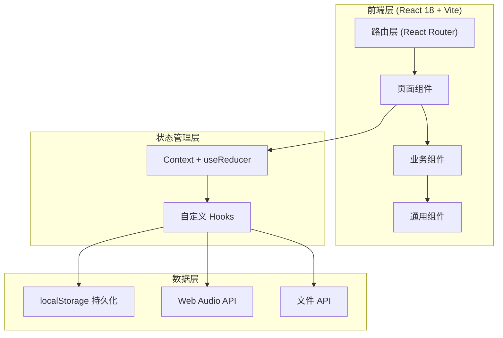

## 1. 架构设计



**架构说明**：
- 纯前端应用，无需后端服务
- 所有数据本地存储在浏览器 localStorage 中
- 使用 React Context + useReducer 管理全局状态
- 自定义 Hooks 封装文件处理、音频分析、周报生成等业务逻辑
- 不依赖外部服务，离线可用

---

## 2. 技术描述

- **前端框架**：React 18 + TypeScript + Vite
- **样式方案**：TailwindCSS 3.4 + CSS 变量
- **路由管理**：React Router DOM v6
- **状态管理**：React Context + useReducer（轻量级，无需 Redux）
- **图标库**：Lucide React（简洁线性图标）
- **音频处理**：Web Audio API（原生，获取时长、基础波形分析）
- **本地存储**：localStorage（封装工具类，支持版本迁移）
- **日期处理**：date-fns（轻量级，比 moment 小）
- **初始化工具**：npm create vite@latest

---

## 3. 路由定义

| Route | 页面 | 说明 |
|-------|------|------|
| `/` | 材料导入页 | 批量上传文件，格式校验 |
| `/review` | 材料核对页 | 关联曲目、处理冲突、添加批注 |
| `/report` | 周报生成页 | 查看汇总、生成周报、导出 |
| `/history` | 历史记录页 | 按周查看历史记录和标注 |
| `*` | 404 重定向 | 跳转回 `/` |

---

## 4. 核心模块划分

```
src/
├── types/              # TypeScript 类型定义
│   └── index.ts        # 所有数据模型定义
├── context/            # 状态管理
│   └── AppContext.tsx  # 全局 Context 和 Reducer
├── hooks/              # 自定义 Hooks
│   ├── useFileImport.ts    # 文件导入逻辑
│   ├── useAudioAnalyzer.ts # 音频分析逻辑
│   ├── useTrackMatcher.ts  # 曲目匹配逻辑
│   ├── useConflictHandler.ts # 冲突处理逻辑
│   ├── useWeeklyReport.ts  # 周报生成逻辑
│   └── useLocalStorage.ts  # 本地存储封装
├── components/         # 组件
│   ├── layout/         # 布局组件
│   ├── import/         # 导入页组件
│   ├── review/         # 核对页组件
│   ├── report/         # 周报页组件
│   ├── history/        # 历史页组件
│   └── common/         # 通用组件
├── pages/              # 页面组件
├── utils/              # 工具函数
│   ├── fileUtils.ts    # 文件处理工具
│   ├── audioUtils.ts   # 音频工具
│   ├── stringUtils.ts  # 字符串匹配工具
│   ├── dateUtils.ts    # 日期工具
│   └── storage.ts      # 存储工具
├── data/               # Mock 数据
│   └── sampleData.ts   # 小样例数据（真实感优先）
├── App.tsx
├── main.tsx
└── index.css
```

---

## 5. 数据模型

### 5.1 ER 图

```mermaid
erDiagram
    WEEKLY_RECORD ||--o{ FILE_ITEM : contains
    WEEKLY_RECORD ||--o{ TRACK : contains
    WEEKLY_RECORD ||--o{ ANNOTATION : contains
    WEEKLY_RECORD ||--o{ CONFLICT : contains
    WEEKLY_RECORD ||--o{ NOTE : contains
    TRACK ||--o| FILE_ITEM : "关联音频"
    TRACK ||--o{ ANNOTATION : "有批注"
    TRACK ||--o{ NOTE : "有备注"
    CONFLICT ||--|| TRACK : "涉及"
    
    WEEKLY_RECORD {
        string id PK
        string weekKey "2026-W23"
        string title
        date startDate
        date endDate
        string status "draft/finalized"
        string operator "老许"
        datetime createdAt
        datetime updatedAt
    }
    
    FILE_ITEM {
        string id PK
        string recordId FK
        string name
        string type "audio/image/text/tracklist"
        string fileHash
        number size
        string status "success/warning/error"
        string errorReason
        datetime uploadTime
        object metadata
    }
    
    TRACK {
        string id PK
        string recordId FK
        string fileId FK
        string name "曲目名称"
        number trackNo "曲目编号"
        string composer "作曲家"
        number duration "秒"
        string status "matched/unmatched/processing"
        string manualNote "人工标注"
        object rawData "原始数据"
    }
    
    ANNOTATION {
        string id PK
        string recordId FK
        string trackId FK
        string source "chat/manual/contract"
        string content "批注内容"
        string author "发消息的人"
        datetime timestamp
        object evidence "截图OCR或引用"
    }
    
    CONFLICT {
        string id PK
        string recordId FK
        string trackId FK
        string type "duration_mismatch/name_mismatch/status_conflict"
        object sideA "一方证据"
        object sideB "另一方证据"
        string suggestion "建议动作"
        string resolution "resolved/unresolved"
        string resolvedBy "谁处理的"
        string resolutionNote "为什么这么判"
        datetime resolvedAt
    }
    
    NOTE {
        string id PK
        string recordId FK
        string trackId FK
        string content
        string author
        boolean isSupplement "是否补录"
        string previousContent "补录前内容"
        datetime createdAt
    }
```



### 5.2 核心类型定义（TypeScript）

```typescript
// 周记录
export interface WeeklyRecord {
  id: string;
  weekKey: string; // 格式：2026-W23
  title: string;
  startDate: string;
  endDate: string;
  status: 'draft' | 'finalized';
  operator: string;
  createdAt: string;
  updatedAt: string;
}

// 文件项
export type FileType = 'audio' | 'image' | 'text' | 'tracklist' | 'unknown';
export type FileStatus = 'success' | 'warning' | 'error' | 'processing';

export interface FileItem {
  id: string;
  recordId: string;
  name: string;
  type: FileType;
  fileHash?: string;
  size: number;
  status: FileStatus;
  errorReason?: string;
  uploadTime: string;
  metadata: Record<string, any>;
  previewUrl?: string;
}

// 曲目
export interface Track {
  id: string;
  recordId: string;
  fileId?: string;
  name: string;
  trackNo: number;
  composer?: string;
  duration?: number; // 秒
  status: 'matched' | 'unmatched' | 'processing' | 'manual';
  manualNote?: string;
  rawData: Record<string, any>;
}

// 批注
export type AnnotationSource = 'chat' | 'manual' | 'contract' | 'ocr';

export interface Annotation {
  id: string;
  recordId: string;
  trackId?: string;
  source: AnnotationSource;
  content: string;
  author: string;
  timestamp: string;
  evidence?: {
    type: 'image' | 'text' | 'ocr';
    reference: string;
  };
}

// 冲突
export type ConflictType = 'duration_mismatch' | 'name_mismatch' | 'status_conflict' | 'annotation_conflict';
export type ConflictResolution = 'use_a' | 'use_b' | 'keep_both' | 'unresolved';

export interface Conflict {
  id: string;
  recordId: string;
  trackId: string;
  type: ConflictType;
  sideA: {
    source: string;
    value: string;
    evidence?: string;
  };
  sideB: {
    source: string;
    value: string;
    evidence?: string;
  };
  suggestion: string;
  resolution: ConflictResolution;
  resolvedBy?: string;
  resolutionNote?: string;
  resolvedAt?: string;
}

// 备注
export interface Note {
  id: string;
  recordId: string;
  trackId?: string;
  content: string;
  author: string;
  isSupplement: boolean;
  previousContent?: string;
  createdAt: string;
}

// 周报
export interface WeeklyReport {
  recordId: string;
  generatedAt: string;
  summary: {
    totalTracks: number;
    totalDuration: number; // 分钟
    matchedTracks: number;
    unmatchedTracks: number;
    conflicts: number;
    resolvedConflicts: number;
    annotations: number;
    notes: number;
  };
  content: string; // 人话周报内容
  anomalies: Array<{
    trackId: string;
    trackName: string;
    issue: string;
    status: string;
    handler?: string;
    handledAt?: string;
  }>;
}
```

---

## 6. 核心业务逻辑说明

### 6.1 批量导入容错机制

```
输入：一批文件（可能包含坏文件）
处理流程：
  1. 逐个文件处理，不并行阻塞
  2. 每个文件独立 try-catch
  3. 成功：标记 status=success，提取元数据
  4. 可恢复异常（如格式不常见但能读）：标记 status=warning，记录警告原因
  5. 严重错误（如文件损坏、空文件）：标记 status=error，记录 errorReason
  6. 全部处理完后，汇总：成功 X 个 / 异常 Y 个 / 失败 Z 个
输出：处理结果列表，不因为个别坏文件导致整批失败
```

### 6.2 曲目匹配逻辑

```
输入：曲目表（CSV/文本解析）+ 音频文件列表
匹配规则（按优先级）：
  1. 精确匹配：文件名包含曲目编号和名称（如 "03_月光奏鸣曲.mp3" ↔ 曲目3 "月光奏鸣曲"）
  2. 模糊匹配：曲目名称相似度 > 85%（使用 Levenshtein 距离）
  3. 时长匹配：音频时长与曲目表标注时长差 < 10%
  4. 顺序匹配：按文件排序与曲目表顺序对应
匹配结果：
  - 高置信度：自动关联，标记 status=matched
  - 低置信度：不自动关联，标记 status=unmatched，高亮提示人工处理
  - 冲突：标记为 conflict，进入冲突处理流程
```

### 6.3 冲突处理机制

```
检测时机：
  - 曲目匹配时发现数据不一致
  - 批注内容与曲目元数据冲突
  - 多源数据（群聊 vs 曲目表 vs 音频元数据）不一致

处理原则：
  1. 绝不自动决策，只展示证据和建议
  2. 并列展示双方证据（sideA vs sideB）
  3. 给出 2-3 个建议动作（按 A / 按 B / 都保留）
  4. 必须用户手动点击确认才算处理完成
  5. 记录处理人、处理时间、处理理由（必填）
```

### 6.4 补录备注机制

```
触发：用户点击"补录备注"按钮
处理：
  1. 记录 isSupplement = true
  2. 如果已有备注，保存 previousContent
  3. 高亮显示"补录"标签
  4. 周报中差异对比显示：
     - 原记录：XXX
     - 补录（6月2日 15:30）：YYY
     - 差异：[高亮变化部分]
```

### 6.5 周报生成逻辑

```
输入：本周所有处理数据
输出：
  1. 汇总数字（但不掩盖异常）
  2. 人话开头："老许，这是你这周的陪练情况..."
  3. 正常情况简要总结
  4. 异常明细单独列出（逐条，不折叠隐藏）
  5. 补录备注单独分区展示
  6. 冲突处理记录列出理由
  7. 结尾："以上，请查阅。有问题群里说。"
```

### 6.6 本地持久化与版本迁移

```
存储结构（localStorage）：
  - piano-coach:records      # 所有周记录索引
  - piano-coach:record:{id}  # 单周完整数据（文件+曲目+批注+冲突+备注）
  - piano-coach:version      # 数据结构版本号
  
版本迁移：
  - 启动时检查 version
  - 如果版本落后，按迁移脚本逐步升级
  - 迁移前自动备份旧数据
```

---

## 7. Mock 数据设计

**小样例数据（真实感优先，不求多但求像）**：

```
周次：2026年第23周（6月1日 - 6月7日）
操作员：老许

曲目表（3首）：
  1. 月光奏鸣曲 - 贝多芬 - 5:30
  2. 致爱丽丝 - 贝多芬 - 3:15
  3. 童年的回忆 - 克莱德曼 - 4:20

音频文件（4个，含1个坏文件）：
  ✓ 01_月光奏鸣曲.mp3 - 5:32（正常）
  ✓ 02_致爱丽丝.mp3 - 3:18（正常）
  ⚠ 03_童年的回忆.mp3 - 4:05（时长偏差8%，警告）
  ✗ 04_损坏文件.mp3 - 无法解码（错误）

群聊批注（3条）：
  - 老王：月光奏鸣曲第三小节速度再慢点
  - 小李：致爱丽丝结尾那个音老许说要重录
  - 老许：童年的回忆按4分10秒版来，别按曲目表

冲突检测：
  - 童年的回忆：曲目表写4:20，群聊说按4:10，实际音频4:05 → 三方冲突

补录备注：
  - 老许（6月2日 15:30 补录）：致爱丽丝已重录，新文件在U盘里，下周补
```
