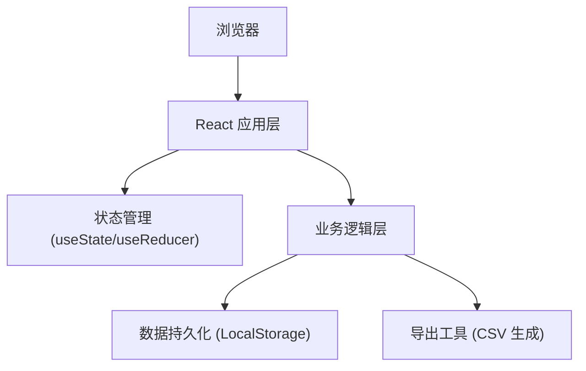
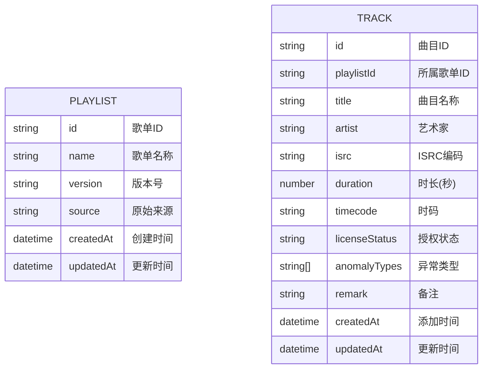

## 1. 架构设计

纯前端单页应用，数据通过浏览器 LocalStorage 持久化存储，无需后端服务。



## 2. 技术描述

- **前端框架**：React@18 + TypeScript + Vite
- **样式方案**：TailwindCSS@3 + CSS 变量
- **数据持久化**：浏览器 LocalStorage
- **导出功能**：纯前端 CSV 生成
- **图标方案**：React Icons (Lucide)

## 3. 路由定义

| 路由 | 用途 |
|------|------|
| / | 歌单管理主页面（单页应用无路由跳转） |

## 4. 数据模型

### 4.1 数据结构定义



### 4.2 TypeScript 类型定义

```typescript
// 异常类型
type AnomalyType = 'expired_license' | 'timecode_mismatch' | 'duplicate_track';

// 曲目数据
interface Track {
  id: string;
  title: string;
  artist: string;
  isrc: string;
  duration: number;
  timecode: string;
  licenseStatus: 'valid' | 'expired' | 'pending';
  anomalyTypes: AnomalyType[];
  remark: string;
  createdAt: string;
  updatedAt: string;
}

// 歌单数据
interface Playlist {
  id: string;
  name: string;
  version: string;
  source: string;
  createdAt: string;
  updatedAt: string;
  tracks: Track[];
}

// 筛选条件
interface FilterOptions {
  search: string;
  status: 'all' | 'normal' | 'anomaly';
  anomalyType: AnomalyType | 'all';
}
```

### 4.3 Mock 数据样例

包含测试用例：空值、重复项、边界记录

```typescript
const mockPlaylist: Playlist = {
  id: 'pl-001',
  name: '音乐App歌单冷启动',
  version: 'v1.2.3',
  source: '厂牌运营小孟-2024春季新歌推荐',
  createdAt: '2024-03-15T10:30:00Z',
  updatedAt: '2024-03-18T14:20:00Z',
  tracks: [
    {
      id: 'trk-001',
      title: '春日序曲',
      artist: '林清风',
      isrc: 'CN-A12-34567-01',
      duration: 215,
      timecode: '00:00:00',
      licenseStatus: 'valid',
      anomalyTypes: [],
      remark: '',
      createdAt: '2024-03-15T10:30:00Z',
      updatedAt: '2024-03-15T10:30:00Z'
    },
    {
      id: 'trk-002',
      title: '城市夜归人',
      artist: '孟星辰',
      isrc: 'CN-A12-34567-02',
      duration: 180,
      timecode: '00:03:35',
      licenseStatus: 'expired',
      anomalyTypes: ['expired_license'],
      remark: '授权已过期，等待厂牌续签',
      createdAt: '2024-03-15T10:30:00Z',
      updatedAt: '2024-03-17T09:15:00Z'
    },
    {
      id: 'trk-003',
      title: '城市夜归人',
      artist: '孟星辰',
      isrc: 'CN-A12-34567-02',
      duration: 180,
      timecode: '00:06:35',
      licenseStatus: 'valid',
      anomalyTypes: ['duplicate_track'],
      remark: '重复曲目，需确认是否为不同版本',
      createdAt: '2024-03-15T10:30:00Z',
      updatedAt: '2024-03-16T16:45:00Z'
    },
    {
      id: 'trk-004',
      title: '',
      artist: '未知艺术家',
      isrc: '',
      duration: 0,
      timecode: '00:09:35',
      licenseStatus: 'pending',
      anomalyTypes: [],
      remark: '空值测试用例，待补充信息',
      createdAt: '2024-03-15T10:30:00Z',
      updatedAt: '2024-03-18T11:20:00Z'
    },
    {
      id: 'trk-005',
      title: '深海回响',
      artist: '沈悠然',
      isrc: 'CN-A12-34567-05',
      duration: 245,
      timecode: '00:09:35',
      licenseStatus: 'valid',
      anomalyTypes: ['timecode_mismatch'],
      remark: '时码与上一曲重叠，需调整',
      createdAt: '2024-03-15T10:30:00Z',
      updatedAt: '2024-03-17T14:30:00Z'
    },
    {
      id: 'trk-006',
      title: '边界测试超长曲目名称测试边界情况abcdefghijklmnopqrstuvwxyz',
      artist: '测试歌手名字也很长看看显示效果如何',
      isrc: 'CN-A12-34567-06-LONG-BOUNDARY',
      duration: 9999,
      timecode: '00:13:40',
      licenseStatus: 'valid',
      anomalyTypes: [],
      remark: '边界记录：字段超长、时长极大值，测试UI适配',
      createdAt: '2024-03-15T10:30:00Z',
      updatedAt: '2024-03-18T08:00:00Z'
    }
  ]
};
```

## 5. 核心功能实现方案

### 5.1 本地数据持久化

- 使用 `localStorage` 存储完整歌单数据
- 数据变更后自动保存（防抖处理）
- 页面加载时自动恢复数据

### 5.2 异常检测逻辑

- **授权过期**：`licenseStatus === 'expired'`
- **时码错位**：检测相邻曲目 timecode 是否重叠
- **重复曲目**：检测相同 ISRC 或相同 曲名+艺术家 组合

### 5.3 CSV 导出格式

导出字段包含：曲目名称、艺术家、ISRC、时长、时码、授权状态、异常类型（中文）、备注、原始来源、处理时间

## 6. 项目目录结构

```
src/
├── components/
│   ├── Header.tsx          # 顶部信息栏
│   ├── FilterBar.tsx       # 筛选工具栏
│   ├── AnomalyPanel.tsx    # 异常分类面板
│   ├── TrackTable.tsx      # 曲目列表表格
│   ├── TrackRow.tsx        # 单行曲目
│   └── ExportBar.tsx       # 底部导出栏
├── hooks/
│   ├── usePlaylist.ts      # 歌单数据管理hook
│   └── useLocalStorage.ts  # 本地存储hook
├── utils/
│   ├── anomalyDetector.ts  # 异常检测工具
│   ├── csvExporter.ts      # CSV导出工具
│   └── formatters.ts       # 格式化工具
├── types/
│   └── index.ts            # 类型定义
├── data/
│   └── mockData.ts         # Mock数据
├── App.tsx
├── main.tsx
└── index.css
```
