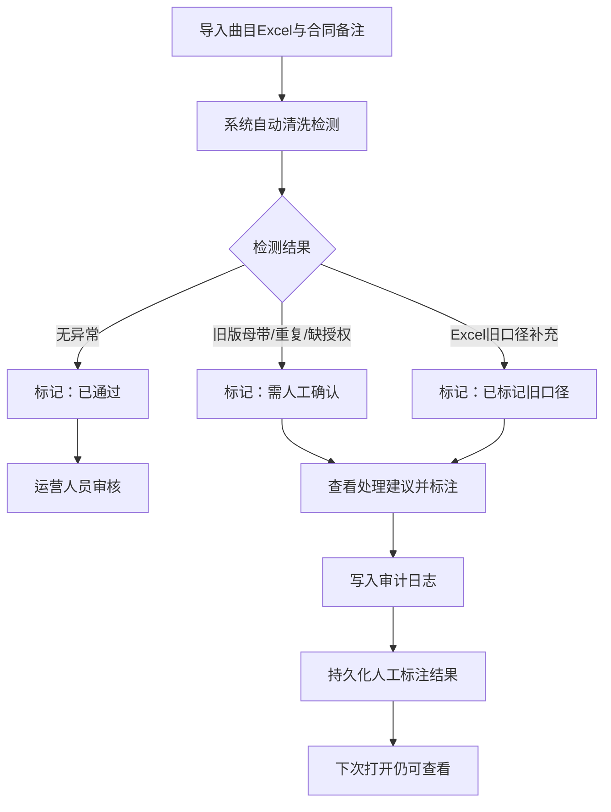

## 1. 产品概述

"剧院返场曲投票清洗"是一套面向厂牌运营人员的数据清洗工具，将曲目 Excel、合同备注、音频文件与异常原因串联成可审计的清洗流水线。核心目标是：自动检测旧版母带、重复曲目、缺授权等异常，给出业务同事可直接照做的处理建议，并持久化人工标注结果，确保换人接手时也能看懂前一次判定。

- 目标用户：厂牌运营人员（如小孟）
- 核心价值：消除手工对第二遍的重复劳动，把文件、曲目、批注和异常原因串起来，让清洗结果不靠猜

## 2. 核心功能

### 2.1 用户角色

| 角色 | 进入方式 | 核心权限 |
|------|----------|----------|
| 厂牌运营人员 | 直接访问 | 浏览清洗列表、标注处理结果、查看审计日志 |
| 管理员 | 直接访问 | 以上权限 + 导出清洗报告 |

### 2.2 功能模块

1. **清洗工作台**：展示全部曲目清洗状态，支持筛选、搜索、批量操作
2. **曲目详情面板**：串联音频文件、曲目信息、合同授权、异常原因与处理建议
3. **审计日志**：记录谁在什么时候对哪条记录做了什么变更
4. **数据管理**：导入曲目 Excel、查看合同备注、管理音频文件关联

### 2.3 页面详情

| 页面名称 | 模块名称 | 功能说明 |
|----------|----------|----------|
| 清洗工作台 | 状态筛选栏 | 按清洗状态（待处理/已通过/需人工确认/已标记旧口径）筛选 |
| 清洗工作台 | 曲目列表 | 展示曲目名、版本、授权状态、异常类型、处理建议、操作人 |
| 清洗工作台 | 快捷操作 | 一键通过、标记需确认、添加处理备注 |
| 曲目详情 | 基本信息 | 曲目名、版本号、来源（Excel/合同）、音频文件路径 |
| 曲目详情 | 授权信息 | 合同编号、授权起止日期、备注 |
| 曲目详情 | 异常分析 | 异常类型（旧版母带/重复曲目/缺授权/人工改名）、原因详情 |
| 曲目详情 | 处理建议 | 业务同事可直接照做的提醒文案 |
| 曲目详情 | 操作历史 | 审计日志时间线，谁在什么时候改过什么 |
| 审计日志 | 日志列表 | 全局操作记录，按时间倒序 |
| 审计日志 | 筛选搜索 | 按操作人、操作类型、时间范围筛选 |

## 3. 核心流程

运营人员打开清洗工作台，系统自动运行清洗规则检测异常，每条记录标记为"已通过"、"需人工确认"或"已标记旧口径"。运营人员查看处理建议，进行标注或补充备注，所有操作写入审计日志。下次打开时，人工标过的版本和处理备注仍然保留。

## 4. 用户界面设计

### 4.1 设计风格

- 主色调：深灰蓝（#1e293b）+ 琥珀色强调（#f59e0b），传达专业严谨但不压抑
- 辅助色：翡翠绿（#10b981）表示通过，玫红（#ef4444）表示异常，天蓝（#3b82f6）表示待处理
- 字体：Noto Sans SC 作为界面字体，JetBrains Mono 用于数据展示
- 布局：左侧主列表 + 右侧详情面板，经典双栏式
- 按钮风格：圆角微凸，hover 带轻微阴影
- 图标：lucide-react 图标库

### 4.2 页面设计概览

| 页面名称 | 模块名称 | UI元素 |
|----------|----------|--------|
| 清洗工作台 | 状态筛选栏 | 标签式筛选按钮组，选中态为琥珀色填充 |
| 清洗工作台 | 曲目列表 | 表格式，行高宽松，异常行左侧带色条 |
| 清洗工作台 | 快捷操作 | 行内按钮组，图标+文字 |
| 曲目详情 | 基本信息 | 卡片式，标题大字+字段对齐 |
| 曲目详情 | 授权信息 | 独立卡片，到期日临近用琥珀色警示 |
| 曲目详情 | 异常分析 | 异常类型徽章+原因说明文本 |
| 曲目详情 | 处理建议 | 黄色底色提示框，icon+文案 |
| 曲目详情 | 操作历史 | 垂直时间线，每条含操作人、时间、变更内容 |
| 审计日志 | 日志列表 | 表格，操作人头像+名称、操作描述、时间戳 |

### 4.3 响应式设计

- 桌面端优先，双栏布局
- 平板端：详情面板改为抽屉式
- 移动端：单栏，列表与详情切换显示
