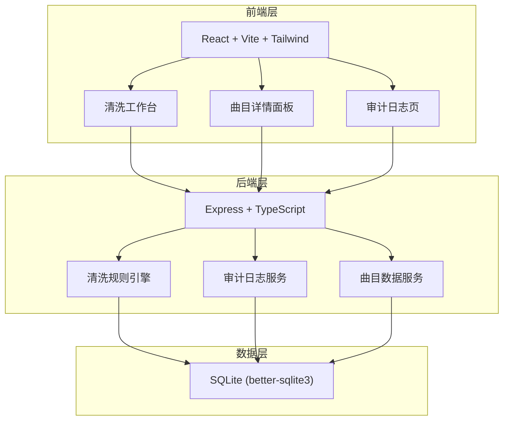
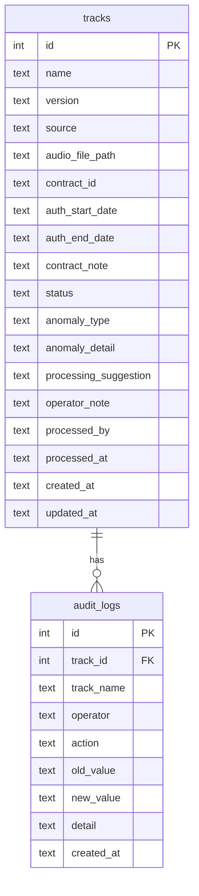

## 1. 架构设计



## 2. 技术说明

- 前端：React@18 + TailwindCSS@3 + Vite + Zustand（状态管理）
- 初始化工具：vite-init
- 后端：Express@4 + TypeScript（ESM格式）
- 数据库：SQLite（better-sqlite3），数据持久化在本地文件
- 无外部服务依赖

## 3. 路由定义

| 路由 | 用途 |
|------|------|
| / | 清洗工作台主页面，展示曲目列表与状态 |
| /track/:id | 曲目详情页（右侧面板或独立页面） |
| /audit | 审计日志页面 |

## 4. API定义

### 4.1 曲目相关

```typescript
interface Track {
  id: number;
  name: string;
  version: string;
  source: "excel" | "contract" | "manual";
  audioFilePath: string | null;
  contractId: string | null;
  authStartDate: string | null;
  authEndDate: string | null;
  contractNote: string | null;
  status: "passed" | "needs_review" | "old_caliber" | "pending";
  anomalyType: "none" | "old_master" | "duplicate" | "missing_auth" | "manual_rename" | null;
  anomalyDetail: string | null;
  processingSuggestion: string | null;
  operatorNote: string | null;
  processedBy: string | null;
  processedAt: string | null;
  createdAt: string;
  updatedAt: string;
}

// GET /api/tracks - 获取曲目列表，支持 ?status= 筛选
// GET /api/tracks/:id - 获取曲目详情
// PUT /api/tracks/:id - 更新曲目（标注、备注等）
// POST /api/tracks/clean - 触发清洗检测
```

### 4.2 审计日志相关

```typescript
interface AuditLog {
  id: number;
  trackId: number;
  trackName: string;
  operator: string;
  action: string;
  oldValue: string | null;
  newValue: string | null;
  detail: string | null;
  createdAt: string;
}

// GET /api/audit-logs - 获取审计日志列表
// GET /api/audit-logs?trackId=1 - 按曲目筛选
```

### 4.3 数据导入

```typescript
// POST /api/import/sample - 导入样例数据
```

## 5. 数据模型

### 5.1 数据模型定义



### 5.2 数据定义语言

```sql
CREATE TABLE IF NOT EXISTS tracks (
  id INTEGER PRIMARY KEY AUTOINCREMENT,
  name TEXT NOT NULL,
  version TEXT NOT NULL DEFAULT 'v1',
  source TEXT NOT NULL CHECK(source IN ('excel', 'contract', 'manual')),
  audio_file_path TEXT,
  contract_id TEXT,
  auth_start_date TEXT,
  auth_end_date TEXT,
  contract_note TEXT,
  status TEXT NOT NULL DEFAULT 'pending' CHECK(status IN ('passed', 'needs_review', 'old_caliber', 'pending')),
  anomaly_type TEXT CHECK(anomaly_type IN ('none', 'old_master', 'duplicate', 'missing_auth', 'manual_rename')),
  anomaly_detail TEXT,
  processing_suggestion TEXT,
  operator_note TEXT,
  processed_by TEXT,
  processed_at TEXT,
  created_at TEXT NOT NULL DEFAULT (datetime('now')),
  updated_at TEXT NOT NULL DEFAULT (datetime('now'))
);

CREATE TABLE IF NOT EXISTS audit_logs (
  id INTEGER PRIMARY KEY AUTOINCREMENT,
  track_id INTEGER NOT NULL,
  track_name TEXT NOT NULL,
  operator TEXT NOT NULL,
  action TEXT NOT NULL,
  old_value TEXT,
  new_value TEXT,
  detail TEXT,
  created_at TEXT NOT NULL DEFAULT (datetime('now')),
  FOREIGN KEY (track_id) REFERENCES tracks(id)
);

CREATE INDEX IF NOT EXISTS idx_tracks_status ON tracks(status);
CREATE INDEX IF NOT EXISTS idx_tracks_anomaly_type ON tracks(anomaly_type);
CREATE INDEX IF NOT EXISTS idx_audit_logs_track_id ON audit_logs(track_id);
CREATE INDEX IF NOT EXISTS idx_audit_logs_created_at ON audit_logs(created_at);
```
