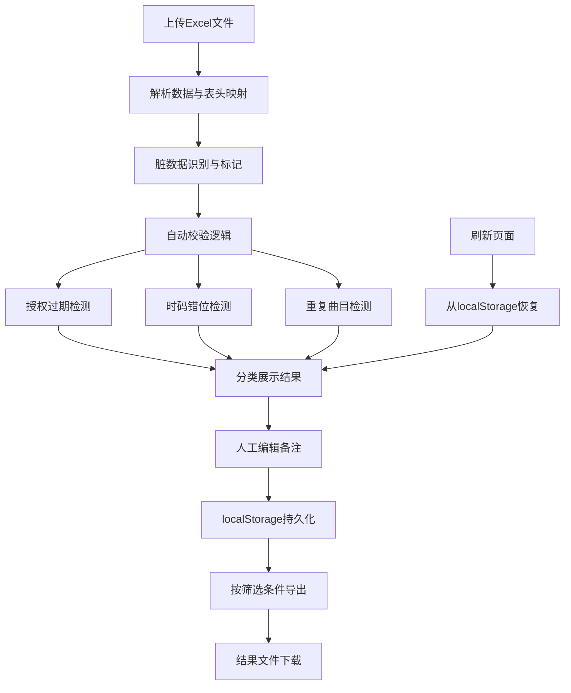

## 1. 产品概述

音乐教师课时核销工具，专为厂牌运营人员设计，用于核销音乐教师授课曲目与实际课时的匹配关系。解决当前依赖文件夹和聊天记录凑材料、命名混乱、数据脱节的问题，实现从导入、校验、人工标注到导出的完整闭环。

- **核心问题**：曲目Excel材料杂乱，半中文半英文命名，授权过期/时码错位/重复曲目难识别，人工备注易丢失，导出结果与筛选条件脱节
- **目标用户**：厂牌运营（小孟）及后续接手的工作人员
- **核心价值**：数据可追溯、校验自动化、备注持久化、导出精准化

---

## 2. 核心功能

### 2.1 用户角色

| 角色 | 登录方式 | 核心权限 |
|------|----------|----------|
| 厂牌运营 | 本地免登录 | 导入Excel、查看列表、编辑备注、筛选数据、导出Excel、查看处理历史 |

### 2.2 功能模块

1. **数据导入模块**：Excel文件拖拽上传，解析曲目数据，自动识别表头映射
2. **数据校验模块**：自动检测授权过期、时码错位、重复曲目三大类问题
3. **列表展示模块**：曲目列表、问题分类标签、筛选条件、分页展示
4. **备注编辑模块**：行内备注编辑、自动保存、历史记录、差异对比
5. **数据持久化模块**：localStorage存储，刷新不丢失，保留原始来源与处理时间
6. **数据导出模块**：按当前筛选条件导出Excel，保持数据一致性

### 2.3 页面详情

| 页面名称 | 模块名称 | 功能描述 |
|----------|----------|----------|
| 主页面 | 顶部操作栏 | Excel导入按钮、导出按钮、统计概览、筛选条件重置 |
| 主页面 | 问题分类面板 | 正常/授权过期/时码错位/重复曲目 四类Tab切换与计数 |
| 主页面 | 数据列表 | 曲目信息展示、问题标签、备注编辑区、处理时间戳、来源标记 |
| 主页面 | 筛选区域 | 按教师姓名、曲目名称、日期范围、处理状态多条件筛选 |
| 主页面 | 备注编辑弹窗 | 历史备注对比、差异高亮、新增备注保存 |
| 主页面 | 导入解析提示 | 导入成功条数、问题条数、脏数据识别结果统计 |

---

## 3. 核心流程

### 3.1 主业务流程描述

1. 小孟将"音乐教师课时核销"小包Excel拖拽上传
2. 系统自动解析数据，检测表头映射，识别脏数据（半英文半中文命名、空值、格式错误）
3. 系统自动校验：授权日期是否过期、开始/结束时码是否错位、曲目名称+教师是否重复
4. 数据按校验结果分类展示，问题数据单独标记并列入对应Tab
5. 小孟临时补一条备注，系统自动保存并记录处理时间、原始来源
6. 小孟按条件筛选后导出Excel，导出内容与当前筛选结果完全一致
7. 刷新页面后，所有数据、标注、备注保持不变
8. 后续补录新材料时，可增量导入，系统自动识别重复并标记差异

### 3.2 业务流程图

---

## 4. 用户界面设计

### 4.1 设计风格

- **主色调**：深蓝 `#1e3a5f`（专业、稳重），配合琥珀橙 `#d97706`（问题警示）、翡翠绿 `#059669`（正常状态）、玫瑰红 `#dc2626`（严重问题）
- **按钮风格**：轻微圆角（4px），悬停时加深阴影，按下时轻微下沉
- **字体**：标题使用 `Noto Serif SC`（宋体变体，书卷气），正文使用 `Inter`（现代无衬线），数字使用 `JetBrains Mono`（等宽清晰）
- **布局风格**：顶部固定操作栏+左侧筛选面板+主内容区卡片式列表，信息密度适中
- **视觉元素**：问题标签使用斜角边框，处理时间戳使用灰色小字，备注区使用浅黄底色区分

### 4.2 页面设计概览

| 页面名称 | 模块名称 | UI元素 |
|----------|----------|--------|
| 主页面 | 顶部操作栏 | 左侧标题带图标、中间统计数字（总数/正常/问题）、右侧导入导出按钮 |
| 主页面 | 问题分类Tab | 4个分类卡片，带数字角标，选中态有底部边框高亮 |
| 主页面 | 筛选面板 | 可折叠，包含教师下拉、曲目搜索框、日期范围选择器、状态复选框组 |
| 主页面 | 数据列表 | 斑马纹表格，行高48px，问题行有左侧色条标记，备注可点击展开编辑 |
| 主页面 | 备注编辑区 | 黄色背景文本框，自动保存提示，历史记录时间线 |
| 主页面 | 导入反馈弹窗 | 成功/警告/错误三级统计，可展开查看详细脏数据列表 |

### 4.3 响应式设计

- **桌面端优先**：1280px以上完整展示三栏布局
- **平板端**：1024px时筛选面板改为抽屉式
- **移动端**：768px以下列表改为卡片式堆叠，操作按钮移至底部

### 4.4 动效设计

- 页面加载：顶部操作栏先出现，然后分类Tab滑入，最后列表项逐行淡入（stagger 50ms）
- 备注保存：成功时出现绿色对勾图标，1秒后消失
- 问题标记：悬停时轻微放大并显示tooltip说明问题原因
- 筛选切换：列表内容淡出→新数据淡入，过渡300ms

---

## 5. 数据要求

### 5.1 导入Excel字段映射

| Excel列名（可能变体） | 系统字段名 | 类型 | 说明 |
|---------------------|-----------|------|------|
| 教师姓名/Teacher/老师 | teacherName | string | 支持中英文混合 |
| 曲目名称/曲目/Title/Song | trackName | string | 核心匹配字段 |
| 授权开始日期/Start Date/开始时间 | authStart | date | 用于过期检测 |
| 授权结束日期/End Date/结束时间 | authEnd | date | 用于过期检测 |
| 开始时码/入点/Start TC | tcIn | string | 格式 HH:MM:SS |
| 结束时码/出点/End TC | tcOut | string | 格式 HH:MM:SS |
| 课时/时长/Duration | duration | number | 单位：分钟 |
| 备注/Remark/Note | remark | string | 初始备注 |

### 5.2 校验规则

1. **授权过期**：`authEnd < 当前日期` 标记为授权过期
2. **时码错位**：`tcIn >= tcOut` 或 时码格式错误 标记为时码错位
3. **重复曲目**：`teacherName + trackName` 组合重复出现 标记为重复曲目
4. **脏数据**：必填字段为空、日期格式无法解析、时码格式异常，统一标记并保留原始值

### 5.3 持久化字段

每条记录额外保存：
- `id`：唯一标识（UUID）
- `sourceFile`：原始文件名
- `importedAt`：导入时间戳
- `lastModifiedAt`：最后修改时间戳
- `modifyHistory`：备注修改历史数组（时间+内容+差异）
- `validationStatus`：校验结果枚举
- `validationErrors`：具体错误详情数组
