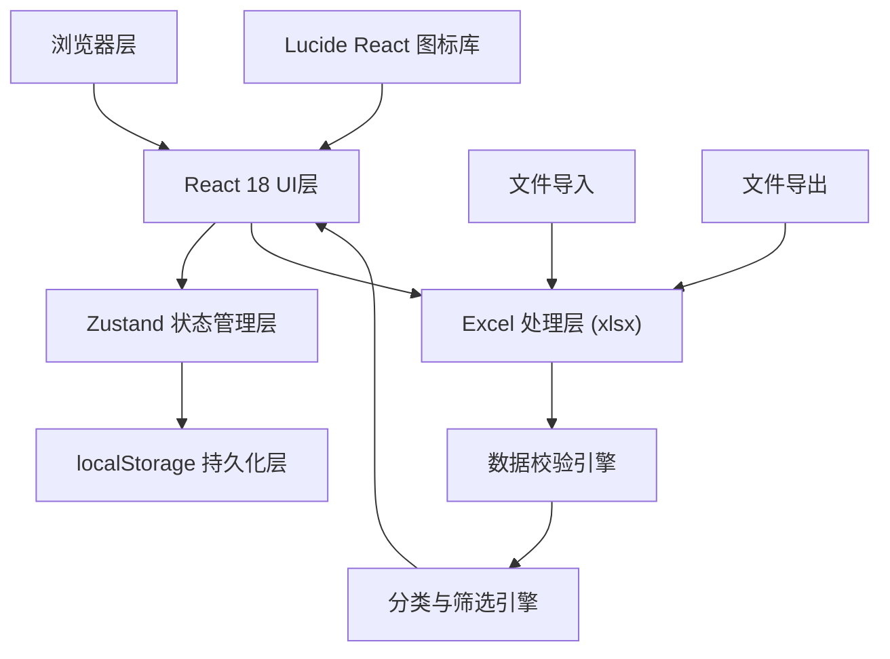
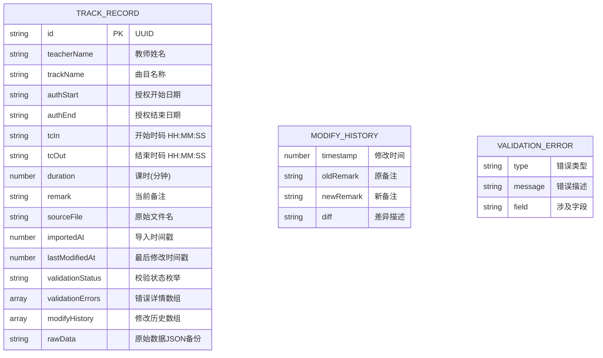

## 1. 架构设计



---

## 2. 技术描述

- **前端**：React@18 + TypeScript + Vite@5
- **状态管理**：Zustand@4（轻量、支持persist中间件）
- **样式**：TailwindCSS@3 + CSS变量
- **Excel处理**：xlsx@0.18.5（SheetJS社区版）
- **图标**：lucide-react@0.344.0
- **持久化**：localStorage + Zustand persist 中间件
- **后端**：无（纯前端应用，数据全部本地存储）
- **数据库**：localStorage（最大存储约5MB，满足数千条记录需求）

### 2.1 核心依赖说明

| 依赖包 | 版本 | 用途 |
|--------|------|------|
| react | ^18.2.0 | UI框架 |
| react-dom | ^18.2.0 | DOM渲染 |
| zustand | ^4.5.0 | 状态管理 + 持久化 |
| xlsx | ^0.18.5 | Excel导入导出 |
| lucide-react | ^0.344.0 | 图标组件 |
| tailwindcss | ^3.4.1 | 原子化CSS |
| typescript | ^5.3.3 | 类型安全 |
| vite | ^5.0.8 | 构建工具 |

---

## 3. 路由定义

| 路由 | 页面组件 | 用途 |
|------|----------|------|
| / | TrackVerificationPage | 主页面，包含所有功能模块 |

---

## 4. 数据模型

### 4.1 数据模型ER图



### 4.2 TypeScript 类型定义

```typescript
export type ValidationStatus = 
  | 'normal' 
  | 'auth_expired' 
  | 'tc_mismatch' 
  | 'duplicate' 
  | 'dirty_data';

export interface ValidationError {
  type: ValidationStatus;
  message: string;
  field: string;
}

export interface ModifyHistory {
  timestamp: number;
  oldRemark: string;
  newRemark: string;
  diff: string;
}

export interface TrackRecord {
  id: string;
  teacherName: string;
  trackName: string;
  authStart: string;
  authEnd: string;
  tcIn: string;
  tcOut: string;
  duration: number;
  remark: string;
  sourceFile: string;
  importedAt: number;
  lastModifiedAt: number;
  validationStatus: ValidationStatus;
  validationErrors: ValidationError[];
  modifyHistory: ModifyHistory[];
  rawData: Record<string, any>;
}

export interface FilterState {
  status: ValidationStatus | 'all';
  teacherName: string;
  trackName: string;
  dateFrom: string;
  dateTo: string;
}

export interface AppState {
  records: TrackRecord[];
  filters: FilterState;
  selectedIds: string[];
  importStats: {
    total: number;
    success: number;
    warnings: number;
    errors: number;
  } | null;
}
```

### 4.3 Zustand Store 定义

```typescript
import { create } from 'zustand';
import { persist } from 'zustand/middleware';

interface TrackStore extends AppState {
  // Actions
  addRecords: (records: TrackRecord[]) => void;
  updateRemark: (id: string, newRemark: string) => void;
  setFilters: (filters: Partial<FilterState>) => void;
  resetFilters: () => void;
  clearAll: () => void;
  getFilteredRecords: () => TrackRecord[];
  getStats: () => Record<ValidationStatus | 'all', number>;
}

export const useTrackStore = create<TrackStore>()(
  persist(
    (set, get) => ({
      // ... state and actions
    }),
    {
      name: 'music-teacher-track-verification',
      version: 1,
    }
  )
);
```

---

## 5. 目录结构

```
src/
├── components/
│   ├── Header.tsx              # 顶部操作栏
│   ├── StatusTabs.tsx          # 状态分类Tab
│   ├── FilterPanel.tsx         # 筛选面板
│   ├── TrackTable.tsx          # 曲目数据表格
│   ├── TrackRow.tsx            # 表格行组件
│   ├── RemarkEditor.tsx        # 备注编辑器
│   ├── ImportModal.tsx         # 导入反馈弹窗
│   ├── FileUpload.tsx          # 文件上传组件
│   └── StatusBadge.tsx         # 状态标签组件
├── hooks/
│   ├── useExcelImport.ts       # Excel导入Hook
│   ├── useExcelExport.ts       # Excel导出Hook
│   └── useTrackValidation.ts   # 数据校验Hook
├── utils/
│   ├── excelParser.ts          # Excel解析与表头映射
│   ├── validator.ts            # 校验逻辑引擎
│   ├── timecode.ts             # 时码处理工具
│   ├── diff.ts                 # 差异对比工具
│   └── storage.ts              # localStorage封装
├── types/
│   └── index.ts                # 类型定义
├── store/
│   └── useTrackStore.ts        # Zustand状态管理
├── pages/
│   └── TrackVerificationPage.tsx  # 主页面
├── data/
│   └── sampleData.ts           # 样例数据（含脏数据）
├── App.tsx
├── main.tsx
└── index.css
```

---

## 6. 核心算法说明

### 6.1 表头模糊映射算法

```
输入: Excel表头数组
输出: 字段映射表 Map<系统字段名, Excel列索引>

规则:
1. 预定义关键词映射表 { systemField: [keywords...] }
2. 对每个Excel表头, 去除空格, 转小写
3. 计算与每个系统字段关键词集合的匹配度(命中数/总关键词数)
4. 匹配度>0.5则建立映射
5. 未匹配字段放入 rawData 保留
```

### 6.2 时码解析与校验

```
输入: 时码字符串 (如 "01:23:45", "1.23.45", "89:61:70")
输出: { valid: boolean, seconds: number, error?: string }

校验规则:
1. 正则匹配 /^\d{1,2}:\d{2}:\d{2}$/
2. 时 < 24, 分 < 60, 秒 < 60
3. tcIn_seconds < tcOut_seconds
```

### 6.3 重复检测算法

```
输入: records 数组
输出: 标记重复记录

规则:
1. 生成复合键: normalize(teacherName) + '|' + normalize(trackName)
2. normalize = trim + toLowerCase + 全角转半角 + 去特殊字符
3. 按复合键分组, 计数>1则全部标记为重复
4. 重复组内第一条标记为主记录, 其余标记为副本
```

### 6.4 备注差异对比

```
输入: oldStr, newStr
输出: diff描述

规则:
1. 按字符级diff计算新增/删除部分
2. 生成人类可读描述: "新增: xxx, 删除: yyy"
3. 纯新增则显示 "补充备注: xxx"
4. 纯删除则显示 "移除备注: xxx"
```

---

## 7. 样例数据设计

包含15条真实感数据，覆盖以下场景：

| 类型 | 数量 | 说明 |
|------|------|------|
| 正常数据 | 6条 | 格式完整、校验通过 |
| 授权过期 | 3条 | authEnd早于当前日期 |
| 时码错位 | 2条 | tcIn >= tcOut 或格式错误 |
| 重复曲目 | 2组共4条 | 同教师同曲目出现多次 |
| 脏数据 | 3条 | 半英文半中文命名、空字段、日期格式混乱 |
| 已修改备注 | 2条 | 带modifyHistory演示历史记录 |
