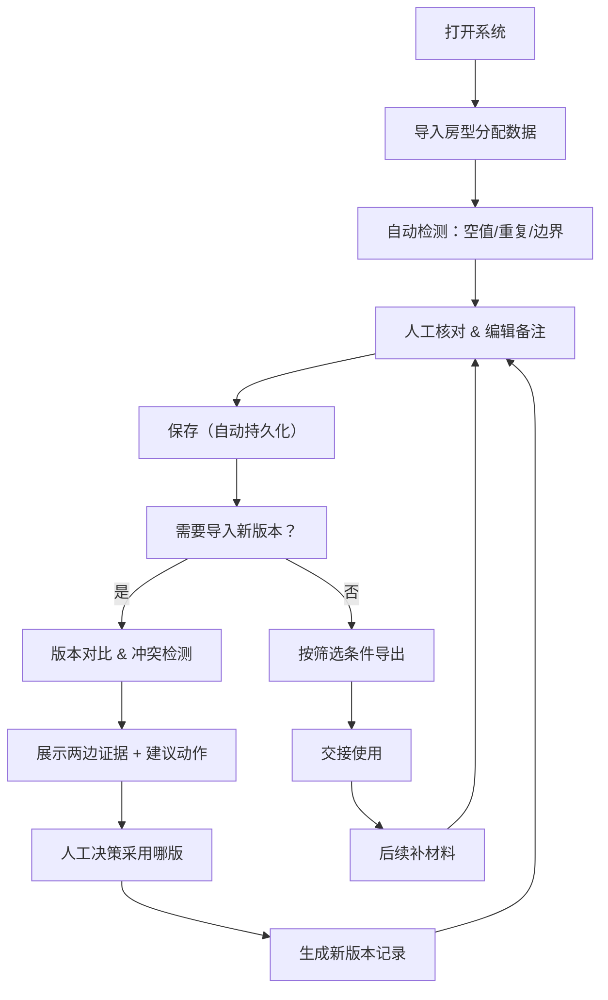

## 1. 产品概述

巡演酒店房型分配管理系统，解决厂牌运营团队在巡演项目中酒店房型分配的版本混乱、人工核对效率低、数据溯源困难等问题。目标用户为厂牌运营人员（如小孟），用于巡演前的交接工作。

- 解决的核心问题：多版本文件管理混乱、人工核对易出错、数据来源不可追溯、备注修改易丢失
- 产品价值：让"巡演酒店房型分配"从靠文件夹和聊天记录凑，变成可追踪、可对比、可审计的专业管理流程

## 2. 核心功能

### 2.1 用户角色

| 角色 | 注册方式 | 核心权限 |
|------|----------|----------|
| 厂牌运营 | 无需注册，本地使用 | 全部功能：数据导入、编辑、版本管理、导出、冲突处理 |

### 2.2 功能模块

1. **主列表页**：房型分配数据展示、筛选、搜索、分页、备注编辑
2. **版本管理页**：版本历史列表、变更记录查看、版本对比、版本回滚
3. **数据导入页**：CSV/JSON导入、数据预览、冲突检测、智能建议
4. **导出功能**：按当前筛选条件导出、导出格式选择
5. **数据质量检查**：空值检测、重复项识别、边界记录标记

### 2.3 页面详情

| 页面名称 | 模块名称 | 功能描述 |
|----------|----------|-------------|
| 主列表页 | 数据筛选区 | 巡演名称、酒店名称、房型、人员类型、状态等多维度筛选 |
| 主列表页 | 数据表格 | 展示房型分配记录，支持排序、批量选择 |
| 主列表页 | 备注编辑 | 行内编辑备注，自动保存不丢失 |
| 主列表页 | 来源追溯 | 点击查看每条记录的来源文件、导入时间、操作人 |
| 主列表页 | 数据质量标记 | 空值黄色标记、重复项红色标记、边界记录蓝色标记 |
| 版本管理页 | 版本列表 | 展示所有历史版本，显示版本号、创建人、创建时间、变更说明 |
| 版本管理页 | 版本对比 | 高亮显示两个版本间的差异（新增、修改、删除） |
| 版本管理页 | 变更记录 | 展示每次修改的字段、旧值、新值、操作人、时间 |
| 数据导入页 | 导入预览 | 上传文件后预览数据，确认无误再导入 |
| 数据导入页 | 冲突检测 | 与现有数据对比，标出冲突项，展示两边证据和建议动作 |
| 数据导入页 | 人工标记 | 用户可手动标记版本为"已确认""待核对""有问题"等状态 |

## 3. 核心流程

### 3.1 主流程描述

厂牌运营小孟打开系统，导入"巡演酒店房型分配"数据，系统自动检测空值、重复项和边界记录。小孟逐条核对，添加备注。导入新版本时，系统自动对比冲突，展示两边数据证据和建议，由小孟决定采用哪一版。修改后的备注和人工标记会自动保存，刷新页面不丢失。最后小孟按当前筛选条件导出清单，用于交接。后续补材料时可继续接着处理。

### 3.2 流程图

## 4. 用户界面设计

### 4.1 设计风格

- **主色调**：深青色 `#0F4C5C`（专业、稳重），搭配暖橙色 `#E36414`（提醒、标记），米白色背景 `#FBF7F4`（温和不刺眼）
- **按钮风格**：圆角8px，悬停有微动画和阴影变化，主按钮用深青色，次要按钮用浅灰边框
- **字体**：标题用 "Noto Serif SC"（有书卷气，区别于普通工具感），正文用 "Noto Sans SC"（清晰易读）
- **布局风格**：卡片式布局，主表格用斑马纹，筛选区固定在顶部，侧边栏放版本快捷入口
- **图标风格**：使用 lucide-react 线性图标，配合状态颜色，重要操作有 tooltip 提示

### 4.2 页面设计概述

| 页面名称 | 模块名称 | UI 元素 |
|----------|----------|----------|
| 主列表页 | 顶部筛选区 | 下拉筛选框、搜索框、重置按钮、导出按钮 |
| 主列表页 | 数据表格 | 斑马纹行、状态标签、可编辑备注单元格、操作按钮列 |
| 主列表页 | 数据质量提示 | 空值黄色背景、重复项红色边框、边界记录蓝色角标 |
| 主列表页 | 来源抽屉 | 点击"来源"滑出抽屉，展示来源文件、导入时间、操作人、历史变更 |
| 版本管理页 | 版本时间线 | 垂直时间线，每个版本卡片显示摘要，点击展开详情 |
| 版本管理页 | 对比视图 | 左右分栏对比，差异部分用高亮背景标出 |
| 冲突检测弹窗 | 冲突详情 | 三栏布局：左边旧值、右边新值、中间建议操作按钮 |

### 4.3 响应式

- 桌面端优先设计（1280px+），主表格区域可横向滚动
- 平板端（768px-1280px）：筛选区改为两行布局，侧边栏可收起
- 移动端（<768px）：表格改为卡片列表展示，每条记录一张卡片

### 4.4 动效细节

- 页面加载：顶部进度条 + 内容区淡入（staggered 动画）
- 行操作：hover 行时背景色微变，操作按钮从透明渐显
- 备注保存：编辑完成后显示 ✓ 小勾动画，300ms 后消失
- 冲突弹窗：从底部滑入，带轻微弹性效果
- 版本对比：差异项逐行高亮，便于聚焦

## 5. 交互文案规范

所有提示语、报告、按钮文案采用"同事写给同事"的口语化风格，避免生硬的专业术语：

| 场景 | 文案示例 |
|------|----------|
| 空值提示 | "这条的【入住人】还空着哦，要不要补一下？" |
| 重复项提示 | "发现2条一模一样的记录，是重复导入了吗？" |
| 冲突建议 | "舞台通道表里写的是大床房，但新导入的数据写的是双床房，你看看哪边对？" |
| 保存成功 | "记下啦 ✓" |
| 导出提示 | "正在按你当前选的筛选条件导清单..." |
| 边界记录 | "这条是最后一间房，分配前确认一下哦" |
