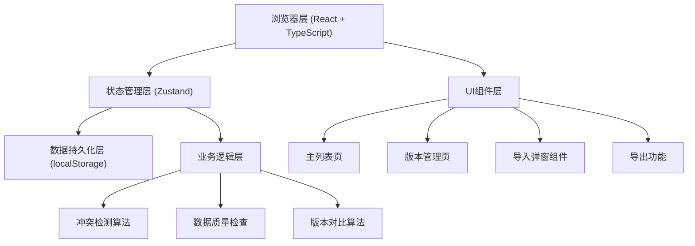
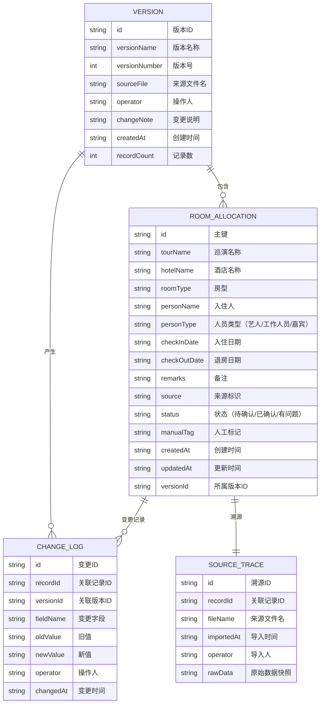

## 1. 架构设计

纯前端应用，数据持久化在浏览器 localStorage，无需后端服务。



## 2. 技术描述

- **前端**：React@18 + TypeScript + Vite + TailwindCSS@3
- **状态管理**：Zustand（配合 localStorage 中间件实现持久化）
- **图标**：lucide-react
- **数据存储**：浏览器 localStorage（纯前端，无需后端）
- **初始化工具**：vite-init
- **后端**：无（纯前端应用）
- **数据库**：localStorage 模拟

## 3. 路由定义

| 路由 | 用途 |
|------|------|
| `/` | 主列表页 - 房型分配数据展示、筛选、编辑 |
| `/versions` | 版本管理页 - 版本历史、对比、变更记录 |

## 4. 数据模型

### 4.1 数据模型定义



### 4.2 存储结构（localStorage）

```typescript
// 存储键名
const STORAGE_KEYS = {
  ALLOCATIONS: 'hotel_allocations',
  VERSIONS: 'hotel_versions',
  CHANGE_LOGS: 'hotel_change_logs',
  SOURCE_TRACES: 'hotel_source_traces',
  UI_STATE: 'hotel_ui_state', // 保存筛选条件、分页等UI状态
};

// 房型分配记录
interface RoomAllocation {
  id: string;
  tourName: string;
  hotelName: string;
  roomType: string;
  personName: string;
  personType: 'artist' | 'staff' | 'guest';
  checkInDate: string;
  checkOutDate: string;
  remarks: string;
  source: string;
  status: 'pending' | 'confirmed' | 'issue';
  manualTag?: string;
  createdAt: string;
  updatedAt: string;
  versionId: string;
}

// 版本记录
interface Version {
  id: string;
  versionName: string;
  versionNumber: number;
  sourceFile: string;
  operator: string;
  changeNote: string;
  createdAt: string;
  recordCount: number;
}

// 变更日志
interface ChangeLog {
  id: string;
  recordId: string;
  versionId: string;
  fieldName: string;
  oldValue: string;
  newValue: string;
  operator: string;
  changedAt: string;
}

// 数据质量检查结果
interface DataQualityIssue {
  recordId: string;
  type: 'empty' | 'duplicate' | 'boundary';
  field?: string;
  message: string;
  severity: 'warning' | 'error' | 'info';
}

// 冲突检测结果
interface ConflictItem {
  recordId: string;
  fieldName: string;
  oldValue: string;
  newValue: string;
  oldSource: string;
  newSource: string;
  suggestion: string;
}
```

### 4.3 核心算法说明

#### 4.3.1 空值检测
遍历每条记录的关键字段（personName, roomType, checkInDate, checkOutDate），检测是否为空或仅包含空白字符。

#### 4.3.2 重复项检测
基于关键字段组合（tourName + hotelName + roomType + personName + checkInDate）生成哈希值，相同哈希值即为重复。

#### 4.3.3 边界记录检测
- 最后一间房：同一酒店同一房型数量为1的记录
- 首日/末日入住：入住日期等于巡演首日或末日
- 特殊人员：艺人/重要嘉宾的分配记录

#### 4.3.4 版本对比算法
对两个版本的记录按唯一键分组，对比每个字段：
- 仅在旧版存在 → 删除
- 仅在新版存在 → 新增
- 两边都存在但字段不同 → 修改

## 5. 项目结构

```
src/
├── components/          # 可复用组件
│   ├── DataTable.tsx    # 数据表格组件
│   ├── FilterBar.tsx    # 筛选栏组件
│   ├── RemarksCell.tsx  # 可编辑备注单元格
│   ├── SourceDrawer.tsx # 来源追溯抽屉
│   ├── ImportModal.tsx  # 导入弹窗
│   ├── ConflictModal.tsx# 冲突处理弹窗
│   ├── VersionTimeline.tsx # 版本时间线
│   ├── VersionDiff.tsx  # 版本对比组件
│   └── QualityBadge.tsx # 数据质量标记
├── store/               # 状态管理
│   └── useAllocationStore.ts # Zustand store
├── pages/               # 页面
│   ├── AllocationList.tsx # 主列表页
│   └── VersionManage.tsx  # 版本管理页
├── utils/               # 工具函数
│   ├── dataQuality.ts   # 数据质量检查
│   ├── conflictDetection.ts # 冲突检测
│   ├── versionCompare.ts # 版本对比
│   ├── export.ts        # 导出功能
│   ├── import.ts        # 导入解析
│   └── storage.ts       # localStorage 封装
├── types/               # 类型定义
│   └── index.ts
├── data/                # Mock 数据
│   └── sampleData.ts    # "巡演酒店房型分配"样例数据
├── App.tsx
├── main.tsx
└── index.css
```

## 6. 状态持久化方案

使用 Zustand 的 persist 中间件，所有数据自动同步到 localStorage：

```typescript
import { create } from 'zustand';
import { persist } from 'zustand/middleware';

export const useAllocationStore = create(
  persist(
    (set, get) => ({
      // 状态
      allocations: [],
      versions: [],
      changeLogs: [],
      sourceTraces: [],
      filters: {},
      selectedRecords: [],
      
      // 操作方法
      addAllocation: (record) => { /* ... */ },
      updateRemarks: (id, remarks) => { /* ... */ },
      importVersion: (data, sourceInfo) => { /* ... */ },
      detectConflicts: (newData) => { /* ... */ },
      checkDataQuality: () => { /* ... */ },
      exportFiltered: () => { /* ... */ },
    }),
    {
      name: 'hotel-allocation-storage',
      partialize: (state) => ({
        allocations: state.allocations,
        versions: state.versions,
        changeLogs: state.changeLogs,
        sourceTraces: state.sourceTraces,
        filters: state.filters,
      }),
    }
  )
);
```

## 7. 关键功能实现思路

### 7.1 备注编辑不丢失
- 单元格失焦时自动保存到 store
- store 自动同步到 localStorage
- 编辑时显示"保存中..."状态，保存成功显示 ✓ 动画
- 页面刷新时从 localStorage 恢复

### 7.2 导出与筛选一致
- 导出时先获取当前筛选条件
- 应用筛选条件过滤数据
- 生成 CSV/JSON 文件下载
- 文件名包含导出时间和筛选条件摘要

### 7.3 冲突检测不自动决策
- 导入时逐条对比新旧数据
- 检测到冲突时弹出三栏对比界面
- 左边显示旧值和来源，右边显示新值和来源
- 中间提供"保留旧版""采用新版""手动编辑"三个按钮
- 用户操作后记录决策到变更日志

### 7.4 版本不覆盖
- 每次导入生成新版本号（自增）
- 旧版本数据保留在 history 中
- 支持版本对比和回滚
- 版本时间线展示完整变更历史

## 8. 测试用例规划

| 测试场景 | 测试数据 | 预期结果 |
|----------|----------|----------|
| 空值处理 | personName 为空的记录 | 黄色背景标记，提示"入住人还空着" |
| 重复项处理 | 两条完全相同的记录 | 红色边框标记，提示重复 |
| 边界记录 | 最后一间大床房 | 蓝色角标标记，提示"最后一间" |
| 备注持久化 | 编辑备注后刷新页面 | 备注内容仍在 |
| 筛选导出 | 筛选"艺人"后导出 | 导出文件仅包含艺人记录 |
| 冲突处理 | 新旧版本房型字段不同 | 弹出对比框，不自动覆盖，等待用户决策 |
| 版本追溯 | 点击来源按钮 | 展示导入文件、时间、操作人、历史变更 |
| 样例数据参与判断 | 加载"巡演酒店房型分配"样例 | 能正确识别样例中的空值、重复和边界情况 |
