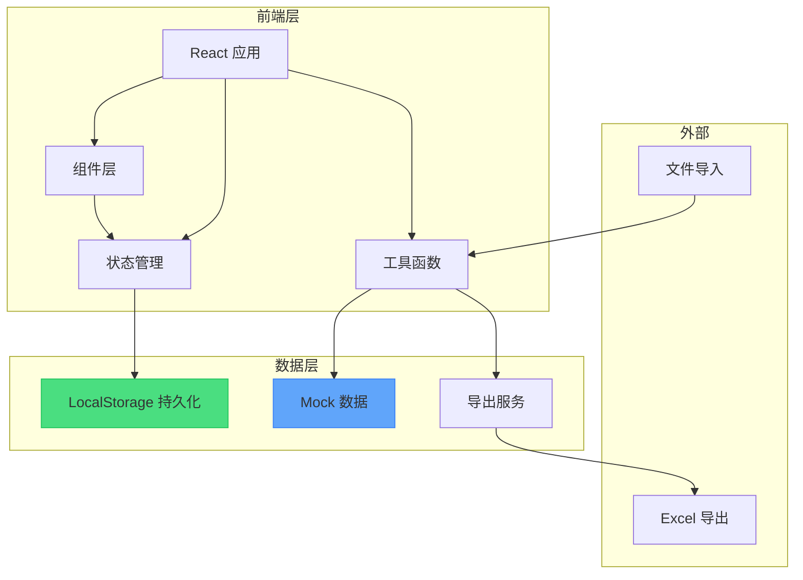
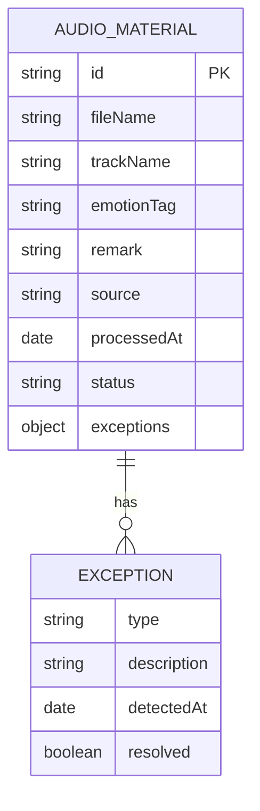

## 1. 架构设计



## 2. 技术描述

- **前端框架**: React@18 + TypeScript
- **构建工具**: Vite@5
- **样式方案**: TailwindCSS@3
- **UI 组件**: lucide-react（图标）
- **状态管理**: React useState + useReducer（轻量场景）
- **数据持久化**: localStorage（无需后端，刷新不丢失）
- **导出功能**: SheetJS (xlsx) - 导出 Excel
- **路由**: React Router DOM@6

## 3. 路由定义

| 路由 | 页面 | 用途 |
|-------|------|---------|
| / | 复核工作台 | 主页面，素材列表、筛选、例外面板 |
| /import | 素材导入页 | 多源材料导入 |
| /report | 报告页 | 统计汇总和报告生成 |

## 4. 数据模型

### 4.1 数据实体关系



### 4.2 TypeScript 类型定义

```typescript
// 情绪标签类型
type EmotionTag = 
  | '欢快' 
  | '舒缓' 
  | '紧张' 
  | '悲伤' 
  | '激昂' 
  | '温馨' 
  | '神秘' 
  | '其他' 
  | '';

// 例外类型
type ExceptionType = 'auth_expired' | 'timecode_mismatch' | 'duplicate_track';

// 素材来源
type SourceType = '曲目表' | '音频文件' | '合同截图' | '群聊批注';

// 素材状态
type MaterialStatus = 'pending' | 'reviewed' | 'exception' | 'resolved';

interface MaterialException {
  type: ExceptionType;
  description: string;
  detectedAt: string;
  resolved: boolean;
}

interface AudioMaterial {
  id: string;
  fileName: string;
  trackName: string;
  emotionTag: EmotionTag;
  remark: string;
  source: SourceType;
  processedAt: string;
  processedBy: string;
  status: MaterialStatus;
  exceptions: MaterialException[];
  originalSource: string;
  authorizationDate?: string;
  timecode?: string;
}

interface FilterState {
  emotionTag: EmotionTag | 'all';
  status: MaterialStatus | 'all';
  source: SourceType | 'all';
  exceptionType: ExceptionType | 'all';
  dateRange: { start: string; end: string } | null;
  searchKeyword: string;
}
```

### 4.3 LocalStorage 存储结构

```json
{
  "audio_materials": [...],
  "filter_state": {...},
  "app_preferences": {
    "lastView": "workbench",
    "exceptionPanelOpen": true
  }
}
```

## 5. 核心模块说明

### 5.1 组件结构

```
src/
├── components/
│   ├── layout/
│   │   ├── Header.tsx
│   │   └── Sidebar.tsx
│   ├── workbench/
│   │   ├── FilterBar.tsx
│   │   ├── MaterialTable.tsx
│   │   ├── MaterialRow.tsx
│   │   ├── ExceptionPanel.tsx
│   │   └── EditModal.tsx
│   ├── import/
│   │   ├── ImportArea.tsx
│   │   └── ImportPreview.tsx
│   ├── report/
│   │   ├── StatsCard.tsx
│   │   └── ReportExport.tsx
│   └── common/
│       ├── Toast.tsx
│       ├── TagBadge.tsx
│       └── Modal.tsx
├── hooks/
│   ├── useMaterials.ts
│   ├── useFilter.ts
│   ├── useLocalStorage.ts
│   └── useException.ts
├── utils/
│   ├── storage.ts
│   ├── export.ts
│   ├── detection.ts
│   └── mockData.ts
├── types/
│   └── index.ts
└── pages/
    ├── Workbench.tsx
    ├── Import.tsx
    └── Report.tsx
```

### 5.2 异常检测逻辑

```typescript
// detection.ts
export const detectExceptions = (materials: AudioMaterial[]): AudioMaterial[] => {
  // 1. 检测授权过期
  // 2. 检测时码错位
  // 3. 检测重复曲目
  // 4. 检测文件名不匹配
};
```

### 5.3 数据持久化 Hook

```typescript
// useLocalStorage.ts
export const useLocalStorage = <T>(key: string, initialValue: T) => {
  // 读取、写入、自动同步
};
```

## 6. 开发规范

- **状态更新**: 所有数据变更必须通过统一的 dispatch 机制，确保持久化同步
- **异常处理**: 操作失败必须展示友好的 Toast 提示
- **边界处理**: 空值、重复项、超长文本都需要有对应的展示策略
- **时间格式**: 统一使用 ISO 格式存储，展示时本地化
- **导出一致性**: 导出函数复用筛选逻辑，确保筛选结果与导出结果完全一致
