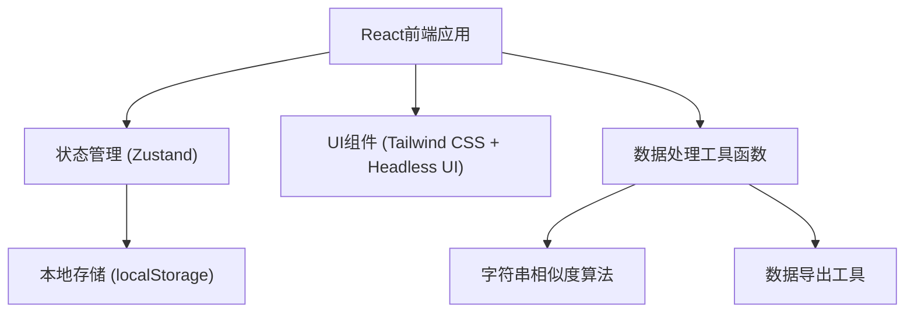
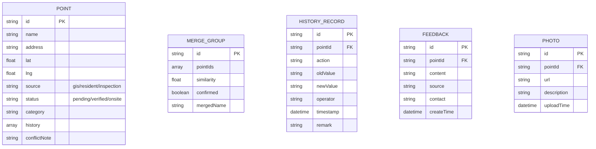

## 1. 架构设计


## 2. 技术描述
- 前端：React@18 + TypeScript + Tailwind CSS@3 + Vite
- 状态管理：Zustand（轻量级本地状态）
- UI组件：Headless UI（无样式组件）+ Heroicons
- 数据存储：localStorage（本地持久化）
- 数据处理：自定义字符串相似度算法（Levenshtein距离）
- 导出功能：xlsx（Excel导出）+ json2csv（CSV导出）
- 初始化工具：npm create vite@latest

## 3. 路由定义
| Route | 页面名称 | 功能 |
|-------|----------|------|
| /import | 数据导入页 | 多源数据导入、样例数据加载 |
| /merge | 点位归并页 | 智能匹配、人工确认归并 |
| /review | 人工复核页 | 点位详情、冲突处理、状态标记 |
| /export | 导出公示页 | 分类筛选、导出预览与下载 |

## 4. 数据模型

### 4.1 数据模型定义


### 4.2 TypeScript 类型定义
```typescript
// 点位来源类型
type PointSource = 'gis' | 'resident' | 'inspection' | 'street';

// 处理状态
type PointStatus = 'pending' | 'verified' | 'onsite' | 'processed';

// 点位数据
interface Point {
  id: string;
  name: string;
  address: string;
  lat: number;
  lng: number;
  source: PointSource;
  status: PointStatus;
  category: string;
  description: string;
  createdAt: string;
  updatedAt: string;
}

// 归并组
interface MergeGroup {
  id: string;
  points: Point[];
  similarity: number;
  confirmed: boolean;
  mergedName: string;
  mergedAddress: string;
}

// 历史记录
interface HistoryRecord {
  id: string;
  pointId: string;
  action: 'create' | 'update' | 'merge' | 'status_change' | 'remark';
  field?: string;
  oldValue?: string;
  newValue?: string;
  operator: string;
  timestamp: string;
  remark?: string;
}

// 冲突信息
interface ConflictInfo {
  type: 'name' | 'address' | 'category';
  gisValue: string;
  importValue: string;
  suggestion: string;
}

// 反馈信息
interface Feedback {
  id: string;
  pointId: string;
  content: string;
  source: string;
  contact?: string;
  createTime: string;
}

// 照片信息
interface Photo {
  id: string;
  pointId: string;
  url: string;
  description?: string;
  uploadTime: string;
}
```

## 5. 核心算法
- 字符串相似度：Levenshtein编辑距离算法，计算点位名称、地址相似度
- 坐标距离：Haversine公式，计算两点间地理距离
- 归并匹配：综合名称相似度(60%) + 地址相似度(30%) + 坐标距离(10%) 计算综合匹配度
