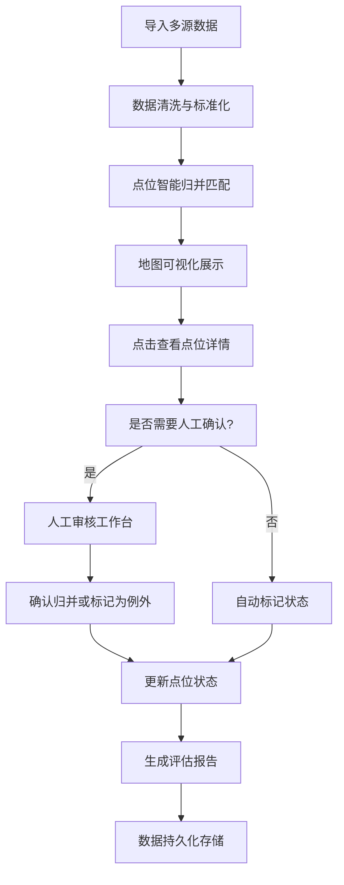

## 1. 产品概述

为市政设计师提供公交站点迁移评估工作平台，解决多源数据（街道表格、现场照片、审批记录）格式不统一、同一地点名称写法多样导致的人工核对繁琐问题。系统支持点位智能归并、地图可视化交互、处理记录追踪和数据持久化，大幅减少人工重复核对工作量。

## 2. 核心功能

### 2.1 用户角色

| 角色 | 注册方式 | 核心权限 |
|------|----------|----------|
| 市政设计师 | 本地登录 | 数据导入、点位管理、人工确认、报告生成 |

### 2.2 功能模块

1. **地图主界面**：点位可视化标注、状态颜色区分、点击查看详情
2. **点位详情面板**：来源信息、状态流转、处理记录时间线
3. **数据归并管理**：相似点位识别、人工确认归并、例外标记
4. **数据导入与导出**：多格式数据导入、评估报告导出
5. **人工审核工作台**：待确认点位列表、边界记录特别标注

### 2.3 页面详情

| 页面名称 | 模块名称 | 功能描述 |
|-----------|-------------|---------------------|
| 主评估页面 | 地图视图 | Leaflet交互式地图，支持缩放、拖拽，点位按状态着色 |
| 主评估页面 | 点位列表 | 侧边栏展示所有点位，支持筛选和搜索 |
| 主评估页面 | 详情面板 | 点击点位后展示：来源数据、状态、处理记录、备注 |
| 主评估页面 | 统计概览 | 顶部展示评估进度统计数字 |
| 归并确认弹窗 | 相似点位推荐 | 算法推荐可能重复的点位，供人工确认 |
| 报告预览模态框 | 报告生成 | 汇总评估结果，支持导出 |

## 3. 核心流程

市政设计师老曹导入街道表格、现场照片和审批记录数据 → 系统自动识别并归并同一地点的不同写法 → 在地图上可视化展示所有点位 → 老曹点击点位查看来源、状态和处理记录 → 对系统推荐的归并建议进行人工确认（特别留意相邻点位不被错误合并） → 标记例外情况（边界记录、空值、重复项） → 完成评估后生成报告，所有数据刷新后持久保存。

## 4. 用户界面设计

### 4.1 设计风格

- **主色调**：深蓝 (#1e3a5f) - 代表专业、可信的市政工作氛围
- **辅助色**：
  - 绿色 (#10b981) - 已完成确认
  - 橙色 (#f59e0b) - 待人工确认
  - 红色 (#ef4444) - 例外/边界记录
  - 灰色 (#6b7280) - 待处理
- **按钮风格**：圆角矩形，轻微阴影，hover时有颜色深浅变化
- **字体**：系统无衬线字体，标题加粗，正文清晰易读
- **布局风格**：三栏布局（左侧列表 + 中间地图 + 右侧详情），卡片式设计
- **图标风格**：简洁线性图标，与市政主题相符

### 4.2 页面设计概述

| 页面名称 | 模块名称 | UI元素 |
|-----------|-------------|-------------|
| 主评估页面 | 顶部统计栏 | 四个统计卡片，数字动画效果，颜色编码 |
| 主评估页面 | 左侧点位列表 | 可折叠列表项，状态标签，搜索筛选框 |
| 主评估页面 | 中央地图区域 | 全屏交互式地图，点位标记带状态颜色，悬停预览 |
| 主评估页面 | 右侧详情面板 | 卡片式布局，时间线组件，来源标签，备注区域 |
| 归并弹窗 | 相似点位对比 | 并排对比卡片，相似度百分比，操作按钮组 |

### 4.3 响应性

- 桌面端优先设计（1280px以上）
- 平板端（768px-1280px）：两栏布局，详情面板改为底部滑出
- 移动端（768px以下）：单栏布局，地图与列表切换

### 4.4 地图交互指引

- 底图：使用OpenStreetMap标准瓦片
- 点位标记：自定义SVG图标，根据状态显示不同颜色和形状
- 点击交互：弹出详情面板，地图中心移动到该点位
- 悬停效果：显示点位名称和状态预览
- 缩放：边界记录在特定缩放级别才显示详细信息
