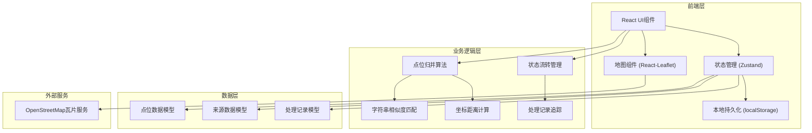
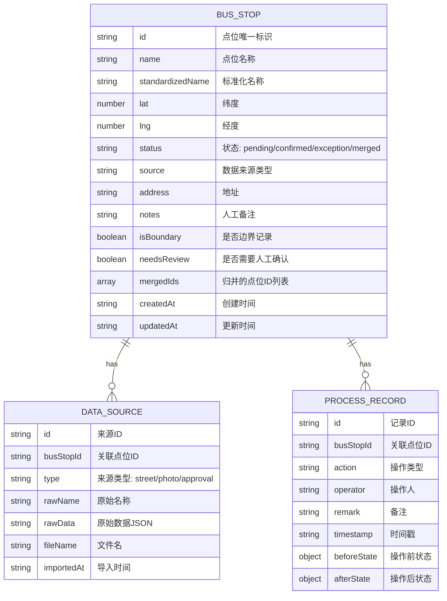

## 1. 架构设计



## 2. 技术描述

- **前端框架**: React@18 + TypeScript + Vite
- **样式方案**: TailwindCSS@3 + PostCSS
- **地图组件**: react-leaflet@3 + leaflet
- **状态管理**: Zustand (轻量级，支持持久化)
- **数据持久化**: localStorage + 导出JSON备份
- **字符串匹配**: 内置Levenshtein距离算法
- **图标库**: Lucide React
- **无后端设计**: 纯前端应用，数据存储在浏览器本地

## 3. 路由定义

| Route | Purpose |
|-------|---------|
| / | 主评估页面 - 地图 + 列表 + 详情 |

## 4. 数据模型

### 4.1 数据模型定义



### 4.2 TypeScript 类型定义

```typescript
type PointStatus = 'pending' | 'confirmed' | 'exception' | 'merged';
type SourceType = 'street' | 'photo' | 'approval';

interface BusStop {
  id: string;
  name: string;
  standardizedName: string;
  lat: number;
  lng: number;
  status: PointStatus;
  address?: string;
  notes?: string;
  isBoundary: boolean;
  needsReview: boolean;
  mergeSuggestions?: string[];
  mergedIds: string[];
  createdAt: string;
  updatedAt: string;
}

interface DataSource {
  id: string;
  busStopId: string;
  type: SourceType;
  rawName: string;
  rawData: Record<string, any>;
  fileName?: string;
  importedAt: string;
}

interface ProcessRecord {
  id: string;
  busStopId: string;
  action: 'import' | 'merge' | 'confirm' | 'exception' | 'update' | 'review';
  operator: string;
  remark?: string;
  timestamp: string;
  beforeState?: Partial<BusStop>;
  afterState?: Partial<BusStop>;
}

interface AppState {
  busStops: BusStop[];
  dataSources: DataSource[];
  processRecords: ProcessRecord[];
  selectedBusStopId: string | null;
  filters: {
    status?: PointStatus;
    source?: SourceType;
    search?: string;
  };
}
```

## 5. 核心算法说明

### 5.1 点位归并匹配算法

1. **字符串相似度计算**：使用Levenshtein距离计算点位名称相似度
2. **坐标距离计算**：使用Haversine公式计算两点间地理距离
3. **归并规则**：
   - 名称相似度 > 80% 且 距离 < 50米 → 高度可能重复
   - 名称相似度 > 60% 且 距离 < 100米 → 可能重复（需人工确认）
   - 距离 < 20米但名称不同 → 相邻点位提醒

### 5.2 状态流转

```
pending → confirmed (自动或人工确认)
pending → exception (标记为例外)
pending → merged (归并到其他点位)
confirmed → exception (可重新标记)
exception → confirmed (可重新确认)
```

## 6. 数据持久化方案

1. **实时保存**：使用Zustand persist中间件，状态变更自动同步到localStorage
2. **数据备份**：支持导出全部数据为JSON文件
3. **数据恢复**：支持导入JSON备份文件恢复数据
4. **版本管理**：存储时附带时间戳和版本号

## 7. 样例数据设计

包含三种测试场景：
1. **顺利记录**：数据完整，自动匹配确认
2. **需人工确认**：名称写法不同，系统推荐归并
3. **巡检照片补录**：旧口径数据，来源为现场照片
4. **边界记录**：区域边界特殊标记
5. **空值测试**：缺失部分字段
6. **重复项测试**：完全重复数据
