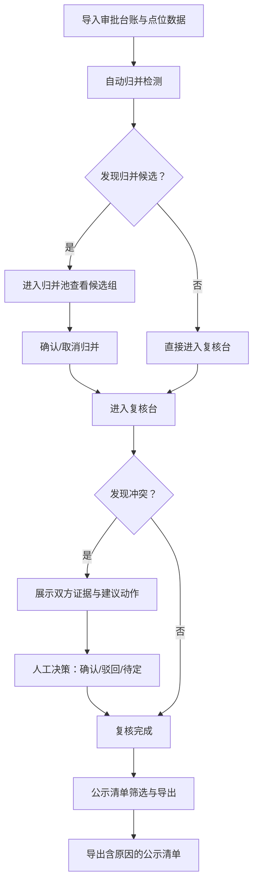

## 1. 产品概述

"海绵城市雨水花园"审批台账管理工具，面向城市规划师，解决审批材料中同名路口、重复投诉、坐标偏移、跨时段统计等数据对不上、靠手工反复核对的问题。核心价值：导入即归并，冲突必呈现，每条可溯源，导出带原因。

- 目标用户：城市规划师（以小赵为典型用户）
- 解决问题：审批台账材料混乱，同名路口/重复投诉/坐标偏移导致人工二次核对，容量超限与时段冲突难以发现
- 核心价值：材料归并自动化、冲突透明化、结果可追溯

## 2. 核心功能

### 2.1 用户角色

| 角色 | 使用方式 | 核心权限 |
|------|----------|----------|
| 城市规划师 | 本地启动即可使用 | 导入、归并、复核、导出全权限 |

### 2.2 功能模块

1. **导入台**：点位数据导入（CSV）、照片附件补充、审批台账导入
2. **归并池**：自动识别同名路口、重复投诉、坐标偏移记录并归并
3. **复核台**：冲突检测（审批台账 vs 导入数据）、人工确认/驳回、边界记录处理
4. **公示清单**：筛选导出、含归并原因与冲突说明、跨时段统计报告

### 2.3 页面详情

| 页面名称 | 模块名称 | 功能描述 |
|----------|----------|----------|
| 导入台 | 点位数据导入 | 支持CSV导入点位数据，自动解析字段映射，预览前10条，校验空值/格式异常 |
| 导入台 | 照片附件补充 | 逐条点位关联照片文件，支持拖拽上传，缩略图预览 |
| 导入台 | 审批台账导入 | 导入审批台账CSV，与已有点位数据自动匹配 |
| 归并池 | 同名路口检测 | 按路口名称+行政区划检测同名项，高亮展示候选归并组 |
| 归并池 | 重复投诉识别 | 按投诉编号+时间窗口检测重复投诉，标记主/副记录 |
| 归并池 | 坐标偏移校正 | 按距离阈值检测同一路口的坐标偏移，建议合并坐标 |
| 归并池 | 归并操作 | 确认归并/取消归并，归并后保留来源追溯链 |
| 复核台 | 冲突检测 | 审批台账说法与导入数据冲突时，展示双方证据和建议动作，不自动拍板 |
| 复核台 | 人工复核 | 逐条审核归并结果和冲突，标记确认/待定/驳回 |
| 复核台 | 边界记录处理 | 空值记录、跨边界记录单独展示，提示处理建议 |
| 公示清单 | 筛选与导出 | 按状态/区域/时段筛选，导出CSV含归并原因和冲突说明 |
| 公示清单 | 跨时段统计 | 展示跨时段统计数据，容量超限和时段冲突用人能懂的话说明 |
| 公示清单 | 报告生成 | 生成完整公示报告，冲突原因写入报告，不只在页面闪一下 |

## 3. 核心流程

用户打开工具后，首先将审批台账和点位数据导入系统。系统自动执行归并检测（同名路口、重复投诉、坐标偏移），生成归并候选组。用户进入复核台逐条确认归并结果和处理冲突，冲突时系统展示双方证据和建议动作供用户决策。确认完成后，在公示清单页筛选并导出，导出文件包含每条记录的归并原因和冲突说明。

## 4. 用户界面设计

### 4.1 设计风格

- **主色调**：深青绿（#0F766E）代表水与生态，辅以暖灰（#F5F5F4）背景
- **强调色**：琥珀色（#D97706）用于冲突和警告，翠绿（#059669）用于已确认状态
- **按钮风格**：圆角（8px），实心填充主操作按钮，描边次操作按钮
- **字体**：标题使用 Noto Serif SC，正文使用 Noto Sans SC
- **布局风格**：左侧固定导航栏 + 右侧内容区，卡片式内容展示
- **图标**：使用 lucide-react 图标库，线性风格

### 4.2 页面设计概览

| 页面名称 | 模块名称 | UI元素 |
|----------|----------|--------|
| 导入台 | 点位数据导入 | 拖拽上传区域、字段映射表、预览表格、校验提示条 |
| 导入台 | 照片附件补充 | 文件列表、缩略图网格、关联状态标签 |
| 归并池 | 同名路口检测 | 归并候选组卡片、地图坐标展示、合并按钮 |
| 归并池 | 重复投诉识别 | 时间线视图、主副记录对比、标识徽章 |
| 归并池 | 坐标偏移校正 | 坐标对比面板、距离数值、校正建议 |
| 复核台 | 冲突检测 | 左右分栏证据对比、建议动作按钮组、状态标签 |
| 复核台 | 人工复核 | 列表+详情面板、快捷操作工具栏、进度指示 |
| 公示清单 | 筛选与导出 | 筛选器组、数据表格、导出按钮、统计摘要卡片 |

### 4.3 响应式设计

- 桌面优先设计，最小宽度1024px
- 复核台左右分栏在窄屏时切换为上下布局
- 表格在窄屏时支持横向滚动

### 4.4 数据溯源设计

- 每条记录显示"来源追溯"徽章，点击展开完整来源链
- 归并后的记录显示"归并自：A、B、C"标签
- 冲突记录显示"冲突原因"和"双方证据"可展开面板
- 导出CSV中包含 `source_trace`、`merge_reason`、`conflict_note` 列
