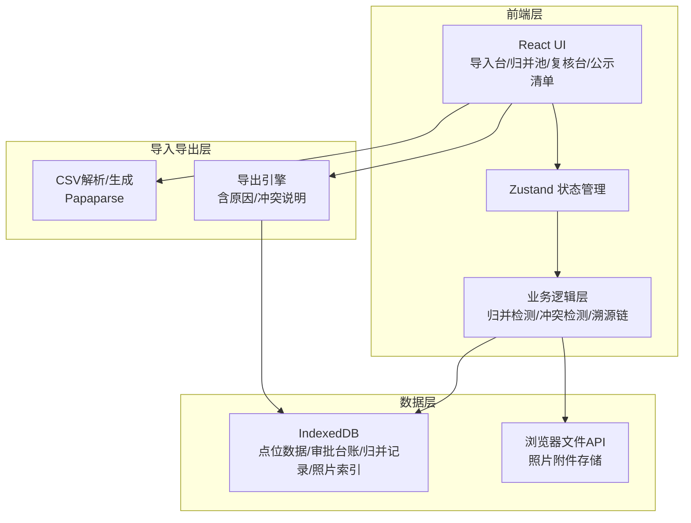
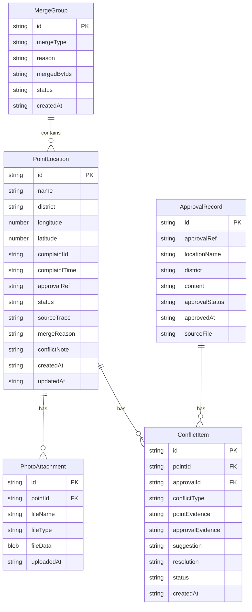

## 1. 架构设计



## 2. 技术说明

- **前端**：React@18 + TypeScript + Tailwind CSS@3 + Vite
- **初始化工具**：vite-init (react-ts 模板)
- **状态管理**：Zustand
- **路由**：react-router-dom@6
- **后端**：无（纯前端，数据存储在浏览器 IndexedDB）
- **数据库**：IndexedDB（通过 Dexie.js 封装）
- **CSV处理**：Papaparse
- **图标**：lucide-react

## 3. 路由定义

| 路由 | 用途 |
|------|------|
| `/` | 重定向到导入台 |
| `/import` | 导入台：点位数据导入、照片补充、审批台账导入 |
| `/merge` | 归并池：同名路口、重复投诉、坐标偏移检测与归并 |
| `/review` | 复核台：冲突检测、人工复核、边界记录处理 |
| `/export` | 公示清单：筛选、跨时段统计、导出公示清单 |

## 4. 数据模型

### 4.1 数据模型定义



### 4.2 数据定义语言（IndexedDB Schema via Dexie.js）

```typescript
import Dexie, { Table } from 'dexie'

interface PointLocation {
  id: string
  name: string
  district: string
  longitude: number | null
  latitude: number | null
  complaintId: string
  complaintTime: string
  approvalRef: string
  status: 'pending' | 'merged' | 'confirmed' | 'rejected'
  sourceTrace: string
  mergeReason: string
  conflictNote: string
  mergedFrom: string[]
  createdAt: string
  updatedAt: string
}

interface ApprovalRecord {
  id: string
  approvalRef: string
  locationName: string
  district: string
  content: string
  approvalStatus: string
  approvedAt: string
  sourceFile: string
}

interface MergeGroup {
  id: string
  mergeType: 'same_name' | 'duplicate_complaint' | 'coordinate_drift'
  reason: string
  mergedIds: string[]
  status: 'pending' | 'confirmed' | 'cancelled'
  createdAt: string
}

interface ConflictItem {
  id: string
  pointId: string
  approvalId: string
  conflictType: 'capacity_overflow' | 'time_conflict' | 'data_mismatch' | 'null_value' | 'boundary'
  pointEvidence: string
  approvalEvidence: string
  suggestion: string
  resolution: string
  status: 'pending' | 'confirmed' | 'rejected' | 'deferred'
  createdAt: string
}

interface PhotoAttachment {
  id: string
  pointId: string
  fileName: string
  fileType: string
  fileData: Blob
  uploadedAt: string
}

class SpongeCityDB extends Dexie {
  points!: Table<PointLocation>
  approvals!: Table<ApprovalRecord>
  mergeGroups!: Table<MergeGroup>
  conflicts!: Table<ConflictItem>
  photos!: Table<PhotoAttachment>

  constructor() {
    super('SpongeCityDB')
    this.version(1).stores({
      points: 'id, name, district, complaintId, status, approvalRef',
      approvals: 'id, approvalRef, locationName, district',
      mergeGroups: 'id, mergeType, status',
      conflicts: 'id, pointId, approvalId, conflictType, status',
      photos: 'id, pointId'
    })
  }
}
```

## 5. 归并检测算法

### 5.1 同名路口检测
- 按 `name + district` 分组，同一组内标记为归并候选
- 展示各条记录的坐标、投诉时间、审批状态供人工判断

### 5.2 重复投诉检测
- 按 `complaintId` 去重
- 若 complaintId 为空，按 `name + district + complaintTime(±7天)` 窗口检测

### 5.3 坐标偏移检测
- 同 `name + district` 组内，两两计算 Haversine 距离
- 距离 < 50米 标记为坐标偏移候选
- 展示偏移距离，建议取均值或以审批台账坐标为准

### 5.4 冲突检测
- 审批台账与导入数据按 `approvalRef` 或 `name + district` 匹配
- 匹配后比对：审批状态、容量、时段，不一致则生成冲突项
- 冲突项展示：左侧审批台账证据、右侧导入数据证据、建议动作
- 容量超限：计算设计容量与实际需求差值，用"超出XX立方米，建议调整汇水面积"等话术
- 时段冲突：用"XX路段施工期与雨水花园养护期重叠，建议错开至XX"等话术
