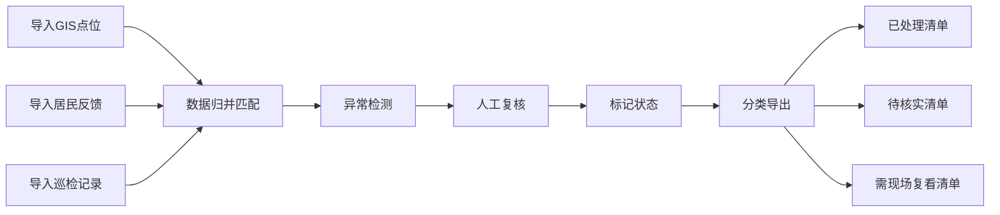

## 1. 产品概述

城市照明能耗巡检工具，面向交通工程师、社区工作人员，用于归集GIS点位、居民反馈、巡检记录等多源数据，实现数据归并匹配、人工复核、异常检测与分类导出公示，提升城市照明管理效率。

## 2. 核心功能

### 2.1 用户角色
| 角色 | 注册方式 | 核心权限 |
|------|----------|----------|
| 工程师用户 | 本地登录 | 数据导入、归并匹配、人工复核、导出公示 |
| 社区用户 | 无需登录 | 查看公示清单（导出结果） |

### 2.2 功能模块
1. **数据导入页**：GIS点位导入、居民反馈导入、巡检记录导入、街道备注上传
2. **数据归并页**：多源数据匹配、重复项检测、关联展示
3. **人工复核页**：逐条审核、状态标记（已处理/待核实/需现场复看）、备注添加
4. **异常检测页**：容量超限、时间段冲突、空值缺失、重复项等异常可视化
5. **公示导出页**：分类数据导出、报告生成、历史记录查询

### 2.3 页面详情
| 页面名称 | 模块名称 | 功能描述 |
|----------|----------|----------|
| 数据导入页 | 文件上传区 | 支持CSV/Excel文件拖拽上传，保留原始数据不做清洗 |
| 数据导入页 | 数据预览 | 显示导入数据原始内容，标注乱码、格式问题 |
| 数据归并页 | 匹配规则 | 基于路灯编号、地址、坐标等多维度自动匹配 |
| 数据归并页 | 匹配结果 | 展示已匹配、未匹配、待确认三类数据 |
| 人工复核页 | 记录列表 | 分页展示待复核记录，支持筛选搜索 |
| 人工复核页 | 状态操作 | 一键标记处理状态，支持批量操作 |
| 人工复核页 | 详情面板 | 展示单条记录全量信息，包括居民原始备注 |
| 异常检测页 | 异常统计 | 分类统计各类异常数量及占比 |
| 异常检测页 | 异常明细 | 展示具体异常记录，用人话解释问题原因 |
| 公示导出页 | 分类导出 | 按处理状态分三类导出Excel/CSV |
| 公示导出页 | 报告生成 | 生成巡检简报，包含异常说明和处理建议 |

## 3. 核心流程

用户上传多源数据 → 系统自动匹配归并 → 异常检测标记问题 → 人工逐条复核 → 分类导出公示清单

## 4. 用户界面设计

### 4.1 设计风格
- 主色调：深蓝 (#1e3a5f) 配合 橙色 (#e97451) 强调，专业务实
- 按钮风格：直角矩形，轻微阴影，点击有明确反馈
- 字体：系统无衬线字体，清晰易读，标题加粗
- 布局：顶部导航 + 侧栏菜单 + 主内容区，表格优先
- 图标风格：线性图标，简洁明了

### 4.2 页面设计概览
| 页面名称 | 模块名称 | UI元素 |
|----------|----------|--------|
| 数据导入页 | 文件上传区 | 虚线边框拖拽区域、文件列表、进度条 |
| 数据归并页 | 匹配结果 | 三色标签（绿/黄/红）、匹配度百分比、展开详情 |
| 人工复核页 | 记录列表 | 斑马纹表格、操作按钮组、筛选下拉框 |
| 异常检测页 | 异常统计 | 卡片式数字展示、颜色编码异常等级 |
| 公示导出页 | 导出操作区 | 大按钮分三类导出、日期选择器 |

### 4.3 响应式
- 桌面端优先，保证表格数据完整展示
- 平板端支持横向滚动查看完整表格
- 移动端简化操作，核心功能可用

### 4.4 样例数据设计
系统预置样例数据，包含：
1. 一条完全顺利的记录（无异常，自动匹配成功）
2. 一条需要人工确认的记录（多数据源信息不一致）
3. 一条居民反馈表补充的旧口径记录（历史数据格式）
4. 边界测试用例：空值记录、重复项记录、容量超限记录、时间段冲突记录
