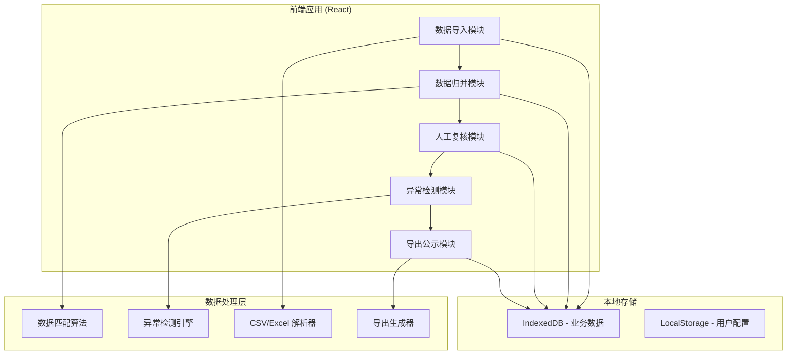
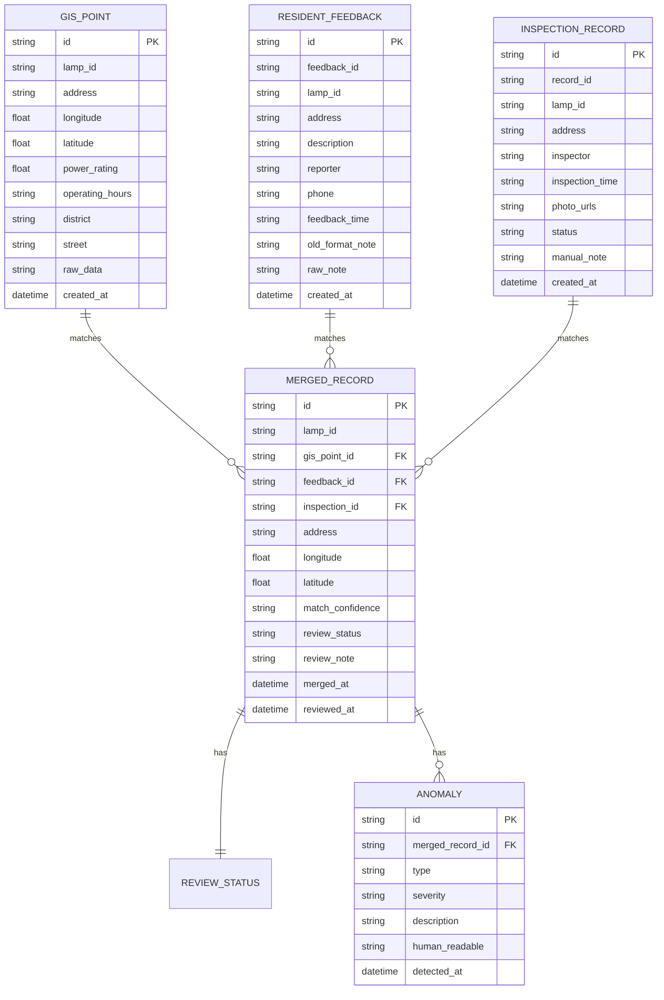

## 1. 架构设计

## 2. 技术描述
- 前端: React@18 + TypeScript + tailwindcss@3 + vite
- 初始化工具: vite-init
- 后端: 无（纯前端应用，本地存储）
- 数据存储: IndexedDB (dexie.js) + LocalStorage
- 文件处理: xlsx (Excel解析), papaparse (CSV解析)
- 图标: lucide-react

## 3. 路由定义
| 路由 | 页面 | 目的 |
|------|------|------|
| / | 首页 | 工具概览、快速开始、数据统计 |
| /import | 数据导入 | 多源数据上传、预览、管理 |
| /merge | 数据归并 | 自动匹配、匹配结果、手动关联 |
| /review | 人工复核 | 记录审核、状态标记、备注编辑 |
| /anomalies | 异常检测 | 异常统计、明细展示、问题说明 |
| /export | 公示导出 | 分类导出、报告生成、历史记录 |

## 4. 数据模型

### 4.1 数据模型定义

### 4.2 数据定义说明

**GIS点位表 (gis_points)**
- lamp_id: 路灯编号（匹配关键字段）
- address: 地址
- longitude/latitude: 坐标
- power_rating: 额定功率（用于容量计算）
- operating_hours: 运行时间段（用于冲突检测）
- raw_data: 原始数据JSON（保留原始格式不清洗）

**居民反馈表 (resident_feedbacks)**
- lamp_id: 路灯编号（可能为空或不规范）
- description: 问题描述
- raw_note: 原始备注（不做清洗，完整保留乱材料）
- old_format_note: 旧口径数据标识

**巡检记录表 (inspection_records)**
- lamp_id: 路灯编号
- photo_urls: 巡检照片
- manual_note: 手改备注

**归并记录表 (merged_records)**
- match_confidence: 匹配置信度 (high/medium/low)
- review_status: 复核状态 (pending/confirmed/need_verify/on_site)

**异常表 (anomalies)**
- type: 异常类型 (empty_value/duplicate/capacity_overload/time_conflict/data_mismatch)
- severity: 严重程度 (low/medium/high)
- human_readable: 人话描述（给社区看的说明）

## 5. 核心算法

### 5.1 数据匹配算法
1. 精确匹配: lamp_id 完全一致
2. 模糊匹配: 地址相似度计算 (Levenshtein距离)
3. 空间匹配: 经纬度距离阈值 (<50米)
4. 综合评分: 加权计算匹配置信度

### 5.2 异常检测规则
- 容量超限: 单条街道总功率 > 阈值
- 时间段冲突: 运行时间段重叠或不规范
- 空值检测: 关键字段缺失
- 重复项检测: 多维度去重判断
- 数据不一致: 多源数据字段冲突
