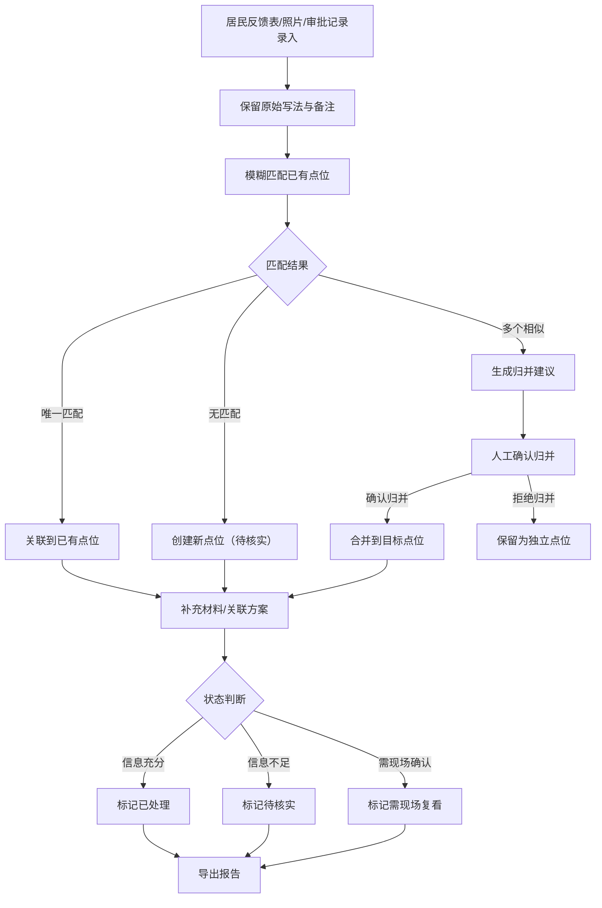

## 1. 产品概述

学校周边慢行安全追踪系统——用于管理"学校周边慢行安全"治理中点位、居民反馈、方案版本和报告的全链路追踪工具。解决居民反馈表中同一点位写法五花八门、临时凑表无法追溯、换人接手看不懂前次判断的问题。

- 目标用户：街道办工作人员、社区治理协调员、安全评估人员
- 核心价值：让"学校周边慢行安全"从居民反馈表原始记录一路走到可导出的分类结果，空值、重复、边界记录都能处理，换人也能看懂前次判断

## 2. 核心功能

### 2.1 用户角色

| 角色 | 进入方式 | 核心权限 |
|------|----------|----------|
| 街道工作人员 | 直接访问 | 录入点位、关联反馈、导出报告 |
| 社区协调员 | 直接访问 | 查看点位状态、补充材料、确认归并 |
| 评估人员 | 直接访问 | 标记需现场复看点、审核方案版本 |

### 2.2 功能模块

1. **点位看板**：展示所有学校周边慢行安全点位，按状态（已处理/待核实/需现场复看）分组，支持搜索和筛选
2. **点位详情**：查看点位关联的所有反馈、方案版本、判断记录，支持补充材料
3. **反馈录入**：从居民反馈表导入或手动录入，保留原始写法和乱备注
4. **归并管理**：同一地点不同写法的自动归并建议和人工确认
5. **方案版本**：为点位关联方案，记录版本变更历史
6. **报告导出**：按状态分类导出，含判断依据和前次处理记录

### 2.3 页面详情

| 页面名称 | 模块名称 | 功能描述 |
|----------|----------|----------|
| 点位看板 | 状态分组列表 | 按已处理/待核实/需现场复看三栏展示点位卡片，卡片显示点位名、关联学校、反馈数、最近更新时间 |
| 点位看板 | 搜索与筛选 | 按学校名、状态、日期范围筛选点位 |
| 点位详情 | 基本信息区 | 点位标准名、别名列表、关联学校、坐标、当前状态 |
| 点位详情 | 反馈时间线 | 按时间倒序展示关联反馈，保留原始写法和备注，标注来源类型（居民反馈表/现场照片/审批记录） |
| 点位详情 | 归并建议区 | 显示自动匹配的相似点位，供人工确认或拒绝归并 |
| 点位详情 | 方案版本区 | 方案列表及版本对比，每版记录修改人、时间、变更说明 |
| 点位详情 | 判断记录区 | 每次状态变更的判断依据、操作人、时间戳，换人可追溯 |
| 反馈录入 | 表单区 | 手动录入反馈（点位写法、内容、来源、日期），保留原始乱备注 |
| 反馈录入 | 批量导入区 | 从表格文件批量导入居民反馈记录 |
| 归并管理 | 归并建议列表 | 列出所有待确认的归并建议，展示两个点位的原始写法和关联反馈数 |
| 报告导出 | 导出面板 | 按状态筛选导出，生成含判断记录的结构化文件 |

## 3. 核心流程

居民反馈表到达系统后，系统保留原始写法和备注，自动与已有点位做模糊匹配。匹配成功则关联到已有点位；匹配到相似但不确定的点位时，生成归并建议待人工确认；匹配不到则创建新点位，状态标记为"待核实"。点位关联方案后可升级状态，所有状态变更均记录判断依据。导出时按已处理/待核实/需现场复看分类输出。

## 4. 用户界面设计

### 4.1 设计风格

- 主色调：深青色 #1A535C（代表安全、稳重），辅助色：暖橙色 #FF6B35（代表警示、待办）
- 按钮风格：圆角矩形，带微妙阴影，状态用颜色区分
- 字体：思源黑体/Noto Sans SC，标题 18px 加粗，正文 14px 常规，备注 12px
- 布局：左侧导航 + 右侧内容区，卡片式展示点位
- 图标风格：线性图标，2px 线宽

### 4.2 页面设计概述

| 页面名称 | 模块名称 | UI 元素 |
|----------|----------|---------|
| 点位看板 | 状态分组列表 | 三栏卡片布局（已处理/待核实/需现场复看），每张卡片含点位名、学校名、反馈计数徽章、时间戳 |
| 点位详情 | 基本信息区 | 顶部状态标签（色块）、别名标签组、关联学校链接 |
| 点位详情 | 反馈时间线 | 左侧时间轴线、右侧反馈卡片（含原始写法高亮、来源图标） |
| 点位详情 | 归并建议区 | 双栏对比卡片，中间"确认/拒绝"按钮 |
| 点位详情 | 判断记录区 | 时间线样式，每条含判断理由文本、操作人、时间 |
| 反馈录入 | 表单区 | 简洁表单，原始写法字段带"保留原文"提示 |
| 报告导出 | 导出面板 | 三个状态勾选框 + 导出按钮，预览表格 |

### 4.3 响应式设计

- 桌面优先设计，最小宽度 1024px
- 平板端：看板从三栏变两栏
- 移动端：单栏列表，详情页全屏展示

### 4.4 数据样例要求

系统需预置以下样例数据：

1. **顺利记录**：完整点位，从反馈录入到已处理的全流程，信息齐全、归并明确
2. **需人工确认记录**：点位有相似匹配但不确定，状态为"待核实"，归并建议待确认
3. **旧口径补录记录**：从居民反馈表补来的旧格式记录，原始写法不规范，备注含乱码或口语化描述
4. **边界测试数据**：含空值字段、重复点位、相邻但不该归并的点位

## 5. 导出规范

导出结果需按以下分类：
- **已处理**：信息充分，判断结论明确，可交付社区使用
- **待核实**：信息不完整或存在矛盾，需进一步确认
- **需现场复看**：无法仅凭书面材料判断，需现场勘察

每条导出记录需包含：
- 点位标准名及别名
- 当前状态及判断依据
- 关联反馈摘要
- 最近一次状态变更的操作人和时间
- 方案版本号（如有）
