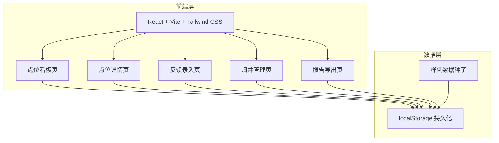
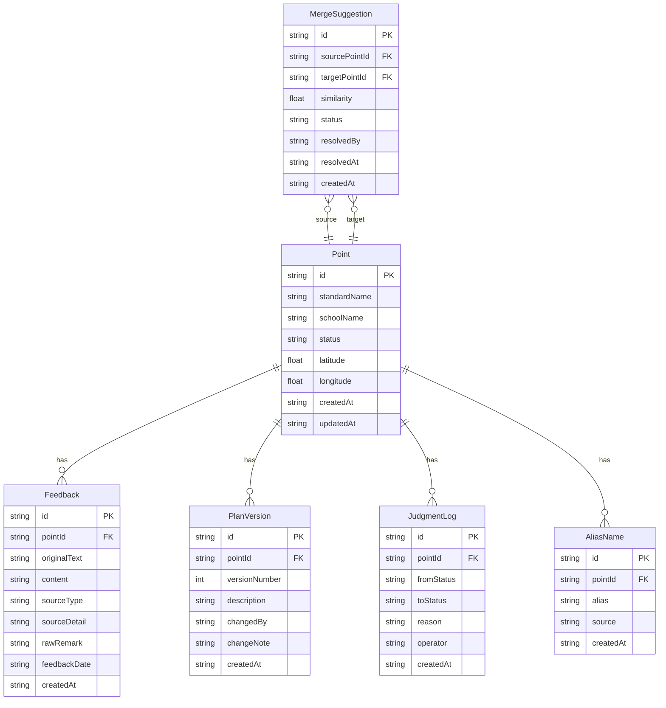
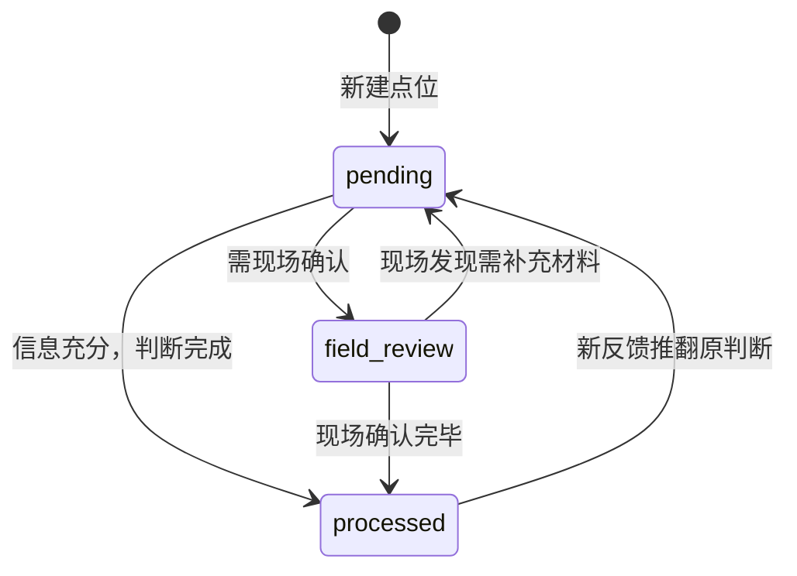

## 1. 架构设计



采用纯前端架构，数据持久化使用 localStorage，无需后端服务。适合街道办内网单机使用，降低部署门槛。

## 2. 技术说明

- 前端：React@18 + TailwindCSS@3 + Vite
- 初始化工具：Vite（React + TypeScript 模板）
- 后端：无（纯前端，localStorage 持久化）
- 数据库：无（localStorage + JSON 序列化）
- 状态管理：React Context + useReducer

## 3. 路由定义

| 路由 | 用途 |
|------|------|
| / | 点位看板，三栏展示所有点位 |
| /point/:id | 点位详情，含反馈时间线、归并建议、方案版本、判断记录 |
| /feedback/new | 新建反馈录入 |
| /merge | 归并管理，展示待确认的归并建议 |
| /export | 报告导出面板 |

## 4. 数据模型

### 4.1 数据模型定义



### 4.2 数据定义

```typescript
type PointStatus = "processed" | "pending" | "field_review";

interface Point {
  id: string;
  standardName: string;
  schoolName: string;
  status: PointStatus;
  latitude: number | null;
  longitude: number | null;
  createdAt: string;
  updatedAt: string;
}

interface Feedback {
  id: string;
  pointId: string;
  originalText: string;
  content: string;
  sourceType: "resident_form" | "field_photo" | "approval_record";
  sourceDetail: string;
  rawRemark: string;
  feedbackDate: string;
  createdAt: string;
}

interface PlanVersion {
  id: string;
  pointId: string;
  versionNumber: number;
  description: string;
  changedBy: string;
  changeNote: string;
  createdAt: string;
}

interface JudgmentLog {
  id: string;
  pointId: string;
  fromStatus: PointStatus | null;
  toStatus: PointStatus;
  reason: string;
  operator: string;
  createdAt: string;
}

interface AliasName {
  id: string;
  pointId: string;
  alias: string;
  source: string;
  createdAt: string;
}

interface MergeSuggestion {
  id: string;
  sourcePointId: string;
  targetPointId: string;
  similarity: number;
  status: "pending" | "confirmed" | "rejected";
  resolvedBy: string | null;
  resolvedAt: string | null;
  createdAt: string;
}
```

## 5. 归并算法说明

采用基于字符串相似度的模糊匹配：

1. **预处理**：去除空格、统一全角半角、去除"学校周边慢行安全"等固定前缀
2. **相似度计算**：使用 Jaro-Winkler 距离，对中文地名加权
3. **阈值设定**：
   - 相似度 >= 0.85：自动归并
   - 0.65 <= 相似度 < 0.85：生成归并建议，待人工确认
   - 相似度 < 0.65：不归并
4. **防误合机制**：归并前检查两个点位的坐标距离，若超过 500 米则拒绝自动归并，即使文本相似度高也必须人工确认
5. **增量处理**：新增反馈时仅对新增记录执行匹配，不重新计算全量

## 6. 状态机



每次状态变更必须记录 JudgmentLog（判断依据、操作人、时间）。
