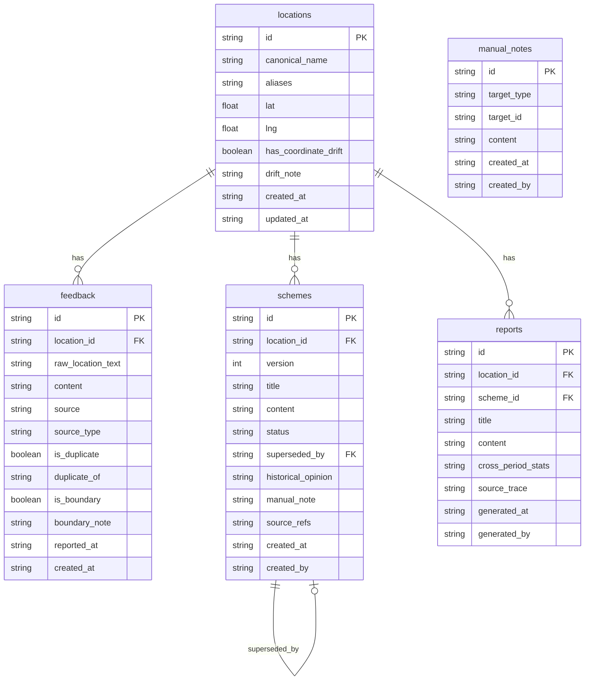

## 1. 架构设计

```mermaid
graph TD
    "React 前端" --> "Express API"
    "Express API" --> "SQLite 数据库"
    "React 前端" --> "Leaflet 地图"
    "Express API" --> "方案版本引擎"
    "Express API" --> "报告生成器"
    "方案版本引擎" --> "SQLite 数据库"
    "报告生成器" --> "SQLite 数据库"
```

## 2. 技术说明

- **前端**：React@18 + TypeScript + Tailwind CSS@3 + Vite
- **初始化工具**：vite-init（react-express-ts 模板）
- **后端**：Express@4 + TypeScript（ESM）
- **数据库**：SQLite（better-sqlite3），文件存储于项目根目录 `data/meditation.db`
- **地图**：Leaflet + react-leaflet（开源免费，无需 API Key）
- **状态管理**：Zustand
- **路由**：react-router-dom

## 3. 路由定义

| 路由 | 用途 |
|------|------|
| `/` | 总览看板：地图 + 统计卡片 + 最近动态 |
| `/locations` | 点位管理：列表/地图双视图 |
| `/locations/:id` | 点位详情：关联反馈、方案、报告 |
| `/feedback` | 反馈追踪：全部居民反馈 |
| `/feedback/:id` | 反馈详情 |
| `/schemes` | 方案版本：全部调解方案 |
| `/schemes/:id` | 方案详情 + 版本对比 |
| `/reports` | 调解报告：报告列表 |
| `/reports/:id` | 报告详情 |

## 4. API 定义

### 4.1 点位（Locations）

```typescript
interface Location {
  id: string;
  canonical_name: string;
  aliases: string[];
  lat: number;
  lng: number;
  has_coordinate_drift: boolean;
  drift_note: string | null;
  created_at: string;
  updated_at: string;
}

// GET    /api/locations          - 列表（支持 ?search= &has_drift= ）
// GET    /api/locations/:id      - 详情（含关联反馈和方案）
// POST   /api/locations          - 新建
// PUT    /api/locations/:id      - 更新
// POST   /api/locations/:id/merge - 合并（归一化）
```

### 4.2 反馈（Feedback）

```typescript
interface Feedback {
  id: string;
  location_id: string;
  raw_location_text: string;
  content: string;
  source: string;
  source_type: "居民投诉" | "网格巡查" | "12345工单" | "现场走访";
  is_duplicate: boolean;
  duplicate_of: string | null;
  is_boundary: boolean;
  boundary_note: string | null;
  reported_at: string;
  created_at: string;
}

// GET    /api/feedback           - 列表（支持 ?location_id= &is_duplicate= &is_boundary= ）
// GET    /api/feedback/:id       - 详情
// POST   /api/feedback           - 新建
// PUT    /api/feedback/:id       - 更新（标记重复等）
```

### 4.3 方案（Schemes）

```typescript
interface Scheme {
  id: string;
  location_id: string;
  version: number;
  title: string;
  content: string;
  status: "草稿" | "已发布" | "被覆盖";
  superseded_by: string | null;
  historical_opinion: string | null;
  manual_note: string | null;
  source_refs: string[];
  created_at: string;
  created_by: string;
}

// GET    /api/schemes             - 列表（支持 ?location_id= &status= ）
// GET    /api/schemes/:id         - 详情
// POST   /api/schemes             - 新建（自动 version++）
// PUT    /api/schemes/:id         - 更新
// POST   /api/schemes/:id/supersede - 覆盖（旧方案标记"被覆盖"，保留历史意见）
```

### 4.4 报告（Reports）

```typescript
interface Report {
  id: string;
  location_id: string;
  scheme_id: string;
  title: string;
  content: string;
  cross_period_stats: Record<string, number>;
  source_trace: Array<{ ref: string; type: string; time: string }>;
  generated_at: string;
  generated_by: string;
}

// GET    /api/reports             - 列表
// GET    /api/reports/:id         - 详情
// POST   /api/reports             - 生成报告
```

### 4.5 人工备注（ManualNotes）

```typescript
interface ManualNote {
  id: string;
  target_type: "location" | "feedback" | "scheme" | "report";
  target_id: string;
  content: string;
  created_at: string;
  created_by: string;
}

// GET    /api/notes?target_type=&target_id=  - 查询
// POST   /api/notes                          - 新建
```

## 5. 服务端架构图

```mermaid
graph LR
    "Controller 层" --> "Service 层"
    "Service 层" --> "Repository 层"
    "Repository 层" --> "SQLite"
```

## 6. 数据模型

### 6.1 ER 图



### 6.2 DDL

```sql
CREATE TABLE IF NOT EXISTS locations (
  id TEXT PRIMARY KEY,
  canonical_name TEXT NOT NULL,
  aliases TEXT NOT NULL DEFAULT '[]',
  lat REAL NOT NULL,
  lng REAL NOT NULL,
  has_coordinate_drift INTEGER NOT NULL DEFAULT 0,
  drift_note TEXT,
  created_at TEXT NOT NULL DEFAULT (datetime('now','localtime')),
  updated_at TEXT NOT NULL DEFAULT (datetime('now','localtime'))
);

CREATE TABLE IF NOT EXISTS feedback (
  id TEXT PRIMARY KEY,
  location_id TEXT NOT NULL REFERENCES locations(id),
  raw_location_text TEXT NOT NULL,
  content TEXT NOT NULL,
  source TEXT NOT NULL,
  source_type TEXT NOT NULL CHECK(source_type IN ('居民投诉','网格巡查','12345工单','现场走访')),
  is_duplicate INTEGER NOT NULL DEFAULT 0,
  duplicate_of TEXT REFERENCES feedback(id),
  is_boundary INTEGER NOT NULL DEFAULT 0,
  boundary_note TEXT,
  reported_at TEXT NOT NULL,
  created_at TEXT NOT NULL DEFAULT (datetime('now','localtime'))
);

CREATE TABLE IF NOT EXISTS schemes (
  id TEXT PRIMARY KEY,
  location_id TEXT NOT NULL REFERENCES locations(id),
  version INTEGER NOT NULL DEFAULT 1,
  title TEXT NOT NULL,
  content TEXT NOT NULL,
  status TEXT NOT NULL DEFAULT '草稿' CHECK(status IN ('草稿','已发布','被覆盖')),
  superseded_by TEXT REFERENCES schemes(id),
  historical_opinion TEXT,
  manual_note TEXT,
  source_refs TEXT NOT NULL DEFAULT '[]',
  created_at TEXT NOT NULL DEFAULT (datetime('now','localtime')),
  created_by TEXT NOT NULL DEFAULT '老曹'
);

CREATE TABLE IF NOT EXISTS reports (
  id TEXT PRIMARY KEY,
  location_id TEXT NOT NULL REFERENCES locations(id),
  scheme_id TEXT NOT NULL REFERENCES schemes(id),
  title TEXT NOT NULL,
  content TEXT NOT NULL,
  cross_period_stats TEXT NOT NULL DEFAULT '{}',
  source_trace TEXT NOT NULL DEFAULT '[]',
  generated_at TEXT NOT NULL DEFAULT (datetime('now','localtime')),
  generated_by TEXT NOT NULL DEFAULT '老曹'
);

CREATE TABLE IF NOT EXISTS manual_notes (
  id TEXT PRIMARY KEY,
  target_type TEXT NOT NULL CHECK(target_type IN ('location','feedback','scheme','report')),
  target_id TEXT NOT NULL,
  content TEXT NOT NULL,
  created_at TEXT NOT NULL DEFAULT (datetime('now','localtime')),
  created_by TEXT NOT NULL DEFAULT '老曹'
);

CREATE INDEX IF NOT EXISTS idx_feedback_location ON feedback(location_id);
CREATE INDEX IF NOT EXISTS idx_schemes_location ON schemes(location_id);
CREATE INDEX IF NOT EXISTS idx_reports_location ON reports(location_id);
CREATE INDEX IF NOT EXISTS idx_notes_target ON manual_notes(target_type, target_id);
CREATE INDEX IF NOT EXISTS idx_feedback_duplicate ON feedback(is_duplicate);
CREATE INDEX IF NOT EXISTS idx_feedback_boundary ON feedback(is_boundary);
```
