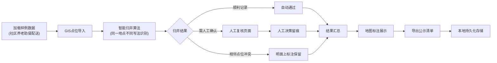

## 1. 产品概述
社区养老助餐配送点位管理系统，解决市政设计师在点位交接时的数据混乱问题。支持GIS点位导入、智能归并、人工复核、过程留痕及公示清单导出，让"社区养老助餐配送"从样例到结果全流程贯通。

## 2. 核心功能

### 2.1 用户角色
| 角色 | 注册方式 | 核心权限 |
|------|----------|----------|
| 市政设计师 | 本地使用 | 数据导入、点位归并、人工复核、导出公示 |

### 2.2 功能模块
1. **数据导入页面**: GIS点位批量导入、居民反馈上传、巡检照片管理、街道备注录入
2. **点位归并页面**: 智能归并算法、相似度展示、合并冲突处理
3. **人工复核页面**: 待确认清单、判断过程记录、人工标注、边界案例处理
4. **公示导出页面**: 结果地图展示、统计报表、公示清单导出、历史记录查询

### 2.3 页面详情
| 页面名称 | 模块名称 | 功能描述 |
|---------|----------|----------|
| 数据导入 | 文件上传区 | 支持CSV/GeoJSON格式GIS点位文件上传，实时预览导入数据 |
| 数据导入 | 样例数据 | 内置"社区养老助餐配送"样例数据，一键加载演示流程 |
| 点位归并 | 归并列表 | 展示所有点位，高亮显示疑似重复项，标注相似度分数 |
| 点位归并 | 归并操作 | 一键智能归并、手动选择合并、拒绝合并并标注原因 |
| 人工复核 | 待审清单 | 展示需人工确认的记录：顺利记录、待确认记录、旧口径记录 |
| 人工复核 | 判断留痕 | 每条记录保留完整判断过程：来源、归并依据、人工决策时间 |
| 人工复核 | 边界处理 | 空值、重复项、边界记录专项处理区域，明面上展示例外情况 |
| 公示导出 | 地图标注 | 地图可视化展示最终点位，支持人工备注叠加显示 |
| 公示导出 | 数据持久化 | localStorage本地存储，刷新后地图标注、人工备注、统计数字不丢失 |
| 公示导出 | 清单导出 | 支持导出公示清单（CSV/Excel格式），包含完整审核轨迹 |

## 3. 核心流程
用户从加载样例数据开始，经过智能归并识别重复点位，人工复核处理边界案例，最终导出包含完整判断过程的公示清单。

## 4. 用户界面设计

### 4.1 设计风格
- 主色调：深蓝(#1e3a5f) + 暖橙(#e67e22)，体现政务专业感与社区温暖
- 按钮风格：微立体圆角按钮，hover时有微妙的阴影变化
- 字体：标题使用 Noto Serif SC，正文使用 Noto Sans SC，兼顾正式与可读性
- 布局风格：卡片式布局，左侧导航 + 主内容区，信息层次清晰
- 图标风格：线性图标配合少量emoji，专业不失温度

### 4.2 页面设计概览
| 页面名称 | 模块名称 | UI元素 |
|---------|----------|--------|
| 数据导入 | 上传区 | 拖拽上传区域、文件预览表格、样例数据快捷按钮、进度动画 |
| 点位归并 | 归并列表 | 双列对比卡片、相似度进度条、操作按钮组、颜色编码状态标签 |
| 人工复核 | 待审清单 | 时间线式流程展示、决策标签、来源标记、留痕展开/收起 |
| 公示导出 | 地图区 | 交互式地图、点位弹框、统计面板、导出按钮组 |

### 4.3 响应式
桌面端优先设计，主内容区最小宽度1200px；平板端自适应调整卡片布局；移动端简化为列表视图，保留核心操作。

### 4.4 交互与动效
- 页面加载：元素渐入动画，导航栏固定，内容区平滑滚动
- 归并操作：卡片合并动画，进度条平滑过渡
- 人工决策：确认按钮点击有按压反馈，状态标签颜色渐变
- 地图标注：点位悬停有放大效果，点击弹框淡入
