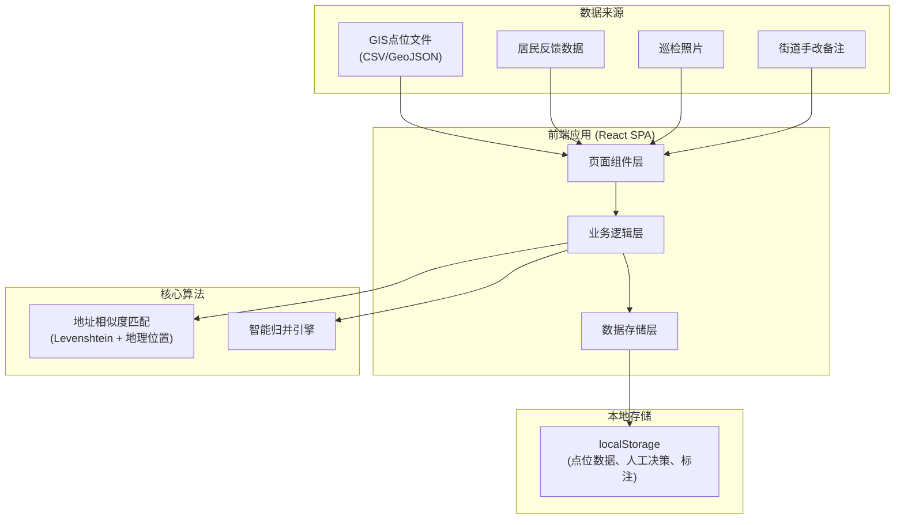
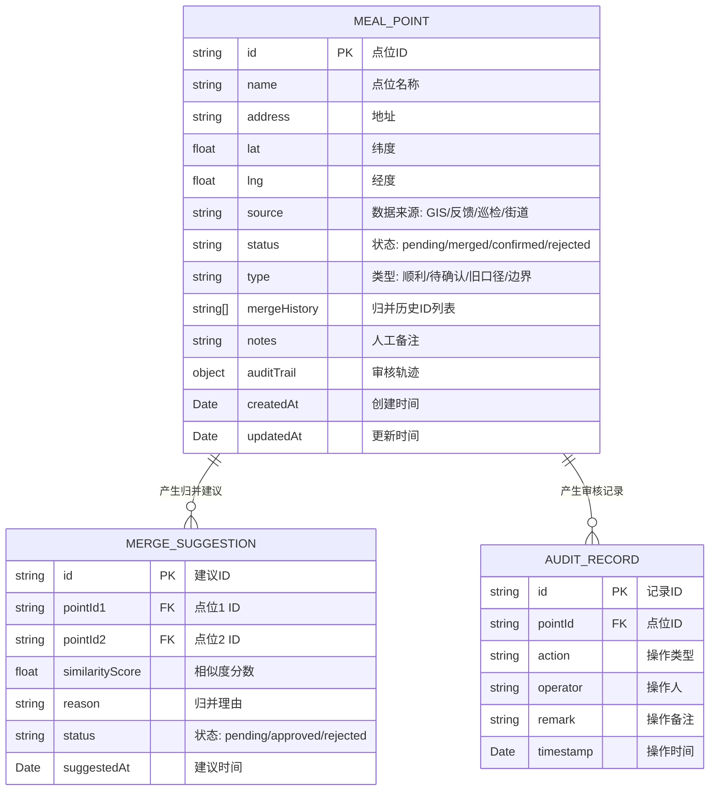

## 1. 架构设计



## 2. 技术描述
- 前端框架：React@18 + TypeScript + Vite
- 样式方案：TailwindCSS@3
- 地图组件：Leaflet + react-leaflet
- 状态管理：React Context + useReducer
- 数据持久化：localStorage
- 文件处理：papaparse (CSV解析)
- 图表展示：recharts

## 3. 路由定义
| 路由 | 页面组件 | 功能 |
|------|----------|------|
| / | DataImportPage | 数据导入页面，GIS点位上传、样例数据加载 |
| /merge | PointMergePage | 点位归并页面，智能归并、冲突处理 |
| /review | ManualReviewPage | 人工复核页面，待确认清单、判断留痕 |
| /export | PublicExportPage | 公示导出页面，地图展示、清单导出 |

## 4. 核心数据模型

### 4.1 数据模型定义



### 4.2 TypeScript 类型定义

```typescript
interface MealPoint {
  id: string;
  name: string;
  address: string;
  lat: number;
  lng: number;
  source: 'GIS' | 'feedback' | 'inspection' | 'street';
  status: 'pending' | 'merged' | 'confirmed' | 'rejected';
  type: 'smooth' | 'review' | 'legacy' | 'boundary' | 'duplicate' | 'empty';
  mergeHistory: string[];
  notes: string;
  auditTrail: AuditRecord[];
  createdAt: Date;
  updatedAt: Date;
}

interface MergeSuggestion {
  id: string;
  pointId1: string;
  pointId2: string;
  similarityScore: number;
  similarityBreakdown: {
    address: number;
    name: number;
    distance: number;
  };
  reason: string;
  status: 'pending' | 'approved' | 'rejected';
  suggestedAt: Date;
}

interface AuditRecord {
  id: string;
  action: 'import' | 'merge' | 'confirm' | 'reject' | 'note';
  operator: string;
  remark: string;
  timestamp: Date;
}

interface AppState {
  points: MealPoint[];
  suggestions: MergeSuggestion[];
  currentStep: 'import' | 'merge' | 'review' | 'export';
}
```

## 5. 核心算法模块

### 5.1 地址相似度算法
- 使用Levenshtein距离计算文本相似度
- 结合地理位置距离（Haversine公式）
- 综合评分 = 地址相似度×0.4 + 名称相似度×0.3 + 距离相似度×0.3
- 阈值：>0.85 自动归并，0.6-0.85 人工确认，<0.6 不处理

### 5.2 归并规则
- 同一地点不同写法（如"社区食堂" vs "社区助餐点"）优先归并
- 相邻点位（距离<50米但名称地址不同）保留并标注
- 空值记录单独分类处理
- 重复项保留主记录，标记合并历史
